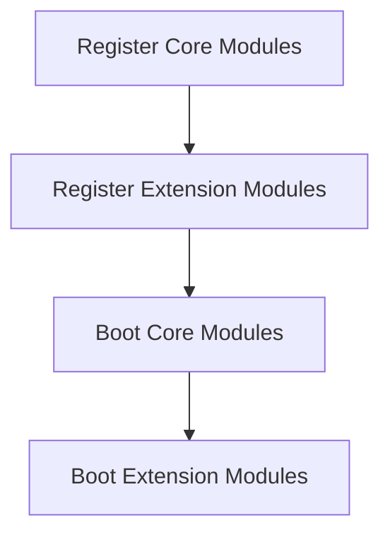
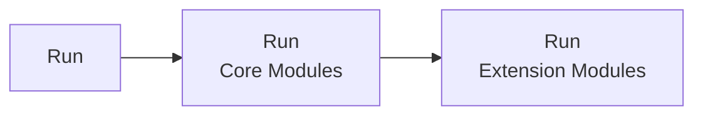

# Architecture Overview
1. Domain diagram showing commands/routines, events & general lifecyle, remote control block


> [!WARNING]
> Mother requires a Remote Control block to function.  This allows us to leverage autopilot and flight data across our modules easily.
   
### Mother Instance (& Program access)

#### System attributes (px, name, id)
Mother makes several properties widely available to your script to assist with common lookups.

For example, we can access the [Intergrid Communication (IGC)](LINK_TO_MALWARE_DOCS) system via the following accessor on Mother:

```
IGC = Mother.IGC
```

#### Boot

When Mother boots, many of the core modules do most of their work.  This aims to save a great deal of computation at runtime, reducing impact on gameplay.  During boot, the `Boot` method is called on all Core Modules, then all Extension Modules.




#### Run



##### Scheduling an Action for Run
Sometimes it may be important to define custom time intervals you wish for a module or method to run over.  Mother's clock makes this easy.

Mother updates the Almanac every 2 seconds using the `Schedule` method.

```csharp
# Mother.cs

Clock.Schedule(UpdateAlmanac, 2);
```

##### Queuing an action for later execution

You can queue and action for execution later with the `QueueForLater` method.  This is used to defer commands for later execution when the [`wait`](../../IngameScript/CommandLineInterface.md) command is used.

```csharp
# Mother.cs

Clock.QueueForLater(
    () => DoSomething(),  // run the action...
    10 // ...after 10 seconds
);
```

#### Registering Modules

Mother makes it easy to register Extension Modules via the `RegisterModule` method:

```csharp
# Mother.cs

// Instantiate module
MissileGuidanceModule module = new MissileGuidanceModule(this);

// Register module with Mother
RegisterModule(module);
```

> [!IMPORTANT]
> Extension Modules must conform the the `IExtensionModule` interface.