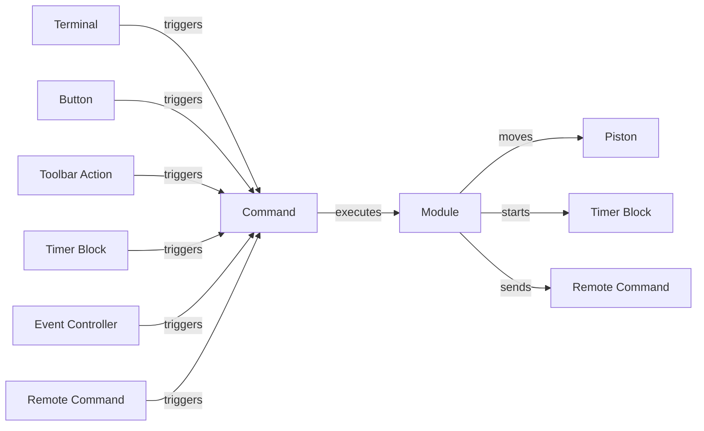

# Ingame Script

> MOTHER IS IN BETA DEVELOPMENT. I'M ON A QUEST TO REDUCE THE CHARACTER COUNT, AND INCREASE THE FUNCTIONALITY.  PLEASE REPORT ANY ISSUES YOU ENCOUNTER, AND EXPECT SOME OF THE COMMANDS AND UNDERLYING FRAMEWORK TO CHANGE.

Mother is available as an ingame script for Programmable Blocks in Space Engineers. It gives you access to many features, including:

- Secure intergrid communication for position monitoring and sending remote commands
- Expanded automation beyond what the default block actions can provide
- Flight planning and autopilot leveraging the existing GPS system and Remote Control block
- Easily port your automations from one grid to another by copying `CustomData`

This script is designed to be efficient, only running when triggered by a command. It is not intended to replace all existing block actions, but rather attempts to improve the most common automations and block types. Over time, I expect the command library to grow considerably.

>Mother interoperates seamlessly with Timer Blocks and Event Controllers allowing it to be used to augment existing automations.

---

1. [Installation](Installation.md)
2. [Running Commands](CommandLineInterface.md)
3. [Configuration](Configuration.md)
4. [Modules](Modules/Modules.md)
5. [Examples](Examples.md)
6. [Command Cheatsheet](CommandCheatsheet.md)

## Videos

### Introduction

## Overview

## Upcoming Features
1. Autodocking
2. Run commands when a waypoint is reached within a flight plan
3. Master-Node architecture to allow for multiple programmable blocks to work together on the same grid.