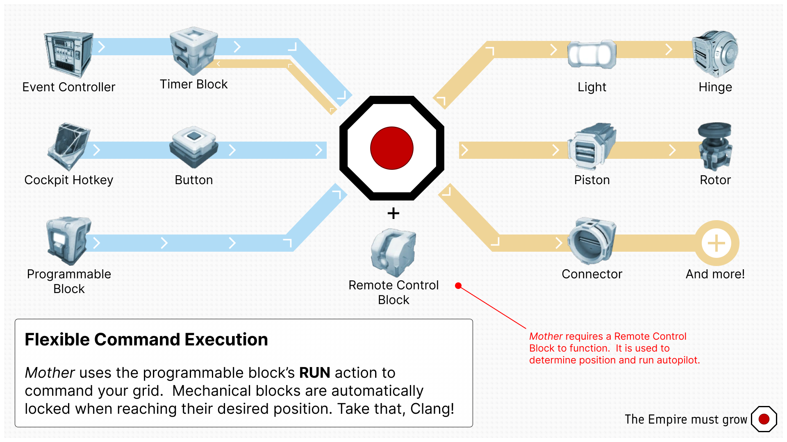

# Ingame Script

[< Home](../README.md)

> [!WARNING] 
> Mother is in beta development. I'm on a quest to reduce the character count, and increase the functionality. Please report any issues you encounter, and expect some of the commands and underlying framework to change.

Mother is available as an ingame script for Programmable Blocks in Space Engineers. It gives you access to many features, including:

- **Secure Intergrid Communication** - Grids share positions and can easily send commands remotely to each other.
- **Expanded Automation** - Mother aims to simplify interacting with the mechanical system on your grid, and monitoring them for changes.
- **Flight Planning and Visualization** Leveraging the existing GPS system and Remote Control block to program and flight flight plans dynamically.
- Easily port your automations from one grid to another by copying `CustomData`

This script is designed to be efficient, only running when triggered by a command. It is not intended to replace all existing block actions, but rather attempts to improve the most common automations and block types. Over time, I expect the command library to grow considerably.

> [!NOTE]
> Mother interoperates seamlessly with Timer Blocks and Event Controllers allowing it to be used to augment existing automations.

---

1. [Installation](Installation.md)
2. [Running Commands](CommandLineInterface.md)
3. [Configuration](Configuration.md)
4. [Modules](Modules/Modules.md)
5. [Examples](Examples.md)
6. [Command Cheatsheet](CommandCheatsheet.md)

## Videos

### Introduction

## Overview

## Upcoming Features

1. Master-Node architecture to allow for multiple programmable blocks to work together on the same grid.
2. `wait` command to allow delays
3. Use of block customData to improve customization.  Ie. Rotor1.CustomData can contain configuration specific to Rotor1. This could also allow for the injection of an event triggering system at the block level.
4. Autodocking
