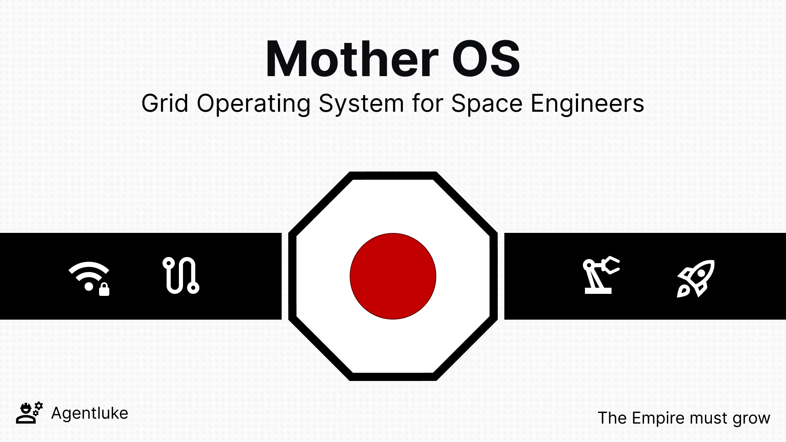

<!--div>
# MotherOS
<div-->

 <!-- ```
 ███╗   ███╗ ██████╗ ████████╗██╗  ██╗███████╗██████╗    ██████╗ ███████╗
 ████╗ ████║██╔═══██╗╚══██╔══╝██║  ██║██╔════╝██╔══██╗  ██╔═══██╗██╔════╝
 ██╔████╔██║██║   ██║   ██║   ███████║█████╗  ██████╔╝  ██║   ██║███████╗
 ██║╚██╔╝██║██║   ██║   ██║   ██╔══██║██╔══╝  ██╔══██╗  ██║   ██║╚════██║
 ██║ ╚═╝ ██║╚██████╔╝   ██║   ██║  ██║███████╗██║  ██║  ╚██████╔╝███████║
 ╚═╝     ╚═╝ ╚═════╝    ╚═╝   ╚═╝  ╚═╝╚══════╝╚═╝  ╚═╝   ╚═════╝ ╚══════╝
 ``` -->



> [!WARNING] 
> Mother is in beta development. I'm on a quest to reduce the character count, and increase the functionality. Please report any issues you encounter, and expect some of the commands and underlying framework to change.

[](https://buymeacoffee.com/Agentluke)

Mother is a general purpose operating system for Space Engineers grids, available as an in-game script. It exposes an intuitive command line interface (CLI), flexible flight control & planning, and an intergrid communication system to massively expand what you can do with your grid(s). I built Mother to make my ships operate more like intelligent spacecraft, rather than just a collection of blocks moving through space. With Mother's CLI, most common automations can easily be assigned to a button without needing a Timer or Event Block, though it can also be used in conjunction with them.

You do not need any programming experience to use Mother.  In fact, most of Mother's CLI commands offer a more intuitive control mechanism than the base game itself. I have taken extreme care to ensure Mother is efficent and reliable.  With few exceptions, Mother only runs operations when triggered by a command.  This aims to have minimal impact on your sim speed and will likely be the most efficient script running on your grid.

I hope you enjoy using Mother as much as I enjoyed building it.

*The empire must grow.*

| Tool                                      | Details                   |
| --------                                          | -------                   |
| [In-game Script](IngameScript/IngameScript.md) <br>*For Players*   | <br>Use Mother within a programmable block to access advanced flight planning, intergrid communication and an intuitive command system to supercharge your grid automation.                                               |
| [Script Framework](Framework/README.md) <br> *For Developers*                  |  <br>Use the Mother Framework to develop your own custom scripts leveraging many of Mother's core services like intergrid communcation, activity monitoring and almanac. |

## About The Author

I have always been passionate about aviation and space.  I studied Aerospace Engineering, and flew in fighter jets in the Air Force for over a decade. I have been writing software since university, and I have always been fascinated by the intersection of software and hardware.

I discovered Space Engineers several years ago after my brother had been playing it for some time.  I was immediately hooked.  Sandbox games and *builders* are my jam, and Space Engineers is the ultimate sandbox. When I finally dove into programmable blocks, I noticed there was a gap in how players can coordinate automations at the grid level. Mother has been a labor of love for about a year, and I have learned a lot along the way.

**Luke**<br>Space Engineer 🚀🇨🇦

## Recommended Companion Scripts

I cannot live without the following scripts, and Mother works with them seamlessly.  I highly recommend you check them out!

- [Automatic LCDs 2](https://steamcommunity.com/sharedfiles/filedetails/?id=822950976) by MMaster
- [Isy's Inventory Manager](https://steamcommunity.com/sharedfiles/filedetails/?id=1216126863) by Isy

## Acknowledgements

Mother is built using [MDK-SE](https://github.com/malware-dev/MDK-SE) so I offer a big thanks to Malware.  [Splitsie](https://www.youtube.com/@Splitsie), Arron at [LastStandGamers](https://www.youtube.com/@LastStandGamers), [Black Armor](https://www.youtube.com/@BlackArmor718), and lately [Engineered Coffee](https://www.youtube.com/@EngineeredCoffee) have been incredible inspirations as I bring this project to life.

## Contributions
Contributions are welcome.  For now, please reach out directly via the Steam Workshop or this Github repo while I prep the project for open source and beyond.