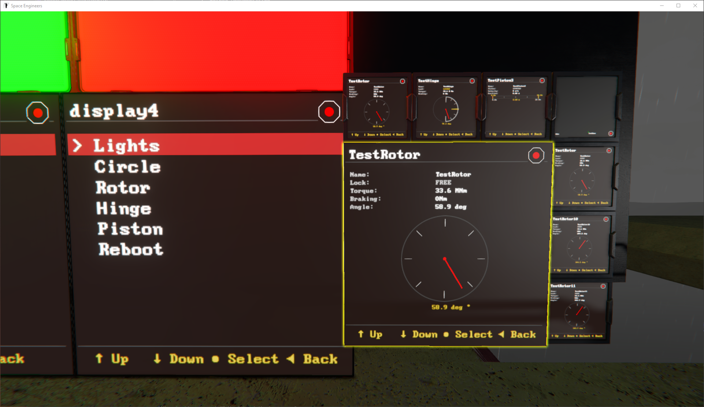
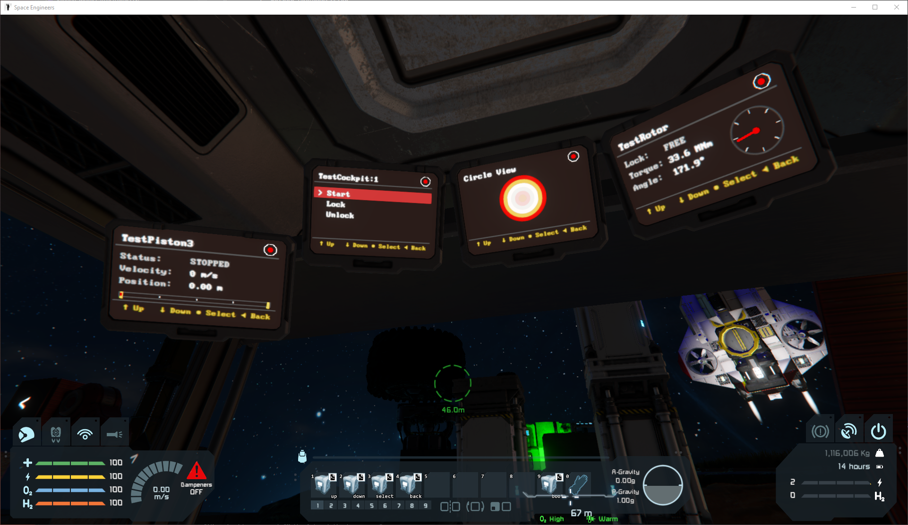
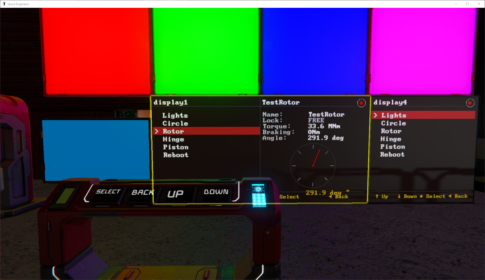

# Mother 1.1 Release

Hi guys, I'm happy to invite you to the official Mother beta testing group! Your support was incredibly important in the development of Mother OS and Mother Core, and after about 6 months of ongoing feedback and testing, v1.1 of Mother OS and Mother Core are nearly ready. I am hoping to release immediately after the SE 1.209 release to take advantage of the hype!

--

The Version 1.1 release will come with improvements (and intros) to the following tools. I have included documentation covering changes (and areas to test below).

1. [Mother OS (v1.1)](#mother-os-v11)
2. [Mother Core (v1.1)](#mother-core-v11)
3. [Mother Autopilot System - MAPS (v0.1)](#mother-autopilot-system---maps-v01)
4. [Mother GUI (v0.1)](#mother-gui-v01)
5. [Mother CLI (v1.0.3)](#mother-cli-v103)
6. [Mother Dev Tools (v0.2)](#mother-dev-tools-v02)

Please feel free to provide feedback here with code examples and screenshots/videos if possible! All scripts have been tested and are working in the upcoming Space Engineers 1.209 update 🙂


## Mother OS (v1.1)

IMPORTANT - Mother OS no longer supports flight planning or autopilot features. These have been moved to the [Mother Autopilot System](#mother-autopilot-system---maps-v01)

### Command Sharing

Mother OS, MAPS, and Mother GUI will all interoperate seamlessly when you load them.  GUI can easily call a command registered on another script running Mother Core. I have tried extremely hard to make this next generation of Mother Core scripts operate without requiring any additional work from the player.

**Example**

We can call a command registered in MOS from Mother GUI, and vice-versa.

MOS Programmable Block

```ini
[commands]
LightsOn=block/on Lights; light/color Lights white;
```

Mother GUI Programmable Block

```ini
[commands]
ActivateLights=LightsOn;
```

### Merge Block & Mechanical Block Attachment Support

After a very long wait, Mother Core now natively supports connecting and disconnecting from other grids using merge blocks and mechanical connections (piston, rotor, hinge). With some of your help, the Block Catalogue has evolved to be an extremely responsive system that watches your grid for changes and updates the relevant configurations without breaking a sweat. Mother OS is now running buttery smooth on every grid she's been tested on - big and small.

### Variables

You have two options for variables - global which is defined in the custom data `variables` section, or inline variables which can be used to dynamically pass in variables during command execution.

**Example**

Global Variable in Programmable Block Custom Data

```ini
[variables]
PLAYER=Dave

[commands]
greeting=screen/print BedroomDisplay "Good morning, $PLAYER"
```

 **Example - Execute in Terminal**

```bash
greeting
# => Good morning, Dave!
```

Inline Variables in terminal, or custom commands:

```ini
[commands]
greeting=screen/print AirlockScreen "Hello, {{player:Space Engineer}}!"
```

**Example - Execute in Terminal**

```bash
# without parameter
greeting
# => Hello, Space Engineer!

# with parameter
greeting --player=Agentluke
# => Hello, Agentluke!

# with spaces
greeting --player="Ellen Ripley"
# => Hello, Ellen Ripley!
```

### *Parallel* Command Execution

You can now run commands in a pseudo-parallel fashion, meaning you can, for example, trigger several large hangar doors to open simultaneously vs. having them open in sequence. I have found this most useful when you have several complex commands that need to run independently. By encapsulating commands and routines in curly braces `{}`, we can tell the Command Bus to execute them separately (in parallel), vs. in series.

**Example - Programmable Block Custom Data**

```ini
[commands]
; wait, then open HangarDoor1, then open HangarDoor2
openHangarDoors=wait 5; door/open HangarDoor1; door/open HangarDoor2;

; wait, then open both hangar doors at the same time
openHangarDoors=wait 5; {door/open HangarDoor1} {door/open HangarDoor2}

; run a stored command in parallel with an inline command
greeting=screen/print "HangarScreen" "Welcome to the hangar!";
openHangarDoors=wait 5; {greeting} {door/open HangarDoor1}
```

### New/Improved Commands

#### light/color

Light color now supports hexadecimal, rgb, and some shortcut names for the most common colors.

```bash
# name
light/color Light1 red;
# hexadecimal
light/color Light1 #FF0000;
# RGB
light/color Light1 255,0,0;
```

#### piston/distance, rotor/rotate, hinge/rotate

All three "set into motion" mechanical block commands now support a `--share` option which allows the player to distribute movement across a group of blocks. The examples show how we could either move a single block to position, or use the shared motion of several blocks to achieve the same outcome. This is a great QoL improvement for the more complex extension and retraction mechanisms some of you are building.

**Example - Piston Distance**
```bash
# Each piston extends to 10m
piston/distance PistonGroup 10

# Total 10m shared between pistons (5m each for 2 pistons)
piston/distance PistonGroup 10 --share
```

**Example - Rotor Angle**
```bash
# Each rotor rotates to 90°
rotor/rotate RotorGroup 90

# Total 90° shared between rotors (45° each for 2 rotors)
rotor/rotate RotorGroup 90 --share
```

**Example - Hinge Angle**
```bash
# Each hinge rotates to 60°
hinge/rotate HingeGroup 60

# Total 60° shared between hinges (30° each for 2 hinges)
hinge/rotate HingeGroup 60 --share
```

#### `piston/attach`, `piston/detach`, `rotor/attach`, `rotor/detach`, `hinge/attach`, `hinge/detach`

With Mother now supporting grid construct changes, it was natural to introduce commands to attach and detach mechanical blocks to take advantage of this new capability. They work exactly as you'd expect:

**Example**

```bash
# Detach rotor head
rotor/detach LandingGearLock

# Attach rotor head
rotor/attach LandingGearLock
```

#### `piston/ulimit`, `piston/llimit`, `rotor/ulimit`, `rotor/llimit`, `hinge/ulimit`, `hinge/llimit`

Mechanical blocks now expose explicit upper and lower limit commands so players can clamp motion. This is useful when you want to reconfigure safe travel bounds without manually opening the terminal for each block.

**Example - Piston Limits**

```bash
# Clamp a piston group between 1.5m and 7.5m
piston/llimit PistonGroup 1.5
piston/ulimit PistonGroup 7.5
```

**Example - Rotor Limits**

```bash
# Restrict a rotor to a forward scanning arc
rotor/llimit TurretRotor -45
rotor/ulimit TurretRotor 120
```

**Example - Hinge Limits**

```bash
# Limit a landing hinge travel range
hinge/llimit LandingGearHinge -15
hinge/ulimit LandingGearHinge 45
```

#### `wheel/height`

- Add `wheel/height` command to set the height offset of wheel suspensions. Supports `--add` and `--sub` flags for incremental adjustments.

```ini
; absolute
wheel/height MainWheels 0.5;

; incremental
wheel/height MainWheels 0.1 --add;
```

#### `wheel/power`

Set the power of a wheel or group of wheels as a percentage. Power controls how much force the wheel applies when driving.

```bash
# set power to 50%
wheel/power "Backup Wheels" 50;
```

#### `wheel/friction`

Set the friction of a wheel or group of wheels as a percentage. Friction affects how much grip the wheel has on surfaces.

```bash
# set friction to 75%
wheel/friction "All Wheels" 75;
```

#### `wheel/strength`

Set the strength of a wheel or group of wheels as a percentage. Strength controls the suspension stiffness.

```bash
# set to max strength (100%)
wheel/strength "All Wheels" 100;
```


#### `block/rename`

Rename a block by setting its custom name.

```bash
# Piston 1 -> DrillPiston
block/rename "Piston 1" DrillPiston;
```

#### `rename`

This allows you to rename your current grid.  This is extremely useful when printing unique variants of a grid, so it also supports a `--unique` option.

```ini
; rename the current grid (we just provide the new name - easy peasy)
rename Mothership

; rename and ensure unique
rename Missile --unique
; CustomName = Missile-12345
```

#### `var/set`

Dynamically sets a variable from the terminal or from within a command routine. Useful for updating values that are shared across commands without editing Custom Data.

```bash
var/set PLAYER Agentluke;
greeting
# => Good morning, Agentluke!
```

### New Hooks

#### `onBoot` Hook

Define on the programmable block itself to run commands after a successful boot cycle.

```ini
[hooks]
onBoot=screen/print StatusLCD "Mother Online";
```

### New Hooks

#### `onMerge`, `onUnmerge`, `onAttach`, `onDetach`

These hooks can be used on the respective merge or mechanical block to take advantage of attach and detach events. 

### Manually Setting Mother grid name

Players can now override the instance name via configuration. This allows a programmable block to declare its own name rather than deferring to the grid's custom name. This is useful for subgrids with unusual names that should act as the "main grid" from Mother's perspective.

**Example - Programmable Block Custom Data**

```ini
[general]
name="Slave 2"
```

## Mother Core (v1.1)

### Remove dependency on Remote Control Block

The Remote Control block is no longer a requirement for Mother Core to operate. Remote control specific logic has been migrated to MAPS. Ship speed, gravity and mass are now determined from the first available `IMyShipController`, if found.

### Construct auto-syncing

The `IntergridMessageService` and `CommandBus` have been updated to automatically sync with local instances of Mother Core and share command libraries. This means that any Mother-script can call commands of another without any additional effort from the player. Just load the script into a new programmable block and the scripts will handshake during boot using a `ConstructPing()`.

### Merge Block support

The `BlockCatalogue` will now automatically update when merge blocks are merged/unmerged which means that Mother should work as expected before and after a merge. This also applies to attaching/detaching mechanical blocks (Rotor, Hinge, Piston).

### ⚠️Change to Display Rendering

In order to support a wider scope of compatibility, all Mother Core scripts will now target displays and surfaces differently. This new methodology enables rich display targeting and formatting, best demonstrated with [Mother GUI](#mother-gui-v01).

**OLD Method - Change Block Name**

Add `MMAP`, `MALMANAC`, etc. to the block's name. We also optionally supported cockpit/nested displays - `MLOG:1`. The problem is, what if I want `MMAP:2` as well? This makes names very verbose and, in my opinion, is the wrong approach.

**New Method - Use Custom Data**

Shifting closer to Mother's default configuration approach, we now set up our displays using their custom data. Not only does this allow for us to target multiple screens, but it allows multiple scripts to target multiple different screens simultaneously.

**Example - Display/Cockpit Custom Data**
```ini
[surfaces]
; print main menu (rendered by Mother GUI from player config)
0=MainMenu
; print map view (targeted from Mother Autopilot System script)
1=MapView
; print log using provided source script's name "print the log of Mother OS script"
2=LogView "Mother OS"
```

It's a bit more involved, but incredibly more flexible as more Mother Core scripts render to displays.

### Important Commands

Commands can now be marked as *important* using the `!` prefix. Important commands take priority over local commands on other Mother Core instances on the same construct. This is useful when multiple instances define the same command but you want one instance to be the authoritative source. When Instance B runs `dock`, it will execute Instance A's important command instead of its own local command.

**Example - Programmable Block Custom Data (Instance A)**
```ini
[commands]
; This command will be called by all instances on the construct
!dock=connector/lock DockingPort
```

**Example - Programmable Block Custom Data (Instance B)**
```ini
[commands]
; This local command will be ignored in favor of Instance A's important command
dock=echo "Local dock command"
```

Use the `!!` prefix when running a command to force local execution, bypassing any important commands defined on other instances.

**Example - Execute in Terminal**

```bash
# Run the important command from another instance (default behavior)
dock

# Force run the local command, ignoring important commands
!!dock
```

### improved `DisplayModule`

The `DisplayModule` from Mother OS has moved most capability to Core so that scripts can use some of Mother's foundational logic for rendering content to a screen or the terminal window. Map logic has been moved to the [Mother Autopilot System (MAPS)](#mother-autopilot-system---maps-v01) script.


### Improved `ColorHelper` Utility

The `ColorHelper` utility class now supports hexadecimal color values.

### Other Improvements

- `BaseModuleCommand` now includes `IsSharedMode()` and `GetDistributedValue()` helper methods to support distributing values across multiple blocks. This enables commands to implement a `--share` flag for cumulative operations.
- Add `MechanicalBlockModule` to handle mechanical block state changes.
- Add `rename` command to set the grid's custom name. Use the `--unique` option to append a random integer for uniqueness.
- `Almanac` now tracks grid orientation (`Forward` and `Up` vectors) for improved navigation and docking operations. These are shared automatically in message headers.
- `Almanac` now validates records on load and periodically removes stale grid records that haven't pinged within 5 minutes.
- `AlmanacRecord` now includes `SafeRadius`, `UnicastId`, and orientation data (`Forward`, `Up`) for enhanced grid tracking.
- `IntergridMessageService` now elects a relay instance per construct for external communication and syncs commands across construct instances.
- `IntergridMessageService` now supports Almanac synchronization via the `almanac` route to share data across instances.
- `CommandBus` now maintains registries for `ConstructCommands` and `ImportantConstructCommands` to track commands available on other Mother Core instances.
- `CommandBus` now handles external command requests via relay and internal construct commands directly via `localcmd` route.
- Task Queue in `CommandBus` is now a `List`.
- Changes to the Programmable Block custom data no longer force a system reboot. Instead, modules should listen for the `SystemConfigUpdatedEvent` so that when the system configuration changes, the modules can update their internal configuration without needing to reboot the system.
- Fixed issue where Almanac was not updating grid name and cannot be targeted when changing the name. When a grid's name changes, it will now be broadcasted on the construct, and through defined channels.
- Fixed issue with setting hooks on the programmable block instance for blocks on the grid. Hooks for blocks can now be defined in the programmable block's custom data and are updated automatically.
- Remove `FlightPlanningModule`, `FlightControlModule`, and `DockingModule`. These modules have been moved to the [Mother Autopilot System (MAPS)](#mother-autopilot-system---maps-v01) script.


## Mother Autopilot System - MAPS (v0.1)

Mother Autopilot System is a fully independent script containing all flight planning and autopilot-related logic originally contained in Mother OS. To ensure the same gameplay experience, players should use Mother OS and MAPS so that they may access a wide command library in cooperation with autopilot features.

I intend to put a lot of focus into MAPS moving forward to ensure it is a competitive and feature-rich addition to the Space Engineers autopilot ecosystem.

There are a few areas that have changed which will need attention:

### Map and Almanac Display Rendering

Mother Core 1.1 reworks how screens are targeted.  In order to show the Map and Almanac screens, we now use custom data configuration on the screen/block.

```ini
;standard LCD panel (only has one surface at index 0)
[surfaces]
0=MapView

; cockpit (where we have multiple surfaces)
[surfaces]
0=LogView "Mother GUI"
1=MapView
2=AlmanacView
```

This surface targeting paradigm makes Mother Core extremely flexible and powerful when rendering views to displays.

## Mother GUI (v0.1)

Mother GUI is a brand new entry to the Mother Project. It is designed to render visualizations using Mother Core tools, but also demonstrates the cooperation between an execution-based script (Mother OS) and a player-interface and visualization script (Mother GUI). Both are built with Mother Core and so interoperate seamlessly from the player's perspective. 






Here is what you need to know to get started.

### Core Concepts
|Concept |	Description |
| - | - |
| Display|	Any LCD Panel, cockpit screen, or other text surface configured with type=gui in its Custom Data.|
|View	|A named renderer that draws content onto a display (e.g. RotorView, PistonView, a menu).|
| Menu | 	A hierarchical list of items defined in the PB's Custom Data. A menu is just a special kind of view.|
|Command |	A string run via the PB's argument input (e.g. from a button, timer, or hotbar action).|

### Setting Up a Display

#### Configure the Surface
In the Custom Data of any LCD panel or cockpit, add a [surfaces] section to tell Mother GUI which view to show on which surface index. For an LCD panel with only one surface, we will use the 0<sup>th</sup> index (first screen).

```ini
[surfaces]
0=RotorView "MainRotor"
```

The RotorView shows basic states and a visualization of the rotor's state in real time. We use the rotor's name as the first argument so that the RotorView renders the correct rotor data.

For cockpits or blocks with multiple screens:

```ini
[surfaces]
0=MainMenu
1=RotorView "Landing Gear Rotor"
2=PistonView LiftPiston
```

#### Optional Format Settings

```ini
[general]
; adjust the size of the text
size=0.6
; adjust the entire screen using a scaling multiplier
scale=1.2
```

### Setting Up Menus

Menus are a powerful feature built into Mother GUI and take inspiration from other scripts to enable a menu-navigation system.  We can run commands and routines from these menus, as well as nest them to build rich interfaces for interacting with your grid.

Menus are defined in the PB's Custom Data using [menu:name] sections. Items use leading dots to express hierarchy (one dot per level of depth). Every line must include = to be INI-compatible. You can use an empty value for submenus.

Let's define our `MainMenu`:

```ini
[menu:Main Menu]
; Define simple command
Startup=battery/auto MainBatteries; block/on #atmo-thrusters;
; Define a Lights submenu
Lights=
.Toggle Light 1= block/toggle Light1;
.Toggle Light 2= block/toggle Light2;
; define a reboot action
Reboot=boot;
```

In the above example, the player will see:

```
Main Menu      ⚬
----------------
> Startup
  Lights       >
  Reboot
```

If they select the `Lights` option, the nested submenu will open:

```
Lights         ⚬
----------------
> Toggle Light 1
  Toggle Light 2
  << Back
```

Let's go even further and define a `Lights Menu` menu that we can navigate to:

```ini
; The new menu
[menu:Lights Menu]
Toggle Light 1= block/toggle Light1;
Toggle Light 2= block/toggle Light2;

[menu:Main Menu]
; Define simple command
Startup=battery/auto MainBatteries; block/on #atmo-thrusters;
; navigate to the Lights Menu
Lights=view/go self "Lights Menu"
; define a reboot action
Reboot=boot;
```

Breaking up menus allows you to keep functionality modular. Remember to use the `self`keyword so the navigate know to target the screen you have run the `select` action for.


#### Duplicate label disambiguation

`MyIni` requires unique keys within a section. Prefix duplicate labels with a number and colon — the prefix is stripped from the display label:

```ini
[menu:main]
Lights=
; Define Light1 menu
.Light1=
..0:Toggle= block/toggle Light1;

.Light2=
..1:Toggle= block/toggle Light2;
```

Without unique IDs, MyIni would discover two `Toggle` keys and throw an error. This only applies to a simple menu, though, so we can nest additional menus to get around this problem.

### Built-In Views

⚠️These are subject to change as Mother GUI evolves. Please let me know what's missing, or how you'd improve these.

#### RotorView
Displays rotor diagnostics: name, lock state, torque, braking torque, and a live angle dial.

```ini
; navigate to the RotorView on the BridgeLCD
view/go BridgeLCD RotorView "Turret Rotor"
```

#### HingeView
Displays hinge diagnostics: lock state, torque, braking torque, and a live semi-circle angle dial (−90° to +90°).

```ini
; navigate to the HingeView on the BridgeLCD
view/go BridgeLCD HingeView "LandingGearHinge1"
```

#### PistonView

Displays piston diagnostics: status (extending/retracting/stopped), velocity, and a horizontal progress bar showing current extension within min/max limits.

```ini
; navigate to the PistonView on the BridgeLCD
view/go BridgeLCD PistonView LiftPiston
```

### Widescreen / Split-views
On widescreen displays, the script automatically splits the viewport in two:

- Left half — the active menu.
- Right half — a side-panel view (pushed via view/go on a widescreen display).

### Navigation Commands
Wire these to button panels, timers, or hotbar actions via the PB's argument field.


```ini
view/select "Display Name"
view/back   "Display Name"
view/up "Display Name"
view/down "Display Name"
view/go "Display Name" [NewViewOrMenuName] [ViewParameters...]
```

#### Cockpit and multi-screen traversal

```ini
; Plain LCD panel
view/go BridgeLCD RotorView "Turret Rotor"

; Cockpit surface 0 (front-facing screen)
view/go "Fighter Cockpit:0" MainMenu

; Cockpit surface 1 (side screen) — pinned to a specific rotor
view/go "Fighter Cockpit:1" RotorView "Turret Rotor"

; Cockpit surface 2 — piston diagnostics
view/go "Fighter Cockpit:2" PistonView "Cargo Lift"

; Navigate to a different view on surface 0
view/go "Fighter Cockpit:0" HingeView LandingGearHinge

; Tag-based targeting (# prefix) with surface index
view/go #cockpit:0 HingeView LandingGearHinge
```

#### `self` keyword
Inside a menu command string, use self instead of a display name to refer to the display that triggered the command — works with both plain names and surface-indexed displays:

```ini
[menu:main]
; Navigates whichever screen this menu is shown on
Rotor=view/go self "RotorView" "Turret Rotor"
Piston=view/go self "PistonView" "Cargo Lift"
Back=view/back self
```

This means the same menu definition works correctly whether it is displayed on "Bridge LCD", "Cockpit:0", or "Cockpit:2" without any changes.

### Quick Start Guide
1.	Place and configure the `Mother GUI` PB.
2.	Add a [menu:MainMenu] section to the PB's Custom Data with your desired items.
4.	Open each LCD/cockpit screen and add a [surfaces] section pointing to your menu or a specific view.
5.	Wire navigation buttons/actions to the PB:
    -  `view/up "Cockpit:0`
    -  `view/down "Cockpit:0`
    -  `view/select "Cockpit:0`
    -  `view/back "Cockpit:0`

### Tips and Gotchas

- Every line in a [menu:*] section must contain an equals sign `=`. MyIni drops lines without it. Use `[Label]=` for group headers (e.g. `Rotors=`).
- Surface indices on cockpit screens start at 0. Use "BlockName:1" to target the second screen, "BlockName:2" for the third, and so on.
- When multiple cockpit screens share the same button panel, use self in command strings so a single button wiring works for all of them regardless of surface index.
- Mechanical block views (RotorView, HingeView, PistonView) refresh every program cycle while visible, so angles and positions always stay current.
- Custom Data changes to any display block are detected at runtime and trigger automatic re-discovery. No PB recompile or boot needed.

## Mother CLI (v1.0.3)

WORK IN PROGRESS
1. Support targeting of specific Mother Core version

## Mother Dev Tools (v0.2)

1. Update command grammar to support new commands and hooks.