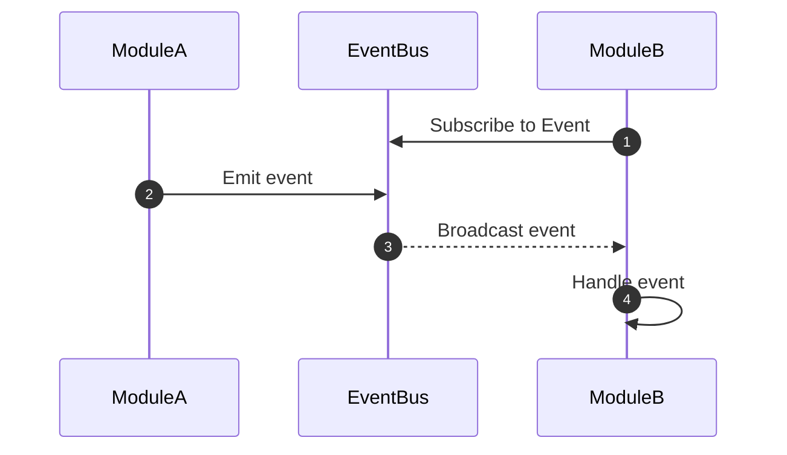

<!-- @@@@@@@@@@@@@@@@@@@@@@@@@@@@@@@@@@@@@@@@@@@@@@@@@@@@@@@@@@@@@@@@@@@@@@@@@@@@@@@@@@@@@@@@@@@@@@@@@@@@@@@@@@@@@@@@@@@@@@@@@@@@@@@@@@@@@@
@@@@@@@@@@@@@@@@@@@@@@@@@@@@@@@@@@@@@@@@@@@@@@@@@@@@@@@@@@@@@@@@@@@@@@@@@@@@@@@@@@@@@@@@@@@@@@@@@@@@@@@@@@@@@@@@@@@@@@@@@@@@@@@@@@@@@@
@@@@@@@@@@@@@@@@@@@@@@@@@@@@@@@@@@@@@@@@@@@@@@@@@@@@@@@@@@@@@@@@@@@@@@@@@@@@@@@@@@@@@@@@@@@@@@@@@@@@@@@@@@@@@@@@@@@@@@@@@@@@@@@@@@@@@@
@@@@@@@@@@@@@@@@@@@@@@@@@@@@@@@@@@@@@@@@@@@@@@@@@@@@@@@@@@@@@@@@@@@@@@@@@@@@@@@@@@@@@@@@@@@@@@@@@@@@@@@@@@@@@@@@@@@@@@@@@@@@@@@@@@@@@@
@@@@@@@@@@@@@@@@@@@@@@@@@@@@@@@@@@@@@@@@@@%@@@@@@@@@@@@@@@@@@@@@@@@@@@@@@@@@@@@@@@@@@@@@@@@@@@@@@@@@@@@@@@@@@@@@@@@@@@@@@@@@@@@@@@@@@@
@@@@@@@@@@@@@@@@@@@%@@@@%%%%@@@@@@@@@@@@@%@@@@@@@@@@@@@@@@@@@@@@@@@@@@@@@@@@@@@@@@@@@@@@@@@@@@@@@@@@@@@@@@@@@@@@@@@@@@@@@@@@@@@@@@@@@@
@@@@%-#@@@@@@@@@@@@@@@@@@@@@@@@@@@@@@@@@@@@@@@@@@@@@@@@%@@@@@@@@@@@@@@@@@@@@@@@@@@@@@@@@@@@@@@@@@@@@@@@@@@@@@@@@@@@@@@@@@@@@@@@@@@@@@@
@#@@@@@@@@@@@@@@@@@@@@@@@@@@%@%%%%%%@@@@@@@@%%@%%%%%%%%%%%%%%%%%%%%%%@@@@@@@@@@@@@@@@%%@@@@@@@@@@@@@@@@@@@@@@@@@@@@@@@@@@@@@@@@@@@@@@@
@@@@@@@@@@@@@@@@@@@%@@@@@%%%%%%%%%%%%%%%%%%###*########*+#**##*##%%%%%%%%%%%%%%@@@@@@@@@@@@@@@@@@@@@@@@@@@@@@@@@@@@@@@@@@@@@@@@@@@@@@@
@@@@@@@@@@@@@%%%%%@%%%%%%%%%%%%%%%%%%%%%######**##*+*####**+*++++*#####%%%%%%%%%%@@@@@@@@@@@@@@@@@@@@@@@@@@@@@@@@@@@@@@@@@@@@@@@@@@@@@
@@@@@@@@@%%%%%@%%%%%%%%%%%%%%#%%%%%#%#***##############***++=====++++****###%%%%%%%%@@@@@@@@@@@@@@@@@@@@@@@@@@@@@@@@@@@@@@@@@@@@@@@@@@
@@@@@@@%@@%%%@@@%%%%%%%%%%%######+#%%%%#%#########*****+++++++**++++*+=-=+++**##%%%%%%%%%%@@@@@@@@@@@@@@@@@@@@@@@@@@@@@@@@@@@@@@@@@@@@
@@@@@@@%%%%%%%%%%%%%%%%%%%%################***+*+==+++=======++====+++++++*******###%%%%%%%%@@@@@@@@@@@@@@@@@@@@@@@@@@@@@@@@@@@@@@@@@@
@@@%@@@@%%%%%%%%%%%%%%%%%###***#####*##*++++++=+=--========++++++++++=++=====+**++****#**#%%%%@@@@@@@@@@@@@@@@@@@@@@@@@@@@@@@@@@@@@@@@
@@@@@@@@%%%%%%%%%%%%%%%%%*+**#*****==***++==-=====+++++++=+****+**+++++***+++**************##%%%%%%@@@@@@@@@@@@@@@@@@@@@@@@@@@@@@@@@@@
@@@@@@%@%%%%%%%%%%%%%%##*******=+++=-=+++=--==+++++++++++++**************+***#*************###**##%%%%%%@@@@@@@@@@@@@@@@@@@@@@@@@@@@@@
#%%@@%%#%%%%%%%%%%%%##%#*##***+++=++=+===========++=+==+++++******************###****###***##***+***#*#%%%%@@@@@@@@@@@@@%@@@@@@@@@@@@@
@@@@@@%#+#%%%%%%%%%%%####***+++++++=++===========++++++++=++++++++**********##*****###*+*#*###*###*#+*+##%%%@@@@@@@@@@%+=%@@@@@@@@@@@@
%@@@@@@%%#%%%%%%%##%%####**+=+++==++++====+=====+==++++++++++++++++++++****#####*############*######****+*#%%%@@@@@@@%@%%@@@@@@@@@@@@@
@@@@@@@@%%%%%%%%%%#*####**==++==-=+++===++====--====++++++++++++++++++++++****##############*#####*###########%%@@@@@@@@%@@@@@@@@@@@@@
@@@@@@@%@@%%%%%%%%%*+*##***++++=======-==++=======++++++++++++++++==++++++++++**#################******###*##**#%%%@@@@@@@@@@@@@@@@@@@
@@@@%@%%%%#%%%%%%%%%%###***+++++==--=----+++==+++++++++++++++++++++===+==++++++++**#################*########***+#%%%@@@@@@@@%@@@@@@@@
@@@@%%%%%%%%%%%%%%%%%%###**+=======--=-==+=+===++++++++=++++++++++++=+++++++=++++++***###############################%%%@@@@@@@@@@@@@@
@@@@%%%%%%%#%%%%%%%%%%%##***++=++=++=---==+=+====++++=====================++++++===++***######################%%#######%%@@@@@@@@@@@@@
@@@@@%#*%%%###%%%%%%#%%#####*++==++++==--=++========+==========-----========++++++++++++***##############*#######%%%%####%@@@@@@@@@@@@
@@@@@%%###%%##*#%%%%%%#######*++======+=--===================-----------=======+++++++++++*#######################%%%%%%%#%%@@@@@@@@@@
@%@%@@%%%%%######%%%%%########*++==-====+=--===+=============-----:::::---=======+++++++++++**#############%%%%%##%%%%%#%%%%%@@@@@@@@@
@@@@@@@%%%%%%##+##%%%%%%####******++====++=--=+++============-----::..:::--=======++++++==+++***#####%%%#%%%%%%%%#%%%%#%%%%%%%@@@@@@@@
@@@@@@@@@%#%#***#####%%###*####***+***+==++=--=+++=============----::::::---=======+++++++++++++**###%%##%%%%%%%%%%#%%%%%%%%%%%%%@@@@@
@@@@@@@@@@@%%%%%##########*#####**+++**+=++*++====+===-=========------------=========++++++++++=-+**###%%##%%%%%%%%%%#%%%%%%%%%%%%%@@@
@@@@@@@@@@@@@%%%%%##***############*++++******++===================--------==========++++++=-+++-:=+*#######%%%%%%%%%%%%%%%%%%%%%%@@@@
@@@@@@@@@@@@@@@%%%%##*################+++=+**++**++===+=================--=========-=++++++++++++=-=+*####*##%%%#%%#%%%%%#%%@%%%%@@@@@
@@@@@@@@@@@@@@@@%%%####******###########**++++******+===++=====================+++++====++++++=+++-:-+*****####%%%%%%%%%%%%%%%%%%%@@@@
@@@@@@@@@@@@@*%@@@%%%#####*+**#*#########*********#***++=-=+=========+++++++++++++++====++++++++++==--=++++**###%%%%%%%%%%%%%%%%%%@@@@
@@@@@@@@@@@@@@@@@@@@%%%%#####**+**#########**+***********+==============++==+++++++===+++++==+++**+=---=++***##%%%%%%%%%%%%##%%%%%%%@@
@@@@@@@@@@@@@@@@@@@@@@@%%#%######+++*############**********+++-==========+++++++++++++++++++++++*+++=--==+**####%%%%%%%%%%%%%%%%%%%%@@
@@@@@@@@@@@@@@@@@@@@@@@@%%%######*##*****########********+***++==----===+++++++=++++++++++++++*+++===--===++*#####%%%%%%%%%%%%%%%%%%@@
@@@@@@@@@@@@@@@@@@@@@@@@@@%%%*****#****+******###*#**************++=========++++++++++++++++*+*+++++=:-==++++*####%%%%%%%@@@%%%%*###%@
@@@@@@@@@@@@@@@@@@@@@@@@@@@@@%%#######***+++***######********+++**+++++=++======++==++++++++*+++==-=+=--===++*#######%%%%%%@@@@%%%%%%@
@@@@@@@@@@@@@@@@@@@@@@@@@@@@@@%%%%###%###****+++*****#*****++++++++++++++========+++=-==+++++=++++++=---=++****#####*+%%%%@@@@@%%%%%%@
@@@@@@@@@@@@@@@@@@@@@@@@@@@@@@@@@@%%%%%%%#*++++++*+******+***++++++++++++++++++++++++++++++====++++=---==++***#*##%#####%@@@@@@@%%%@@@
@@@@@@@@@@@@@@@@@@@@@@@@@@@@@@@@@@@@@@@%%%%#####*+*++=-====+++++============+==-=+++++++++====+++++======+***#####%%####%%%%%%#%%%%%@%
@@@@@@@@@@@@@@@@@@@@@@@@@@@@@@@@@@@@@@@@%%%%#######***++++++==++=-=+++=-====+===++++++=====+++++*+++=++++****####%%%%####%%@%@@@@@@@@@
@@@@@@@@@@@@@@@@@@@@@@@@@@@@@@@@@@@@@@@@@@%%###########****++=++=====-====+++++++++++++=+*++++++=++++****#######%%%%%%###%%%@@@@@@@@@@
@@@@@@@@@@@@@@@@@@@@@@@@@@@@@@@@@@@@@@@@@@@%###%%##*###%#%##*##*#*+++++*******+***************+++**+=#####**##%%%%%%%%####%%%%@@%@@@@@
@@@@@@@@@@@@@@@@@@@@@@@@@@@@@@@@@@@@@@@@@@@@@@@@%%@@%%%%%%%###%%%##*###############**##*#########*########%%%%%%%%@@@@%%##%%%%%@@@@@@@
@@@@@@@@@@@@@@@@@@@@@@@@@@@@@@@@@@@@@@@@@@@@@@@@@@@@%%%%%%%%%%%%%###%%%%%####%%%%%######%%%%%%#%%%%#%%%%%%%%%%%%@@@@@@@@%%%%%%@@@@@@@@
@@@@@@@@@@@@@@@@@@@@@@@@@@@@@@@@@@@@@@@@@@@@@@@@@@@@@%@@@@@%%%#%%%%%%###%%%%%%%%%%%%%%%%%%%%%%%%%%%%%%%%%%%%@@%%%@@@@@@@@%%%%%@@@@@@@@
@@@@@@@@@@@@@@@@@@@@@@@@@@@@@@@@@@@@@@@@@@@@@@@@@@@@@@@%@@@@@@@@@%#%@@@@@@@%%%%%%%%%%%%%%##**@@@@@@@%%%%@@@@@@@@%%@@@@@@@@@@@@@@@@@@@@
@@@@@@@@@@@@@@@@@@@@@@@@@@@@@@@@@@@@@@@@@@@@@@@@@@@@@@@@@@@@@@@@@@@@@@@@@@@@@@@%%%%%%%%%#%@%@@@@@@@@@%%%@@@@@@@@@@@@@@@@@@@@@@@@@@@@@@
@@@@@@@@@@@@@@@@@@@@@@@@@@@@@@@@@@@@@@@@@@@@@@@@@@@@@@@@@@@@@@@@@@@@@@@@@@@@@@@@@@@@@@@@@@@@@@@@@@@@%#%%%@@@@@@@@@#@@@@@@@@@@@@@@@@@@@
@@@@@@@@@@@@@@@@@@@@@@@@@@@@@@@@@@@@@@@@@@@@@@@@@@@@@@@@@@@@@@@@@@@@@@@@@@@@@@@@@%%@@@@@@@@@@@@@@@@@#@@@@@@@@@@@@@@@@@@@@@@@@@@@@@@@@@
@@@@@@@@@@@@@@@@@@@@@@@@@@@@@@@@@@@@@@@@@@@@@@@@@@@@@@@@@@@@@@@@@@@@@@@@@@@@@@@@@@@@@@@@@@@@@@@@@@@@@@@@@@@@@@@@@@@@@@@@@@@@@@@@@@@@@@
@@@@@@@@@@@@@@@@@@@@@@@@@@@@@@@@@@@@@@@@@@@@@@@@@@@@@@@@@@@@@@@@@@@@@@@@@@@@@@@@@@@@@@@@@@@@@@@@@@@@@@@@@@@@@@@@@@@@@@@@@@@@@@@@@@@@@@
@@@@@@@@@@@@@@@@@@@@@@@@@@@@@@@@@@@@@@@@@@@@@@@@@@@@@@@@@@@@@@@@@@@@@@@@@@@@@@@@@@@@@@@@@@@@@@@@@@@@@@@@@@@@@@@@@@@@@@@@@@@@@@@@@@@@@@
@@@@@@@@@@@@@@@@@@@@@@@@@@@@@@@@@@@@@@@@@@@@@@@@@@@@@@@@@@@@@@@@@@@@@@@@@@@@@@@@@@@@@@@@@@@@@@@@@@@@@@@@@@@@@@@@@@@@@@@@@@@@@@@@@@@@@@ -->


# Building a Module

You will be creating an **Extension Module**. These are the main components of your scripts. This section will cover the basics of creating an extension module, registering custom terminal commands, and handling events.

[[toc]]

## Creating a Module
::: note
[Mother OS](../../../IngameScript/IngameScript.md) is a collection of extension modules built on top of Mother Core.
:::


Use the `make:module` command from within your project directory to create a new module in the `/Modules` directory. Let's create the ``MissileGuidanceModule`` module.

```sh title="Console/Terminal"
mother make:module MissileGuidanceModule
```

```plaintext
ExampleProject/
├── Program.cs
├── thumb.png
├── Modules/
    ├── MissileGuidanceModule/
        ├── MissileGuidanceModule.cs
```


### Registering a Module

Mother makes it easy to register Extension Modules via the `RegisterModule()` or `RegisterModules()` methods. This ensures our module is accessible when Mother boots. We register the module in the `Program` constructor of your script.

And then we register it in the `Program` constructor:

```csharp title="Program.cs"
partial class Program : MyGridProgram
{
    private Mother mother;

    public Program()
    {
        // Create Mother instance
        mother = new Mother(this);

        // Instantiate module
        MissileGuidanceModule missileGuidanceModule = new MissileGuidanceModule(this); 

        // Register module with Mother
        mother.RegisterModule(missileGuidanceModule);

        // Or as part of a list of modules
        mother.RegisterModules(new List<IExtensionModule> { 
            missileGuidanceModule,
            ...
        });
    }
}
```

::: important
Extension Modules must conform the the `IExtensionModule` interface. It is recommend that you use the `BaseExtensionModule` class as a base class to leverage the library of useful helper methods.
:::

### Booting a Module
The `Boot()` method of every module is called during boot by Mother. [Core Modules](../CoreModules/CoreModules.md) are booted before Extension Modules.  Modules are booted in the order they are registered. It is important to consider boot order to reduce conflicts among module dependencies and leverage [Events](#events) to keep modules decoupled.

```csharp title="MissileGuidanceModule.cs"
class MissileGuidanceModule : BaseExtensionModule
{
    public void Boot()
    {
        // Register commands
        RegisterCommand(new LaunchCommand())
        RegisterCommand(new DetonateCommand())

        // Subscribe to events
        Subscribe<WaypointReachedEvent>();
        Subscribe<ReadyForLaunchEvent>();

        // Boot activities
        ConfigureWarheads();
    }
}
```

### Running a Module
You may also run processes every program cycle using the `Run()` method. This is only recommended for specific use cases where you need the module to run 6 times per second.  Otherwise it is advised to use the [Clock's](../CoreModules/Clock.md) `Schedule()` method to control the frequency, or use an [Event](#handling-events) when you want your module to respond to an activity.

```csharp title="MissileGuidanceModule.cs"
class MissileGuidanceModule : BaseExtensionModule
{
    // Runs every program cycle automatically
    public void Run()
    {
        // Update the current position of the missile
        DetermineCurrentPosition();

        // Update the thrusters based on the current position
        UpdateThrusters();

        // Check if we are within the terminal range
        if(IsWithinTerminalRange())
        {   
            ArmWarheads();
        }
    }
}
```

## Terminal Commands

Custom terminal commands are easily registered from within modules. Commands implement the `IModuleCommand` interface and are registered in the `Boot()` method of the module.

### Creating a Command

Use the `make:command` command from within your project directory to create a new command. You may provide an optional module name if you wish to associate the command with a specific module.

Let's create the `LaunchCommand` command.


```sh title="Console/Terminal"
mother make:command LaunchCommand --module MissileGuidanceModule
```

```plaintext
ExampleProject/
├── Program.cs
├── thumb.png
├── Modules/
    ├── MissileGuidanceModule/
        ├── MissileGuidanceModule.cs
        ├── Commands/
            ├── LaunchCommand.cs
```

:::info
Mother automatically registers the command in the modules' `Boot()` method when used in the `make:command` command.
:::

Running the `make:command` command without a module option will create a command in the `/Commands` folder of your project.

```sh title="Console/Terminal"
mother make:command HaltAndCatchFireCommand
```

```plaintext
ExampleProject/
├── Program.cs
├── thumb.png
├── Modules/
├── Commands/
    ├── HaltAndCatchFireCommand.cs
```

### Customizing a Command
First we define the command's `Name`. This is what the player will use to call the command from the terminal.

```csharp title="LaunchCommand.cs"
public class LaunchCommand : BaseModuleCommand
{
    // The name of the command
    public string Name => "launch";
    // or we can use a namespace to organize our 
    // commands by function or block   
    public string Name => "missile/launch";
}
```

We can instantiate the command with the parent module for easy reference.

```csharp title="LaunchCommand.cs"
public class LaunchCommand : BaseModuleCommand
{
    MissileGuidanceModule Module;

    public LaunchCommand(MissileGuidanceModule module)
    {
        Module = module;
    }
}
```

Now we implement the `Execute()` method, which will be called when the command is executed via a player command or other trigger.  The method takes a `TerminalCommand` object as the only parameter and returns a `string` which will be printed in the terminal.

Let's imagine we run the following command in our Programmable Block terminal to launch a missile, which includes a target position, and option for max speed:

```bash title="Programmable Block Terminal"
launch 24422.23,32334.56,10045.33 --maxSpeed=50
```

The `TerminalCommand` object will contain the command name, arguments, and options.  We can access these properties to get the information we need to execute the command.

```csharp title="LaunchCommand.cs"
public class LaunchCommand : BaseModuleCommand
{
    public string Execute(TerminalCommand command)
    {
        // first argument
        string targetCoordinate = command.Arguments[0];

        // second argument as a double
        string detonationDistance;
        double.TryParse(command.Arguments[1], out detonationDistance);

        // get an option ie. --maxSpeed=50
        string maxSpeed = command.GetOption("maxSpeed");

        // call InitiateLaunch() method on parent module. The parent will 
        // handle the core launch logic and may fire an event 
        // that other modules can listen for.
        bool success = Module.InitiateLaunch(
            targetCoordinate, 
            detonationDistance, 
            maxSpeed
        );

        // return a message to the terminal for the player
        if(success)
            return "Missile Launched!";
        else
            return "Missile Launch Failed!";
    }
}
```

### Registering a Command
To register a command, we use the `RegisterCommand()` method. We define it in the `Boot()` method of the parent module.  This method can accept an instance of the module to allow access to its specialized methods from within the command.

```csharp title="MissileGuidanceModule.cs"
public class MissileGuidanceModule : BaseExtensionModule
{
    public void Boot()
    {
        // Register command with access to the current module
        RegisterCommand(new LaunchCommand(this));

        // Or without using the current module
        RegisterCommand(new DetonateCommand());
    }
}
```

## Events

Events allow modules to communicate with each other without being tightly coupled.  Modules can emit events, then other modules may respond and take action. This keeps our scripts modular.

### Creating an Event

Use the `make:event` command from within your project directory to create a new event. You may provide an optional module name if you wish to associate the event with a specific module.

Let's create the `MissileLaunchedEvent` event.

```sh title="Console/Terminal"
mother make:event MissileLaunchedEvent --module MissileGuidanceModule
```

```plaintext
ExampleProject/
├── Program.cs
├── thumb.png
├── Modules/
    ├── MissileGuidanceModule/
        ├── MissileGuidanceModule.cs
        ├── Events/
            ├── MissileLaunchedEvent.cs
```

Running the `make:event` command without a module option will create an event in the `/Events` folder of your project.

```sh title="Console/Terminal"
mother make:event EnemySpottedEvent
```

```plaintext
ExampleProject/
├── Program.cs
├── thumb.png
├── Modules/
├── Events/
    ├── EnemySpottedEvent.cs
```

### Emitting an Event

Modules can emit events using the `Emit()` method.  This method takes an `IEvent` instance as a parameter, and an optional `object` of event data.



When we launch our missile, we should emit the `MissileLaunchedEvent` event.

```csharp title="MissileGuidanceModule.cs"
    public void Launch()
    {
        // Emit the event using the event Type, and event data  
        object eventData;
        Emit<MissileLaunchedEvent>(eventData);

        // Or, we can emit without event data (nice a simple!)
        Emit<MissileLaunchedEvent>();
    }
```

::: note
The `Emit()` and `Subscribe()` methods are accessors for the [Event Bus](../CoreModules/EventBus.md) via the `BaseExtensionModule` class.
:::

### Subscribing to an Event

Modules can monitor the behaviour of other modules via events.  Once subscribed to an event, a module take action via the `HandleEvent()` method each time that event is emitted.

Let's image we have a `WarheadModule` that needs to arm the warhead when a missile is launched.

```plaintext
ExampleProject/
├── Program.cs
├── thumb.png
├── Modules/
    ├── WarheadModule/
        ├── WarheadModule.cs
    ├── MissileGuidanceModule/
        ├── MissileGuidanceModule.cs
        ├── Events/
            ├── MissileLaunchedEvent.cs
```

We subscribe to this event in our module's `Boot()` method. Then we override the `HandleEvent()` method to handle the event when it is emitted.

```csharp title="WarheadModule.cs"
public class WarheadModule : BaseExtensionModule
{
    // Subscribe to the event during boot
    public override void Boot()
    {
        Subscribe<MissileLaunchedEvent>();
    }
 
    // Handle the event when it is emitted by this, or another module
    public override void HandleEvent(IEvent e, object eventData)
    {
        if(e is MissileLaunchedEvent) {
           Mother.Print("Missile has launched, arming warhead!");

           ArmWarhead();
        }
    }

    void ArmWarhead() {
        // Red light, green light
    }
}
```

## Accessing Blocks

### Getting Blocks From the Grid

The [Block Catalogue](../CoreModules/BlockCatalogue.md) makes a ledger of all blocks on the current grid during boot. This allows us to access these blocks more efficiency when updated via commands or events. It also simplifies access to block configuration and state monitoring.

::: important
Mother treats all blocks connected via hinges, rotors, and pistons as a single **construct**. It is fully compatible with subgrids and will not interfere with blocks on other grids via connector connections (ie. a docked ship). Your automations will not interfere with other ships when connected via connectors.
:::

Any `IMyTerminalBlock` on your construct can be accessed via the `GetBlocks()` method. You can get a block by its type, and use an optional action for filtering the retrieved blocks. 

::: tip
See Malware's [API Index](https://github.com/malware-dev/MDK-SE/wiki/Api-Index) for more information on block types.
:::

```csharp title="MissileGuidanceModule.cs"
public class MissileGuidanceModule : BaseExtensionModule
{
    public void Boot()
    {
        // Get the Block Catalogue core module
        BlockCatalogue BlockCatalogue = Mother.GetModule<BlockCatalogue>()

        // Get all thrusters on the grid
        List<IMyThrust> thrusters = BlockCatalogue
            .GetBlocks<IMyThrust>();

        // or, only get blocks where name contains a key
        List<IMyThrust> thrusters = BlockCatalogue
            .GetBlocks<IMyThrust>(block => block.CustomName.Contains("key"));
    }
}
```

The more practical situation is when we want to get a specific block on the grid by it's *name*, or multiple blocks within a *group*.  This can be done by via the `GetBlocksByName()` method.  It accepts a block type, and a string for the block, group, or tag name.

```csharp title="MissileGuidanceModule.cs"
public class MissileGuidanceModule : BaseExtensionModule
{
    public void Boot()
    {
        // Get the Block Catalogue core module
        BlockCatalogue BlockCatalogue = Mother.GetModule<BlockCatalogue>()

        // Get the thrusters in the group "Booster Thrusters"
        List<IMyThrust> thrusters = BlockCatalogue
            .GetBlocksByName<IMyThrust>("Booster Thrusters");

        // or, get a specific block by name
        IMyThrust retroThruster = BlockCatalogue
            .GetBlocksByName<IMyThrust>("RetroThruster")
            .firstOrDefault();

        // or even via a tag
        IMyThrust taggedThruster = BlockCatalogue
            .GetBlocksByName<IMyThrust>("#tagged-thruster")
            .firstOrDefault();
    }
}
```

### Monitoring Blocks For Changes

#### Blocks in Motion
Blocks that *move* can leverage the [Activity Monitor](../CoreModules/ActivityMonitor.md) to monitor their changing state ie. angle, distance.  In the case of hinges, we can set a hinge in motion, and then stop and lock it in place when it reaches the specified angle. 

For blocks that change state infrequently between discrete values (ie. `VentStatus.Pressurizing`, `MyShipConnectorStatus.Connected`), you can [monitoring for state changes](#state-changes) instead.

Before our missile launches, we should ensure the exhaust flaps are open.

```csharp title="MissileGuidanceModule.cs"
const float HINGE_OPEN_ANGLE = 45f; // degrees
const string STATE = "READY_FOR_LAUNCH";

public void InitiateLaunch(targetCoordinate, detonationDistance, maxSpeed)
{
    // Get the hinge blocks
    var hinges = Mother.GetModule<BlockCatalogue>()
        .GetBlocksByName<IMyMotorStator>("ExhaustHinges")

    // Set target, detonation distance, and max speed
    // ...

    // Open exhaust flaps
    hinges.ForEach(hinge => {
        Mother.GetModule<ActivityMonitor>()
            .RegisterBlock(
                // we pass in the hinge block
                hinge,
                // we specify to condition where the hinge must stop
                // ie. it reaches the desired angle
                block => HingeAtDesiredAngle(block as IMyMotorStator, HINGE_OPEN_ANGLE),
                // we specify the action to take when the hinge stops
                block => LaunchMissile()
            );
    });
}

void LaunchMissile()
{
    // We ensure that launch can only be called once since multiple hinges 
    // will call this method as they reach their terminal position. The 
    // ability to monitor the aggregate completion of a group of 
    // blocks will come in a future update.
    if(LAUNCH_STATE == "LAUNCH")
        return;

    LAUNCH_STATE = "LAUNCH";
    
    // logic to start thrusters, engage autopilot, etc...
}
```

::: tip
The [hinge/rotate](../../../IngameScript/Modules/Extension/HingeModule.md#rotate) command is an example of where the activity monitor is used. [Mother OS](../../../IngameScript/IngameScript.md) uses the Activity Monitor to track the motion of hinges, rotors and pistons.
:::

#### Block State Changes
All blocks on the grid can also be monitored for state changes.  The state value of blocks varies by the block type, so we will define the property to watch, and define an action to handle the state change when it occurs. We do this in the `Boot()` method of our module:

:::warning
Use this capability with caution as this adds more computation per game cycle. Blocks being monitored like this will always be checked for state changes, even if they are not in motion. This is useful for blocks that change state infrequently, such as connectors, doors, and landing gear. 
:::

```csharp title="MissileGuidanceModule.cs"
public void Boot()
{
    // Register connectors and monitor the Status property which 
    // tells us if the connector is connected or not.
    RegisterBlockTypeForStateMonitoring<IMyShipConnector>(
        // We specify the block's property to monitor
        connector => connector.Status, 
        // We specify the action to use each cycle to compare the state
        (block, newState) => HandleConnectorStateChange(block as IMyShipConnector, newState);
    );
}
```

We will create the `HandleConnectorStateChange()` method to accept the new state of the connector, and emit an event upon change. This method will only be called if the state of the connector has changed.

```csharp title="MissileGuidanceModule.cs"
public void HandleConnectorStateChange(IMyShipConnector connector, object newState)
{
    // We cast the new state to the specific type we are monitoring
    var status = newState as MyShipConnectorStatus?;

    if(status.hasValue)
    {
        switch(newState)
        {
            // The connector is now connected
            case ConnectorStatus.Connected:
                Emit<ConnectorLockedEvent>(connector);
                break;
                
            // The connector is now disconnected
            case ConnectorStatus.Unconnected:
                Emit<ConnectorUnlockedEvent>(connector)
                break;
        }
    }
}
```

::: note
In [Mother OS](../../../IngameScript/IngameScript.md), a connector's [hooks](../../../IngameScript/Modules/Extension/ConnectorModule.md#hooks) are activated by the connector's state change using the method above.
:::