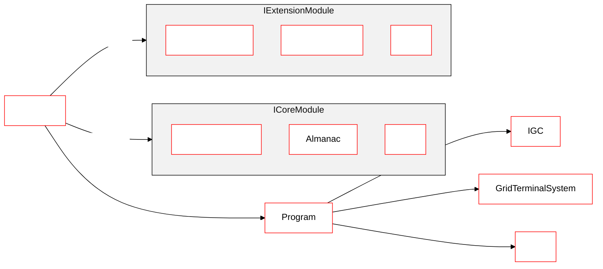
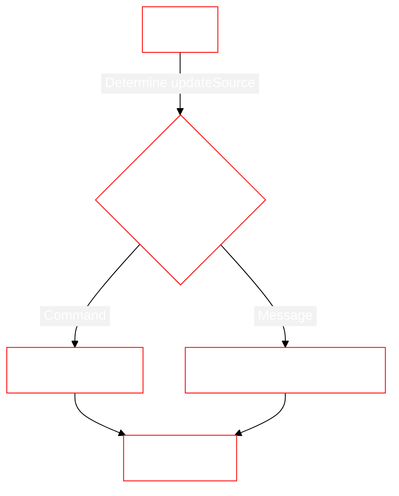
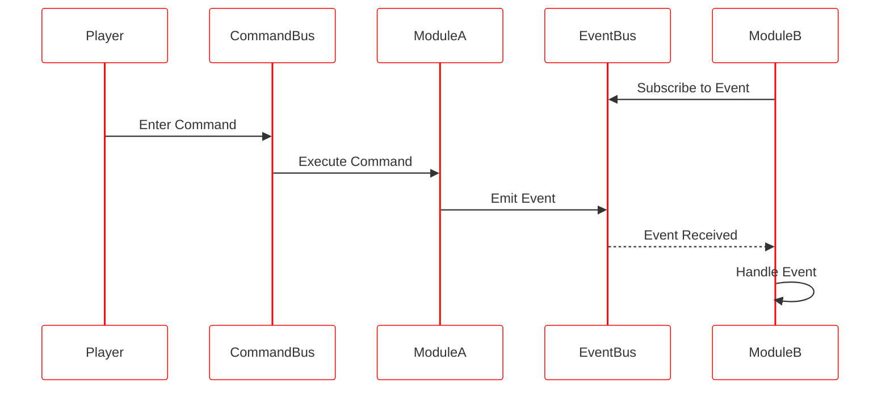
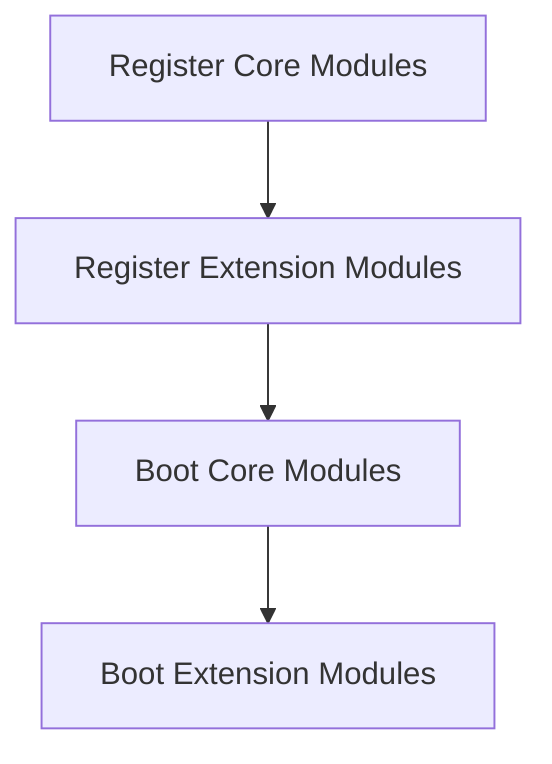
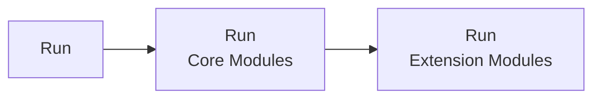

# Architecture Overview

::: warning
Mother requires a **Remote Control block** to function.  This allows us to leverage autopilot and flight data across our modules easily.
:::

[[toc]]
<!-- 1. Domain diagram showing commands/routines, events & general lifecyle, remote control block -->

## Entity Diagram


<!-- https://mermaid.js.org/config/theming.html#theme-variables -->


## Progam Lifecycle

Mother runs at a default speed of 6 ticks per second (Update10). This tolerance should be acceptable for most use cases. Each program cycle we *run* Mother.

```csharp title="Program.cs"
// The game will run this method every cycle
public void Main(string argument, UpdateType updateSource)
{
    // So we delegate to Mother
    Mother.Run(argument, updateSource);
}
```

The `Run` method is responsible for running all Extension Modules, managing incoming communications, and running scheduled actions. See [Clock](../CoreModules/Clock.md) for more information on scheduling and delaying actions.



```csharp title="Mother.cs"
public void Run(string argument, UpdateType updateSource)
{
    // Process commands/routines from player input
    if (!string.IsNullOrWhiteSpace(argument) && (updateSource == UpdateType.Terminal || updateSource == UpdateType.Trigger || updateSource == UpdateType.Script))
    {
        CommandBus.RunTerminalCommand(argument);
    }

    // Process IGC messages
    if (updateSource == UpdateType.IGC)
    {
        IntergridMessageService.HandleIncomingIGCMessages();
    }

    // Process scheduled tasks
    Clock.Run();
}
```

<!-- ```mermaid
``` -->

## Command Lifecycle

When a player runs a command, it is passed to the [Command Bus](../CoreModules/CommandBus.md).  The Command Bus then executes the command on the appropriate module.  The module may then emit an event, which is received by subscribed modules.



## Mother Instance

### System Attributes
Mother makes several properties widely available to your script to assist with common lookups.

For example, we can access the [Intergrid Communication System (IGC)](https://github.com/malware-dev/MDK-SE/wiki/Sandbox.ModAPI.Ingame.IMyIntergridCommunicationSystem) and [Grid](https://github.com/malware-dev/MDK-SE/wiki/VRage.Game.ModAPI.Ingame.IMyCubeGrid) instance via the following accessors on Mother:

```csharp title="ExampleModule.cs"
// via Mother (recommended)
IntergridCommunicationSystem IGC = Mother.IGC
IMyCubeGrid Grid = Mother.Grid


// via the Program instance
IntergridCommunicationSystem IGC = Mother.Program.IGC
IMyCubeGrid Grid = Mother.Program.Me.CubeGrid

```

### Boot

When Mother boots, many of the core modules do most of their work.  This aims to save a great deal of computation at runtime, reducing impact on gameplay.  During boot, the `Boot` method is called on all Core Modules, then all Extension Modules.




### Run



#### Scheduling an Action for Run
Sometimes it may be important to define custom time intervals you wish for a module or method to run over.  Mother's clock makes this easy.

Mother updates the Almanac every 2 seconds using the `Schedule` method.

```csharp title="ExampleModule.cs"
public void Boot()
{
    Mother.Clock.Schedule(DoExampleThings(), 2);
}

void DoExampleThings()
{
    // Do something
}
```

#### Queuing an action for later execution

You can queue and action for execution later with the `QueueForLater` method.  This is used to defer commands for later execution when the [`wait`](../../IngameScript/CommandLineInterface.md) command is used.

```csharp title="ExampleModule.cs"
public void DoSomethingAfterDelay()
{
    Mother.Clock.QueueForLater(
        () => DoSomething(),  // run the action...
        10 // ...after 10 seconds
    );
}
```

### Registering Modules

Mother makes it easy to register Extension Modules via the `RegisterModule` method:

```csharp title="Program.cs"
// Instantiate module
MissileGuidanceModule module = new MissileGuidanceModule(this);

// Register module with Mother
Mother.RegisterModule(module);
```

::: important
Extension Modules must conform the the `IExtensionModule` interface.
:::