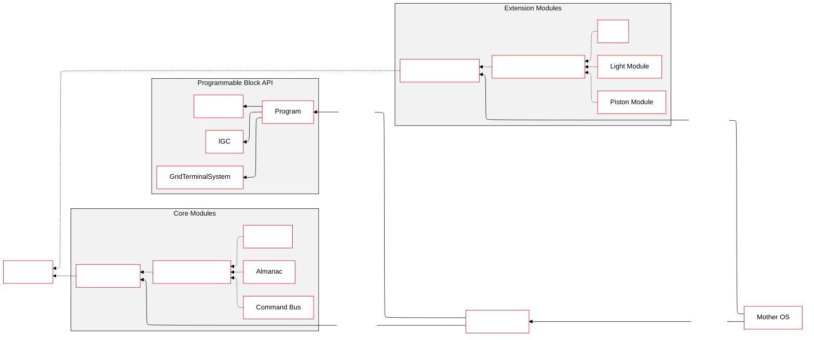
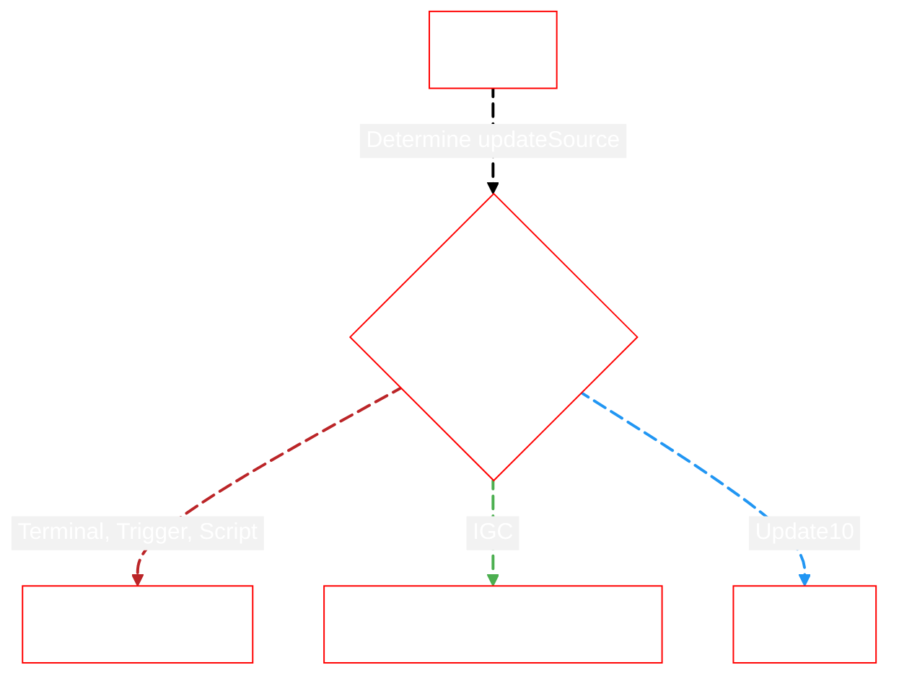
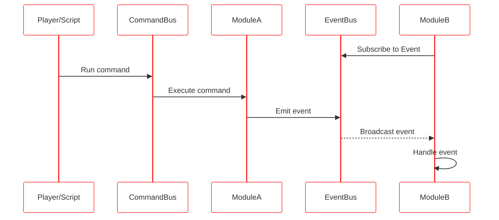

# Architecture Overview

::: warning
Mother requires a **Remote Control block** to function.  This allows us to leverage autopilot and flight data across our modules easily.
:::

[[toc]]
<!-- 1. Domain diagram showing commands/routines, events & general lifecyle, remote control block -->
 
## Entity Diagram

Let's look at the entity diagram for Mother OS which is the same as your custom script.  This shows the relationship between Mother OS, Mother Core, and the Program.  The Program is the entry point for all scripts.

  <!-- MotherOS["Mother OS"] e1@==> |Depends on| MotherCore
    e1@{animation: slow} -->


<!-- https://mermaid.js.org/config/theming.html#theme-variables -->


## Program Lifecycle

### Setting up Mother   
To use Mother, we need to create a `Mother` instance in our `Program` class. This is done in the constructor. We then register any extension modules we want to use.

```csharp title="Program.cs"
partial class Program : MyGridProgram
{
    private Mother mother;

    public Program()
    {
        // Create Mother instance
        mother = new Mother(this);

        // Register Extension Modules
        mother.RegisterModules(new List<IExtensionModule> { 
            new RotorModule(mother),
            new FlightControlModule(mother),
            ...
        });
    }
}
```

::: important
Extension Modules must conform the the `IExtensionModule` interface. It is recommend that you use the `BaseExtensionModule` class as a base class to leverage the library of useful helpers.
:::

### Booting the Script
Mother boots automatically when the script compiles.  Otherwise, the `Boot()` method can be called to force the boot process. Mother will boot all Core Modules, and then all Extension Modules in the order they were registered.

```csharp
Mother.Boot();
```

### Running the Script Each Cycle

The `Run()` method is responsible for running all registered modules, managing communications, and executing scheduled actions. See the [Clock](../CoreModules/Clock.md) for more information on scheduling and delaying actions. We ensure the program calls this method within the `Main()` method to delegate all further action to Mother.

:::info
Mother runs at a default speed of **~6 ticks/second**, or **every 0.166 seconds** . This tolerance should be acceptable for most use cases. Each cycle, Mother's `Run()` method is called which will then run all registered modules.

**UpdateType = UpdateType.Update10**
:::


```csharp title="Program.cs"
partial class Program : MyGridProgram
{
    // The game will run this method every cycle
    public void Main(string argument, UpdateType updateSource)
    {
        // So we delegate to Mother
        Mother.Run(argument, updateSource);
    }
}
```



## Command Lifecycle

Commands may be triggered via any one of the following methods:

|Method | Description |
|---|---|
| **Terminal** | Via the programmable block terminal. |
| **Toolbar Action** | Via a toolbar action using the programmable block's `Run` action. |
| **Button** | Via a button on a control panel that triggers the programmable block's `Run` action. |
| **Timer Block** | Via a timer block that triggers the programmable block's `Run` action. |
| **Event Controller** | Via an event trigger which runs the programmable block's `Run` action. |
| **Block Hooks** | Via a block's [hooks](../CoreModules/BlockCatalogue.md#hooks) triggered by state change. |
| **Remote Message** | Via a message sent from another grid using the [Intergrid Message Service](../CoreModules/IntergridMessageService.md). |

When a command is trigger it is passed to the [Command Bus](../CoreModules/CommandBus.md).  The Command Bus then executes the command on the appropriate module.



## Mother Instance

### System Attributes
Mother makes most common [Program](https://github.com/malware-dev/MDK-SE/wiki/Sandbox.ModAPI.Ingame.MyGridProgram) properties available to assist with common lookups.

```csharp title="MissileGuidanceModule.cs"
// via Mother (recommended)
IMyCubeGrid Grid = Mother.Grid
IMyGridTerminalSystem GridTerminalSystem = Mother.GridTerminalSystem
IMyProgrammableBlock ProgrammableBlock = Mother.ProgrammableBlock

// via the Program instance
IMyCubeGrid Grid = Mother.Program.Me.CubeGrid
IMyGridTerminalSystem GridTerminalSystem = Mother.Program.GridTerminalSystem
IMyProgrammableBlock ProgrammableBlock = Mother.Program.Me
```