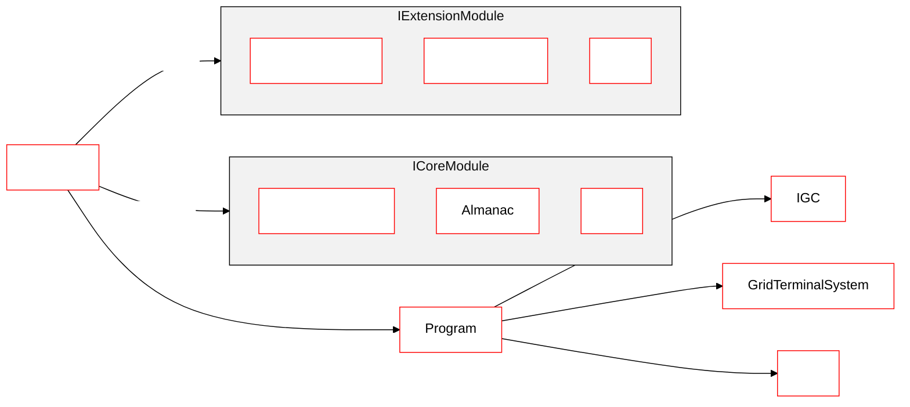
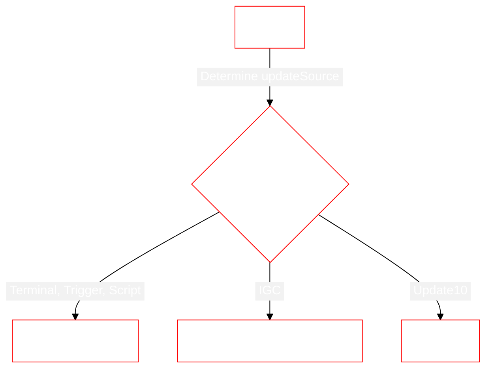
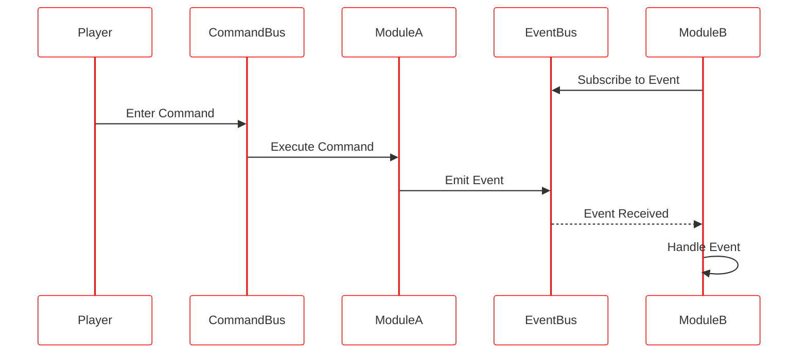
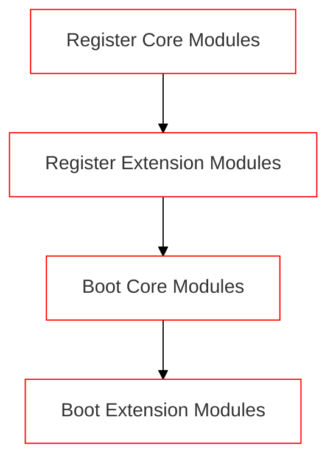
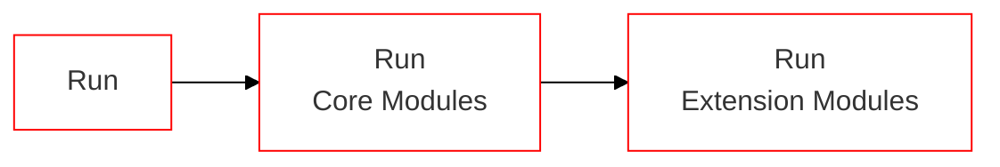

# Architecture Overview

::: warning
Mother requires a **Remote Control block** to function.  This allows us to leverage autopilot and flight data across our modules easily.
:::

[[toc]]
<!-- 1. Domain diagram showing commands/routines, events & general lifecyle, remote control block -->

## Entity Diagram


<!-- https://mermaid.js.org/config/theming.html#theme-variables -->


## Program Lifecycle

Mother runs at a default speed of 6 ticks per second (Update10). This tolerance should be acceptable for most use cases. Each program cycle we *run* Mother.

### Booting the Program
We boot Mother when instatiating the Program.  We instantiate Mother and register the extension modules we wish to include.  Finally, we boot Mother to ensure all of the modules are configured and ready to run.

```csharp title="Program.cs"
partial class Program : MyGridProgram
{
    private Mother mother;

    public Program()
    {
        // Instantiate Mother
        mother = new Mother(this);

        // Register Extension Modules
        mother.RegisterModules(new List<IExtensionModule> { 
            new RotorModule(mother),
            new FlightControlModule(mother),
            ...
        });

        // Boot Mother
        mother.Boot();
    }
}
```

::: important
Extension Modules must conform the the `IExtensionModule` interface.
:::

### Running the Program each cycle

The `Run` method is responsible for running all Extension Modules, managing incoming communications, and running scheduled actions. See [Clock](../CoreModules/Clock.md) for more information on scheduling and delaying actions. We ensure the program calls this method

```csharp title="Program.cs"
partial class Program : MyGridProgram
{
    // The game will run this method every cycle
    public void Main(string argument, UpdateType updateSource)
    {
        // So we delegate to Mother
        Mother.Run(argument, updateSource);
    }
}
```




```csharp title="Mother.cs"
public void Run(string argument, UpdateType updateSource)
{
    if (
        !string.IsNullOrWhiteSpace(argument) 
        && (updateSource == UpdateType.Terminal || updateSource == UpdateType.Trigger || updateSource == UpdateType.Script)
    )
    {
        GetModule<CommandBus>().RunTerminalCommand(argument);
        GetModule<Terminal>().UpdateTerminal();
        return;
    }

    if (updateSource == UpdateType.IGC)
    {
        GetModule<IntergridMessageService>().HandleIncomingIGCMessages();
        return;
    }

    // Otherwise we run all modules and assume a runtime update.
    RunModules();
}
```

```csharp title="Mother.cs"
void RunModules()
{
    AllModules.Values.ToList().ForEach(module => module.Run());
}
```

## Command Lifecycle

When a player runs a command, it is passed to the [Command Bus](../CoreModules/CommandBus.md).  The Command Bus then executes the command on the appropriate module.  The module may then emit an event, which is received by subscribed modules.



## Mother Instance

### System Attributes
Mother makes most common [Program](https://github.com/malware-dev/MDK-SE/wiki/Sandbox.ModAPI.Ingame.MyGridProgram) properties available to assist with common lookups.

```csharp title="MissileGuidanceModule.cs"
// via Mother (recommended)
IMyCubeGrid Grid = Mother.Grid
IMyGridTerminalSystem GridTerminalSystem = Mother.GridTerminalSystem
IMyProgrammableBlock ProgrammableBlock = Mother.ProgrammableBlock

// via the Program instance
IMyCubeGrid Grid = Mother.Program.Me.CubeGrid
IMyGridTerminalSystem GridTerminalSystem = Mother.Program.GridTerminalSystem
IMyProgrammableBlock ProgrammableBlock = Mother.Program.Me
```

### Boot

When Mother boots, many of the core modules do most of their work.  This aims to save a great deal of computation at runtime, reducing impact on gameplay.  During boot, the `Boot` method is called on all Core Modules, then all Extension Modules.




### Run



<!-- ### Registering Modules

Mother makes it easy to register Extension Modules via the `RegisterModule` method:

```csharp title="Program.cs"
// Instantiate module
MissileGuidanceModule module = new MissileGuidanceModule(this);

// Register module with Mother
Mother.RegisterModule(module);
``` -->