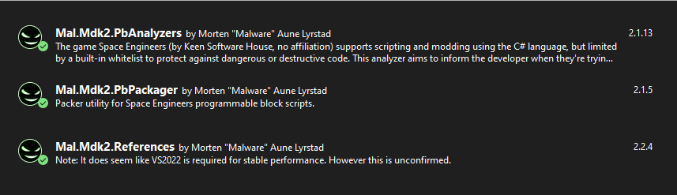
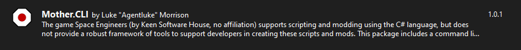
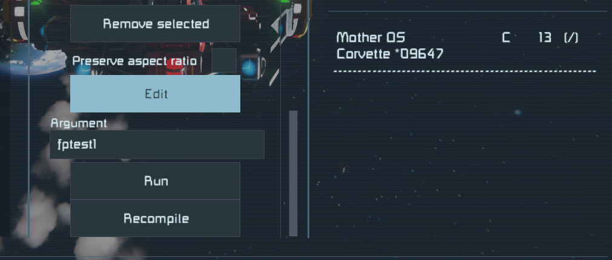
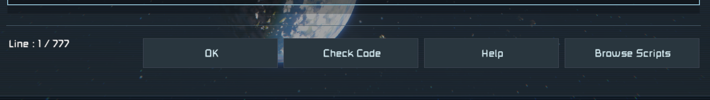
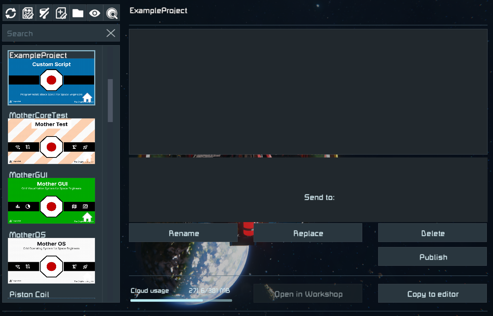
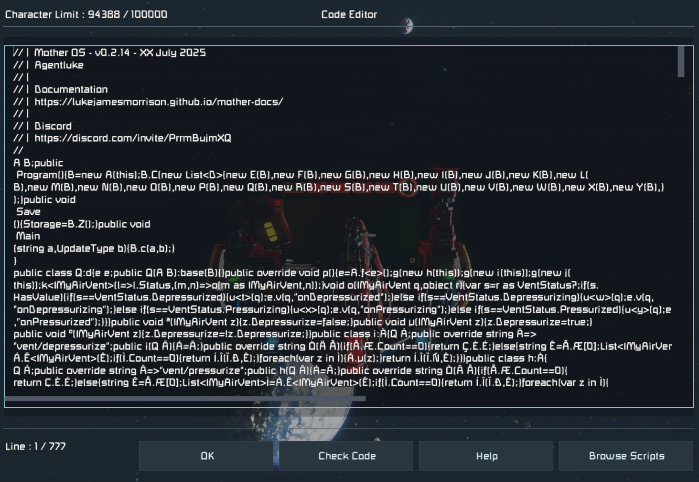

# Installation

Creating a custom Mother project is straight forward.  We will need an IDE like [Visual Studio](https://visualstudio.microsoft.com/), and several Nuget packages to get started.  After that you can use several console commands to simplify your development.

[[toc]]

## 1. Install MDK2

First you will need [MDK2](https://github.com/malforge/mdk2/wiki/Getting-Started-using-Visual-Studio), an amazing developer kit that Malware has created. I highly recommend Visual Studio for developing scripts. Trust me.



## 2. Install Mother CLI Nuget Package

To simplify building projects, you should install [Mother CLI](https://www.nuget.org/packages/Mother.CLI/) which will assist you in quickly building out your project so you can get right to work without worrying about wiring things up.



Install Mother CLI using the following command in your terminal:

```sh title="Console/Terminal"
dotnet tool install --global Mother.CLI
```

This will make the `mother` command available across your projects.

:::important
You should install Mother CLI as a **global** dotnet package.  Due to differing .NetFramework versions, it cannot be installed for a specific project.
:::

## 3. Create a new Project

Now that we have Mother CLI installed, we can simply create a new project in our current folder with the `new` command:

```sh title="Console/Terminal"
mother new ExampleProject
```

::: note
This framework only includes Core Modules shipped with the [Mother OS](../../../IngameScript/IngameScript.md) in-game script.
:::

After running the command, you should now have an `ExampleProject` folder containing your default project files.  With a few exceptions, this folder will look similar to the [MDK2](https://github.com/malforge/mdk2) Progammable Block Script template. Mother CLI will automatically download all Mother Core modules into your project.

**Example folder structure:**
```sh title="sds"
SpaceEngineersScripts/
├── ExampleProject/
    ├── Program.cs
    ├── thumb.png
    ├── Core/
    ├── Modules/
    ├── ...
├── Mother OS/
├── Mother GUI/
```

## 4. Create Your First Module

Mother scripts store all of their logic in *Modules*.  Developers can access many powerful features by extending the `BaseExtensionModule` class.  To make this simple, Mother exposes the `make:module` command to quickly create new modules with the necessary scaffolding.

```sh title="Console/Terminal"
mother make:module ExampleModule
```

You should now see an ExampleModule in the Modules folder:

```
ExampleProject/
├── Program.cs
├── thumb.png
├── Modules/
    ├── ExampleModule/
        ├── ExampleModule.cs
```

Not bad huh? We've only scratched the surface. Mother CLI can also [create commands and events](../Console.md).

## 5. Build your Project

Use `Ctrl + B` to build your script. The build tool should automatically save your script into the appropriate directory, for access in the game.

Scripts are typcially found in `C:\Users\{USER}\AppData\Roaming\SpaceEngineers\IngameScripts\local`

You now have everything you need to get started.  Check out [Creating a Module](../BuildingAModule/BuildingAModule.md) next for more info on Module creation and using terminal commands to expose functions to players easily.  

## 4. Play
When playing Space Engineers, your script should be available via the in game `Edit` menu on a Programmable Block.



The click `Browse Scripts` to view all available programmable block scripts.



`Double-click` the script thumbnail, or click `Copy to editor`:



Finally, click `Ok` and your script shoot immediately begin its boot sequence.

