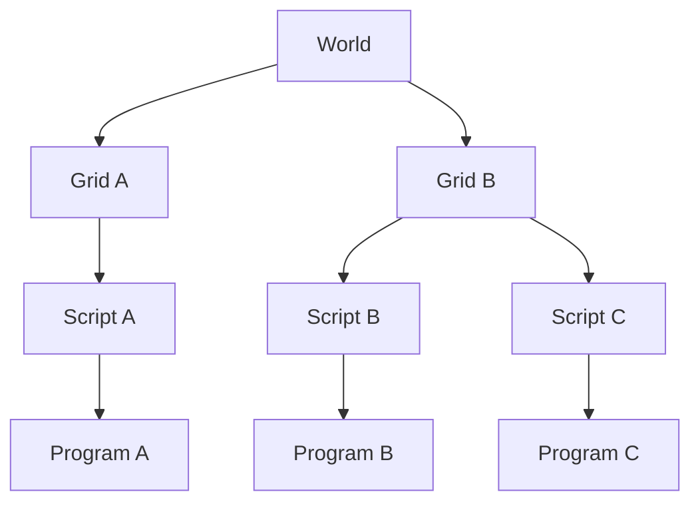

# Mother Testing Framework
This framework is designed to emulate the Space Engineers game world and provide access to a representative environment for the programmable block's `Program` class. It simulates the game clock, IGC and other Program methods and properties. This makes it easy to test your scripts without ever booting Space Engineers. It also supports setup of a multi-script environment for testing across multiple Program instances. Developers can test against their own program (ie. [Mother OS](../../../IngameScript/IngameScript.md)), or develop *modules* and *commands* using a mock Program instance.


[[toc]]

:::tip Why does this framework exist?
I grew tired of booting and testing Mother OS in-game. So much of my work did not require a live game instance, so as I have built several scripts with Mother Core, I have cohered a toolset that makes building on top of this core extremely simple. As MAPS *takes flight*, this framework will be instrumental in keeping our Engineers alive. I aim to enable script developers a new level of confidence and agility as they build the next generation of Space Engineers programmable block scripts. 

> If you ask 'Should we be in space?' you ask a nonsense question. We are in space. We will be in space
> ― Frank Herbert
:::

## Quick Example

We want to test the light/color command. We boot a Script, attach a light block to its grid, and then run the command via the terminal. We validate that the light has changed color and the command has been executed.

```csharp title="LightModule.Tests.cs"
[Test]
public void LightColor_Command_Can_Set_Searchlight_Color()
{
    var searchlight = TerminalBlockFactory.Create<IMySearchlight>("Beacon");

    var script = ScriptFactory<Program>()
        .WithMother()
        .WithBlock(searchlight)
        .Boot();

    script.RunTerminal("light/color Beacon red");

    Assert.That(searchlight.Color, Is.EqualTo(new Color(255, 0, 0)));
    script.ShouldHaveExecuted("light/color");
}
```
 Not bad. The fluency of this interface is maintained throughout this framework and aims to make writing tests as frictionless as possible. 

## Installation

This testing framework comes with every new installation of Mother Core using [Mother CLI](./Console.md). Otherwise, it can be copied manually from the Mother Core project on GitHub and been loaded as a `*.Tests.proj` project.


## Architectural Overview

The test harness is built around a few layers:

- **World**: Multi-script topology, communication, and orchestration.
- **Script**: Wrapper for a single booted programmable block `Program.cs` instance.
- **Module**: A single module containing custom behavior in a booted script.
- **Command**: Player command execution behavior (usually tested from module or script context).

:::tip
When in doubt, write a [Script-based test](#_2-setting-up-a-script). This is easy to change later and immediately situates you in the context of a single script that can send and receive communications on a simulated clock system.
:::



## Configuration

The framework keeps the same compatibility contract as your programmable blocks script.

- Target framework: netframework48
- Language version: C# 6

```xml title="Script.proj"
<TargetFramework>netframework48</TargetFramework>
<LangVersion>6</LangVersion>
```

## Running Tests

Run the full MotherCore test project:

```powershell title="PowerShell"
dotnet test .\MotherOS\tests\MotherOS.Tests\MotherOS.Tests.csproj
```

Run focused slices:

```powershell title="PowerShell"
dotnet test .\MotherOS\tests\MotherOS.Tests\MotherOS.Tests.csproj --filter "FullyQualifiedName~LightModuleTests"
```

<!-- ## Test Setup -->

## Testing a World
Use world-first setup when testing multiple scripts, command routing, or intergrid communication.

### Setting up a basic world
When booting a world, we are also creating all of the necessary framework to store knowledge of grids, and broker messages between then with a mock IGC.

```csharp title="*.Tests.cs"
// Boot a generic world
var world = WorldFactory().Boot();
```

### Adding grids to a world

Use world/grid helpers before booting scripts when you need explicit topology or block placement on specific grids.

```csharp title="*.Tests.cs"
// Boot world
var world = WorldFactory().Boot();

// create grid within world
var grid = world.CreateGrid();

// create grid with a custom name
var grid = world.CreateGrid("Mothership");
```

### Adding scripts to a world

```csharp title="*.Tests.cs"
// Boot world
var world = WorldFactory().Boot();

// Boot a script with Mother Core loaded
var sender = world.CreateScript("Sender").WithMother().Boot();
```

### Communicating Between Scripts

Scripts can easily join the same IGC network with the `OnNetwork` method of the `Script` object. It accepts an optional argument where a [specific network](#setup-a-script-on-a-specific-network) can be provided. Using `OnNetwork` without an argument will join the default world IGC.

```csharp title="*.Tests.cs"
// Boot world
var world = WorldFactory().Boot();

// Create two scripts on the same default network, with Mother loaded
var scriptA = world.CreateScript("scriptA")
    .WithMother()
    .OnNetwork()
    .Boot();

var scriptB = world.CreateScript("scriptB")
    .WithMother()
    .OnNetwork()
    .Boot();

// Run a terminal action on scriptA
scriptA.RunTerminal("@scriptB help");

// Deliver messages through network
world.DeliverMessages()

// Assert communication was delivered
scriptB.ShouldHaveExecuted("help");
```
We can also define a custom network for scenarios where we want to manage multiple within a single gameworld to emulate factions, etc.

```csharp title="*.Tests.cs"
// Create a custom network
var customNetwork = new FakeIGCNetwork();

// Create a script on the custom network
var script = world.CreateScript()
    .WithMother()
    .OnNetwork(customNetwork)
    .Boot();
```

We use the `DeliverMessages()` method on the `World` object to simulate the delivery of all messages queued in the IGC via the `SendBroadcastMessage()` and `SendUnicastMessage()` methods of [IMyIntergridCommuncationSystem](https://malforge.github.io/spaceengineers/pbapi/Sandbox.ModAPI.Ingame.IMyIntergridCommunicationSystem.html).

- `DispatchIgc()` when you need transport-only dispatch.

### Controlling the Clock

- `Tick(...)` for full world cycles.

## Testing a Script

If you do not need to worry about world-level configuration, or a multi-script setup, then you can use the `ScriptFactory` to quickly setup sctipts for testing. We can create a generic `Program`, or one built with Mother Core. To test a specific program instance, we use the Program as a type arguement.

### Booting a script

```csharp title="*.Tests.cs"
// Boot a generic script (MDK2 default)
var script = ScriptFactory().Boot();

// Boot a script with Mother Core
var script = ScriptFactory().WithMother().Boot();

// Boot a specific instance of a generic Program 
var script = ScriptFactory<Program>().Boot();

// Boot a specific instance of a Mother Program
// ie. MotherOS.Program, MotherGUI.Program
var script = ScriptFactory<Program>().WithMother().Boot();
```

### Setup a script on a specific network

```csharp title="*.Tests.cs"
// Create script with new "MainNetwork" IGC network 
// that can be joined by other scripts
var script = ScriptFactory()
    .WithMother()
    .OnNetwork("MainNetwork")
    .Boot();

// Create script with a custom network
var customNetwork = new FakeIGCNetwork();

// Create a script on the custom network
var script = world.CreateScript()
    .WithMother()
    .OnNetwork(customNetwork)
    .Boot();
```

### Using Mother

When our script has Mother Core installed, we can take advantage of the `Mother` property on the script as an easy accessor to our Mother instance. This allows you to circumvent any interaction with the `Program` class.

```csharp title="*.Tests.cs"
// Create a script
var script = ScriptFactory().WithMother().Boot();

// Access Mother's awesomeness
var mother = script.Mother;
```

### Accessing Modules

The `Boot` method generates a script with a fully-booted instance of the Program. If no `Program` argument is provided, Mother boots with no Extension Modules.

```csharp title="*.Tests.cs"
// Create a script with Mother OS Program instance
var script = ScriptFactory<MotherOS.Program>().WithMother().Boot();

// Get module from Mother
var module = script.Mother.GetModule<LightModule>();
```

### Running Terminal Commands

We can easily simulate a terminal command using the `RunTerminal` method. This simulates the a player terminal input with Mother Core uses to trigger activity. 

```csharp title="*.Tests.cs"
// Boot a script with Mother
var script = ScriptFactory<Program>().WithMother().Boot();

// Run a terminal command
script.RunTerminal("rename Frigate");

// Assert command was executed
script.ShouldHaveExecuted("rename");
Assert.That(script.Mother.name, Is.EqualTo("Frigate"));
```

### Running the Program
The `RunToIdle` method runs down any queued activity in the `ClockModule` to ensure all actions complete.

```csharp
// Run with script-default update type
script.Run()

// Run with custom update type and empty argument
script.Run(UpdateType.Update10)

// Helper for running UpdateType.Terminal and UpdateType.Trigger
script.RunTerminal("ping")
script.RunTrigger("help")

// Execute any activity queued in Clock
script.RunToIdle();
```

### Connecting Grids with Mechanical Blocks

One of Mother Core's highest value proposition is the resolution of grid vs. construct when it comes to connectors and mechanical block connections. We can use the `ConnectGrids` method to simulate the joining of two grids together via a Rotor, Hinge, or Piston.

```csharp title="*.Tests.cs"
// Create our script with an associated programmable block and grid
var script = ScriptFactory().WithMother().Boot();

// create second grid
var cargoGrid = GridFactory.Create("Cargo Pod");

// Connect to grids with a mechanical block - default = Rotor
var mechanicalBlock = script.ConnectGrids(script.PrimaryGrid, cargoGrid);

// Or connect with a specific connection type
var mechanicalBlock = script.ConnectGrids(
    script.PrimaryGrid, 
    cargoGrid,
    MechanicalConnectionKind.Piston
);
```

We can then assert that grids are on the same construct now:

```csharp title="*.Tests.cs"
script.ShouldBeSameConstruct(script.PrimaryGrid, cargoGrid);
```


### Connecting Grids with Merge Blocks


## Testing a Module

When we are focused on the logic within a single module, we can use the `ModuleFactory` to create the module instance. We provide module and program type arguements to configure our script.

```csharp title="LightModule.Tests.cs"
// Create a LightModule instance in the Program instance
var module = ModuleFactory<LightModule, Program>().Boot();

// Call a method on the module
module.SetColor(...)
```

<!-- ### 4. Setting Up a Command
#### Setup a module with a command

Prefer module-context-first command setup in module tests.

```csharp title="*.Tests.cs"
var command = ModuleFactory<DoorModule, Program>()
    .Command<OpenDoorCommand>();
``` -->

## Assertion Helpers

Use helper assertions first, then inspect low-level transport or counters only when necessary.

### 1. FakeWorld assertion helpers

- `ShouldHaveDeliveredIgcMessage(sender, receiver, "*")`
- `ShouldHaveNoPendingMessages()`

### 2. FakeScript assertion helpers

- `ShouldHaveExecuted("command/name")`
- `ShouldHavePrinted("expected output")`
- `ClearEventEmissions()` to isolate event assertions between transitions.
- `AssertEventEmitted<TEvent>()` and `AssertEventEmitted<TEvent>(count)`


## Generic Program Support

The harness works with scripts scaffolded by MDK2 and booted from `MyGridProgram`. You can still take advantage off all `World` and `Script` helpers that do not relate to Mother.

```csharp title="*.Tests.cs"
var script = ScriptFactory<Program>().Boot();
var program = script.Program;

program.Echo("Hello")
script.ShouldHavePrinted("Hello");
```

::: important
Developers building on Mother Core get richer world/script/module/command helpers while staying compatible with the baseline `MyGridProgram` model.
:::

## Examples

#### Modules

```csharp title="LightModule.Tests.cs"
[Test]
public void SetColor_Sets_Color_For_Lighting_Blocks()
{
    var module = ModuleFactory<LightModule, Program>().Boot();
    var light = TerminalBlockFactory.Create<IMyLightingBlock>();
    var searchlight = TerminalBlockFactory.Create<IMySearchlightBlock>();

    module.SetColor(light, Color.Blue);
    module.SetColor(searchlight, Color.Red);

    Assert.That(light.Color, Is.EqualTo(Color.Blue));
    Assert.That(searchlight.Color, Is.EqualTo(Color.Red));
}
```