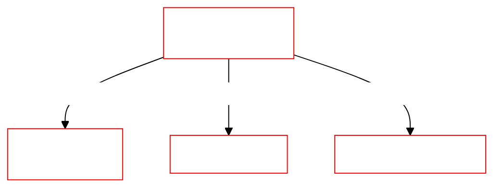

# Framework


Mother Core is a framework for developing custom Programmable Block scripts for Space Engineers. It enables you to build interoperable modules to suit the specific needs of your ship or station. [Mother OS](../IngameScript/IngameScript.md) is built with Mother Core and a collection of extension modules.

Get started with:

1. [Create an Extension Module](./Developer/ExtensionModules/ExtensionModules.md)
2. [Creating a Custom Terminal Command](./Developer/ExtensionModules/ExtensionModules.md#commands)
3. [Sending and Receiving Messages](./Developer/CoreModules/IntergridMessageService.md) 
4. Schedule and Delay Actions

## Overview

Scripts built with Mother Core depend on the [Program](https://github.com/malware-dev/MDK-SE/wiki/Sandbox.ModAPI.Ingame.MyGridProgram) instance, and a collection of [Core Modules](./Developer/CoreModules/CoreModules.md).  These core modules provide a wide range of functionality, including intergrid communication, event handling, and block management. Developers can add their own functionality via **Extension Modules**.



## The Extension Module
Developers can add new functionality to their program by creating an [Extension Module](./Developer/ExtensionModules/ExtensionModules.md). These modules are registered at boot time. They may access all other modules directly and respond to changes when other modules emit events.

```csharp title="MissileGuidanceModule.cs"
class MissileGuidanceModule : BaseExtensionModule
{
    // Boot the module
    public void Boot()
    {
        // Reference important modules
        FlightPlanningModule = Mother.GetModule<FlightPlanningModule>();

        // Register custom terminal commands
        RegisterCommand(new LaunchCommand(this));
        RegisterCommand(new DetonateCommand(this));

        // Load relevant blocks from the grid
        Thrusters = Mother.BlockCatalogue.GetBlocks<IMyThrust>();

        // Listen for events
        Subscribe<ConnectorUnlockedEvent>();
    }

    // Run module every program cycle
    public override void Run()
    {
        UpdateThrusters()
    }
}
```
