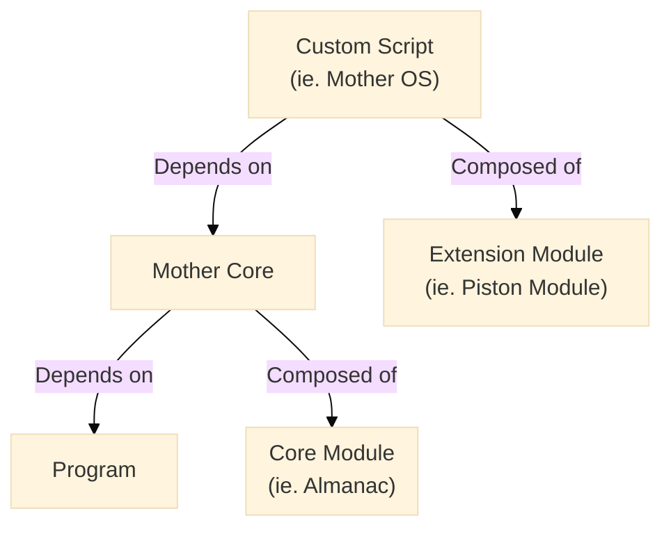

<script setup>
import { ref, computed, onMounted } from 'vue'

const isDark = ref(false)

const getDarkMode = () => {
    const theme = document.documentElement.getAttribute('data-theme')
    isDark.value = theme === 'dark'
}

onMounted(() => {
    const observer = new MutationObserver(getDarkMode)
    observer.observe(document.documentElement, { attributes: true, attributeFilter: ['data-theme'] })
})

// const isDark = computed(() => {
//     return true;
//     return document.documentElement.classList.contains('dark')
// })
</script>

<!-- {{isDark ? 'Dark Mode' : 'Light Mode'}} -->

# Mother Core (Script Framework)
<!--  -->
<!-- <Badge type="info" text="&nbsp;Beta&nbsp;" vertical="middle" /> -->
<!-- <Badge type="tip" text="&nbsp;v1.0.0&nbsp;" vertical="middle" /> -->
<!--  -->
[](https://github.com/lukejamesmorrison/mother-core)


Mother Core is a framework for developing custom Programmable Block scripts for Space Engineers. It enables you to build interoperable modules to suit the specific needs of your ship or station. [Mother OS](../IngameScript/IngameScript.md) is built with Mother Core and a collection of extension modules.

[[toc]]

## Common Activities

1. [Installation](./Developer/GettingStarted/Installation.md)
2. [Create a Module](./Developer/BuildingAModule/BuildingAModule.md)
3. [Create a Command](./Developer/BuildingAModule/BuildingAModule.md#creating-a-command)
4. [Send a Message](./Developer/CoreModules/IntergridMessageService.md) 
5. [Delay an Action](./Developer/CoreModules/Clock.md)
6. [Retrieve a Block](./Developer/CoreModules/BlockCatalogue.md#accessing-blocks)

## Overview

Scripts built with Mother Core depend on the [Program](https://github.com/malware-dev/MDK-SE/wiki/Sandbox.ModAPI.Ingame.MyGridProgram) instance, and a collection of [Core Modules](./Developer/CoreModules/CoreModules.md).  These core modules provide a wide range of functionality, including intergrid communication, event handling, and block management. Developers can add their own functionality via **Extension Modules**.

<!-- %%{
  init: {
    'theme': 'base',
    'themeVariables': {
        'primaryColor': '#BB2528',
        'primaryTextColor': '#fff',
        'primaryBorderColor': '#7C0000',
        'mainBkg': 'white',
        'nodeBorder': 'red',
        'lineColor': 'black',
        'secondaryColor': 'white',
        'secondaryBorderColor': 'black',
        'tertiaryColor': '#F2F2F2',
        'tertiaryBorderColor': 'black'
    }
  }
}%% -->



## Recommended File Structure

A **Module** is the primary unit of functionality.  Therefore modules should in most cases manage their own commands and events.  This allows modules to be self-contained and reusable across different scripts. Mother Core and [Mother OS](../IngameScript/IngameScript.md) observe the following file structure:

```plaintext title="File Structure"
/
├── Program.cs
├── thumb.png
├── Modules/
    ├── MissileGuidanceModule/
        ├── MissileGuidanceModule.cs
        ├── Commands/
            ├── LaunchCommand.cs
            ├── DetonateCommand.cs
        ├── Events/
            ├── MissileLaunchedEvent.cs
            ├── MissileDetonatingEvent.cs
```

## The Program Wrapper

We use the existing `Program` wrapper created using [MDK2](https://github.com/malforge/mdk2), but with a few modifications that allow Mother to do her thing.  We register our Modules in the constructor, and hook into the `Save()` and `Run()` methods to give Mother complete control.

```csharp
partial class Program : MyGridProgram
{
    private Mother mother;

    // Program constructor
    public Program()
    {
        // Create the Mother instance
        mother = new Mother(this);

        // Register Extension Modules
        mother.RegisterModules(new List<IExtensionModule> {
            new DoorModule(mother),
            new LightModule(mother),
            new MissileGuidanceModule(mother),
            ...
        });
    }

    // Save before recompile or when triggered
    public void Save() {
        Storage = mother.Save();
    }

    // Run Mother each time the Program runs
    public void Main(string argument, UpdateType updateType) {
        mother.Run(argument, updateType);
    }
}
```

## The Extension Module
You can add new functionality to the program by creating an [Extension Module](./Developer/BuildingAModule/BuildingAModule.md). These modules are registered in the `Program` constructor using the `RegisterModules()` method. They may access all other modules directly and respond to changes when other modules emit [Events](Developer/BuildingAModule/BuildingAModule.md#events).

We will use the `MissileGuidanceModule` as our example.  It provides functionality to launch and detonate missiles, and updates the thrusters on each program cycle.

```csharp title="MissileGuidanceModule.cs"
class MissileGuidanceModule : BaseExtensionModule
{
    // Boot the module
    public void Boot()
    {
        // Reference important modules
        FlightPlanningModule = Mother.GetModule<FlightPlanningModule>();

        // Register custom terminal commands like 'detonate' and 'launch'
        RegisterCommand(new LaunchCommand(this));
        RegisterCommand(new DetonateCommand(this));

        // Load relevant blocks from the grid
        Thrusters = Mother.GetModule<BlockCatalogue>().GetBlocks<IMyThrust>();

        // Listen for events
        Subscribe<MissileLaunchedEvent>();
    }

    // Run module every program cycle
    public override void Run()
    {
        UpdateThrusters()
    }

    // Do something...
    void UpdateThrusters() { 
        Thrusters.ForEach(thruster => {
            // ...
        })
    }
}
```

As you can see, connecting logic with Modules is easy and most of it is done in the `Boot()` method.

<!-- Let's go into [building a module](./Developer/BuildingAModule/BuildingAModule.md) in more detail. -->

