# Command Line Interface (CLI)

Mother's command line interface allows you to interact with your grid.  We can pass in *arguments* to the script to perform different actions.  The CLI is available in the programmable block terminal, and you can run it by hitting the `Run` button (or using the Run action) with an argument.

[[toc]]

::: tip
See the [Cheatsheet](Cheatsheet.md) to get started!
:::

**Command Syntax**
```bash
<Command> <Argument,> [Option,]
```

Multple commands together form a *routine*:

```bash title="Terminal"
# commmand - set a light color
light/color LandingLight red; 

# routine - set a light color and make it blink
light/color LandingLight red; light/blink LandingLight fast;
```
<br>

<!-- [](https://www.youtube.com/watch?v=Ax5bhoeutcA) -->

<iframe width="100%" height="300" src="https://www.youtube.com/embed/Ax5bhoeutcA?si=B2aE2rusI70_tcJg" title="YouTube video player" frameborder="0" allow="accelerometer; autoplay; clipboard-write; encrypted-media; gyroscope; picture-in-picture; web-share" referrerpolicy="strict-origin-when-cross-origin" allowfullscreen></iframe>


## Anatomy of a Command
Commands are similar to a traditional command line interface, and consist of 3 *terms*:

| Term Type  | Example | Description |
| --------	|-| ------- |
| Command	| `hinge/rotate`<br>`light/color`<br>`help` | The command determines which action is performed by Mother.  See the [Command Cheetsheet](Cheatsheet.md) for a complete list of commands, or run Mother with the `help` command.  |
| Argument	| `Hinge`<br>`45`<br>`"Rotor 1"`<br>`#main-airlock`| Arguments are expected by most commands and contain the details they require to operate.  This is usually values like angle, color or a GPS waypoint. Use double quotes when your arguments include spaces. In most cases, the first argument of command will target a **Block**, **Group**, or **Tag** by its name. |
| Option	| `--speed=2`<br>`--offset=0.1`<br>`--force` |Options can be used with commands to trigger specific modifications like rotational speed or blink offset. Sometimes they may be used without a set value.  |

## Running a Command

Let's start with an simple example, where a rotate a Hinge block:

```bash title="Terminal"
hinge/rotate Hinge 45;
```

We can see the [`hinge/rotate`](../IngameScript/Modules/Extension/HingeModule.md#rotate) command targets the block named `Hinge`, and rotates it to `45` degrees. If we wanted to rotate the hinge at 2 RPM, we can add the `speed` option:

```bash title="Terminal"
hinge/rotate Hinge 45 --speed=2;
```

::: important
 Running `help` in the Programmable Block terminal will show all available commands.  
:::

### Targeting Blocks

#### By Block Name
You can target blocks by their name, via a terminal group, or using a tag.  In our main airlock we have two lights. First we will target them specifically by name:

```bash title="Terminal"
light/color AirlockLightInner red;
light/color AirlockLightOuter red;
```

#### By Group Name
Using multiple block names is verbose, so let's create a group with these our blocks called `AirlockLights`. Now we can run the following command:

```bash title="Terminal"
light/color "Airlock Lights" red;
```

#### By Tag
As you add more connected ships to your grid, you will quickly notice that groups merge, and the terminal window becomes quite busy with block groups. Mother offers a 3rd way to select blocks using **tags**.

```text title="Terminal"
light/color #airlock red;
```

You'll notice that we don't specify *lights* in the above command. This is because tags allow us to include multiple block types, and use the command to determine which block should be operated.  Similar to above, we can close both airlock doors if we also use the tag `#airlock`:

```text title="Terminal"
door/close #airlock;
```

##### Defining a Tag
Tags are defined within a block's Custom Data:

```ini title="AirlockLightInner > Custom Data"
[general]
tags=airlock,airlock-light
```


## Running a Routine

### Using the Terminal
Sometimes it is useful to group commands into a series of actions.  A `Routine` is simply a group of commands separated by a semi-colon `;` that execute in sequence.  The following example changes the color of our `LandingLight`, and also initates a blinking effect.

```bash title="Terminal"
light/color LandingLight red; light/blink LandingLight 0.5 --length=0.5;
```
The light will blink for 0.25s, every 0.5s (50% duty cycle).

### Custom Commands and Routines

The command syntax can get verbose in the terminal, so it is recommended that you define routines in the `commands` section of Mother's **Custom Data**. We can use a multi-line syntax to make it much more readable:

```ini title="Mother > Custom Data"
[Commands]
; Single line
ExtendArm=wait 2; piston/distance LandingArm 3;

; Multi-line
ActivateLandingLight=
| light/color LandingLight red;
| light/blink LandingLight 0.5 --length=0.5;
```

::: tip
The pipe character `|` is used to indicate a new line within Custom Data.  This is not required in the Programmable Block terminal. This only allows us to organize our commands and routines across multiple lines within Custom Data. See [MyIni](https://github.com/malware-dev/MDK-SE/wiki/VRage.Game.ModAPI.Ingame.Utilities.MyIni) for more information.
:::

Now we can run `ActivateLandingLight` in the terminal to execute the routine, or get clever and set it as an *Action* in an Event Controller, or a *hook* on a [Sensor](./Modules/Extension/SensorModule.md).

```sh title="Terminal"
ActivateLandingLight; ExtendArm;
```

## Delaying Command Execution
Mother comes with a `wait` command that allow you to delays a command for execution in seconds.

```bash title="Terminal"
door/open AirlockDoor;
wait 10;
door/close AirlockDoor;
```

This works remotely as well. Imagine we want to run the `Arm` command stored on the `StealthMissile` grid:

```bash title="Terminal"
@StealthMissile fcs/start; wait 10; _Arm;
```

## The Terminal Window

The terminal window act as the primary interface for Mother.  You can run commands directly in the terminal, and you will receive immediate feedback from the script. The window also shows several indicators as relevant:

|Indicator	| Description|
|-			|-|
|#			| A number showing how many grids Mother is currently storing in the Almanac. Mother stores the position and status of other grids automatically as long as they are running Mother locally as well. |
|M			| Shows a mechanical system is currently in motion and tracked by the Activity Monitor.  Blocks like rotors, hinges and pistons will be monitored, and locked when finished to protect Space Engineers from the Almighty Clang.|
|C			| Indicates a communication is current in progress.  Grids running Mother will frequently communicate to share information automatically. |
|Q			| Indicates that a command is queued for future execution at a waypoint. |
|A			| Indicates that autopilot is currently enabled. |
|W          | Indicates that a command is currently waiting to be exeucuted at a later time via the `wait` command. |


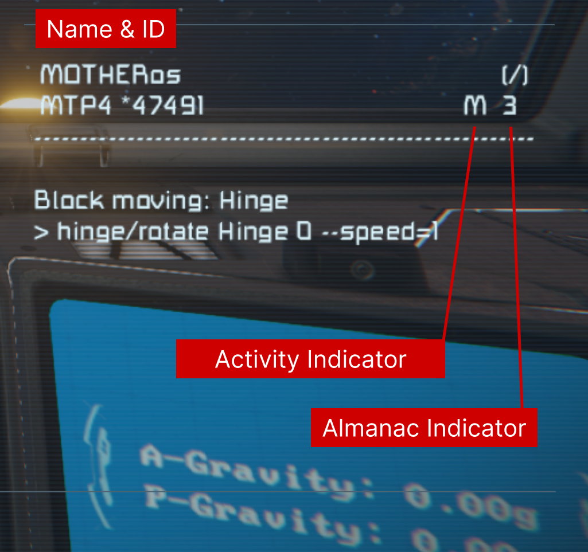


## Running Commands Automatically

You can run commands via several methods:

1. [Programmable Block terminal](#programmable-block-terminal-mother)
2. [Cockpit or Control Station toolbar action](#cockpitcontrol-station-toolbar)
3. [Button action](#button)
4. Event Controller action
5. Timer Block action

### Programmable Block Terminal (Mother OS)

From within your Programmable Block terminal, you can run commands directly.  This is the easiest way to interact with Mother and you will receive immediate feedback in the terminal window.

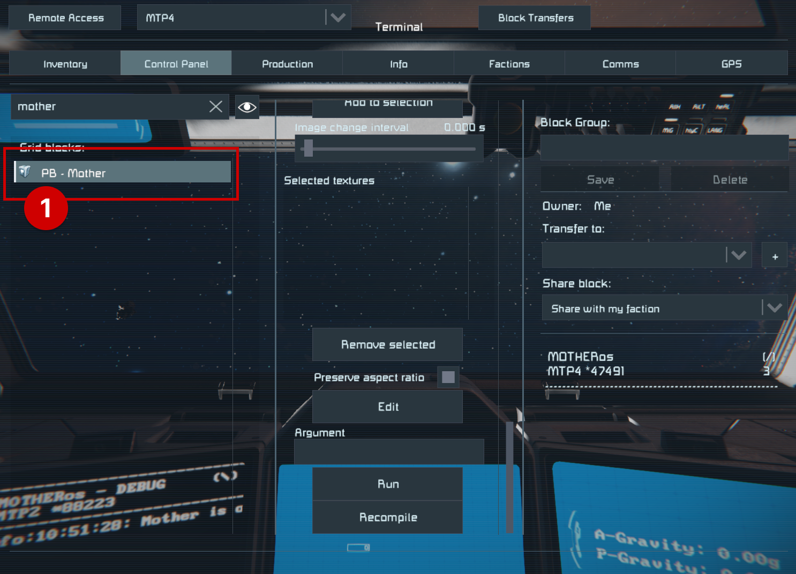

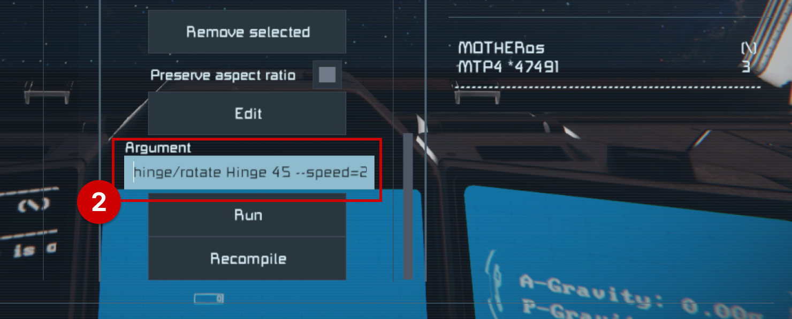

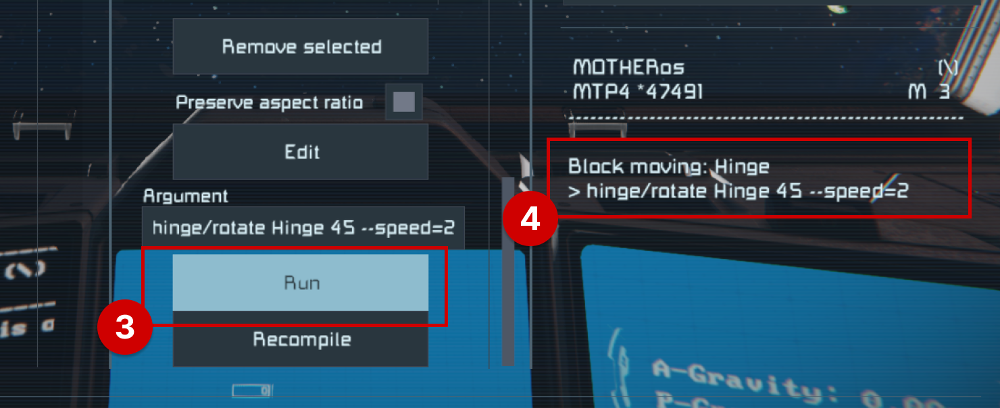


### Cockpit/Control Station Toolbar

When you're flying a ship or sitting at a control station, you can add a button to your toolbar that will run a command when pressed.  This is useful for quick actions like toggling lights or opening doors. To do this, assign the Programmable Block running Mother to the toolbar, and use the `Run` action.  A window will appear asking you for an argument - type your command here and click `Confirm`. You can also set a short label for the button to make it easier to identify.

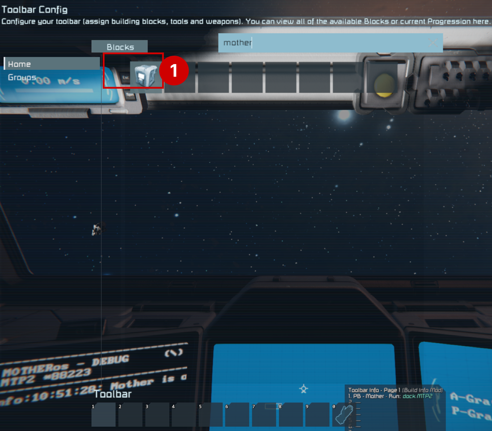

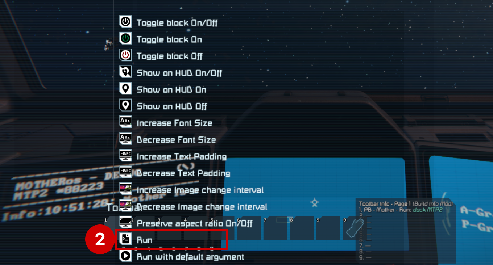

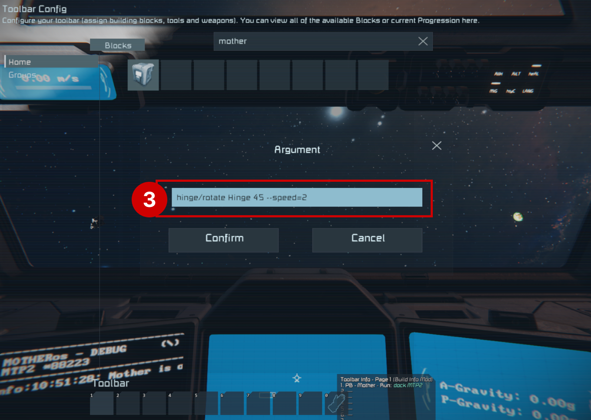

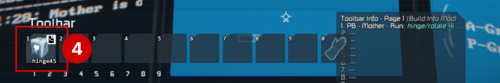

### Button

Like a toolbar, you can also assign a command to a button.  This is useful for quick actions like toggling lights, or initiating a return-to-base procedure for a wandering grid.  To do this, assign the Programmable Block running Mother to the button action, and use the `Run` action.  A window will appear asking you for an argument - type your command here and click `Confirm`. You can also set a short label for the button.

::: tip
Due to the way Space Engineers shows button actions to the player, we are unable to see which command the button runs.  It is recommended to make your button positions intuitive, or to label them with a sign.
:::

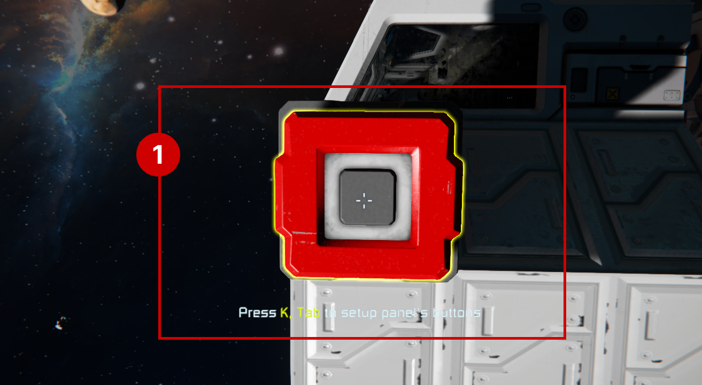

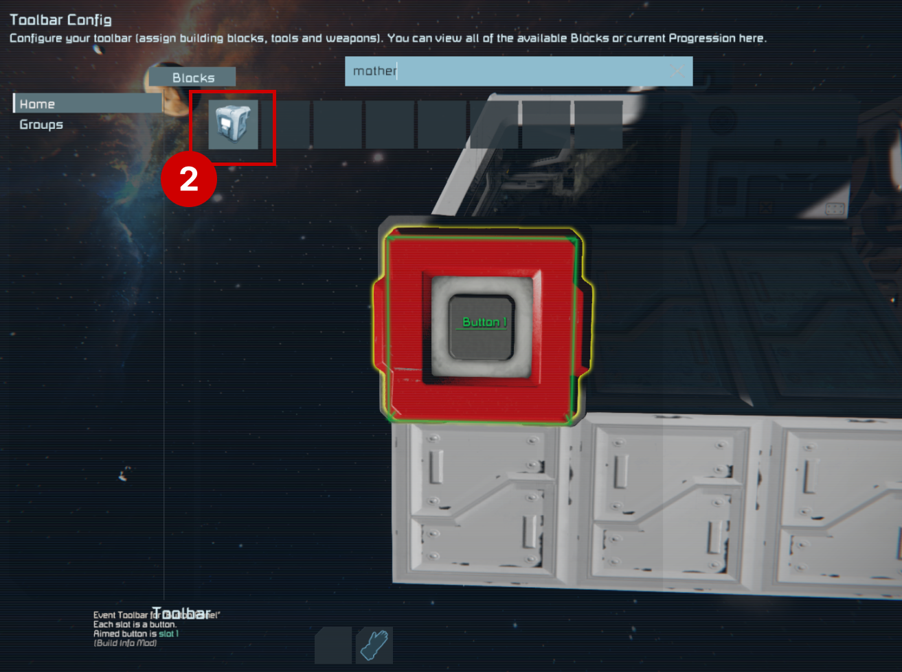

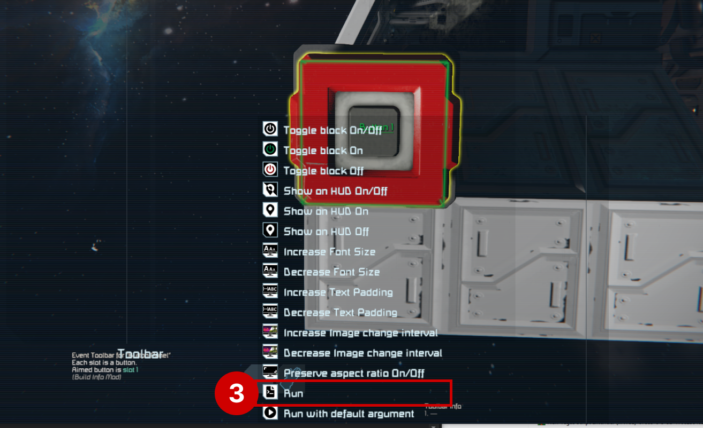

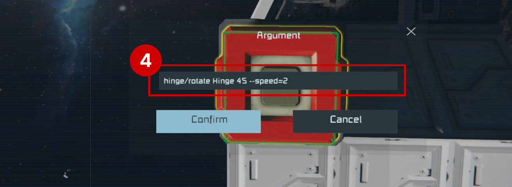

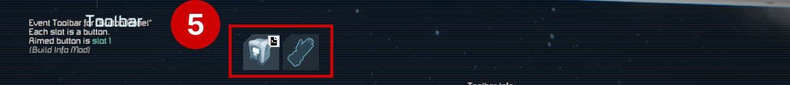

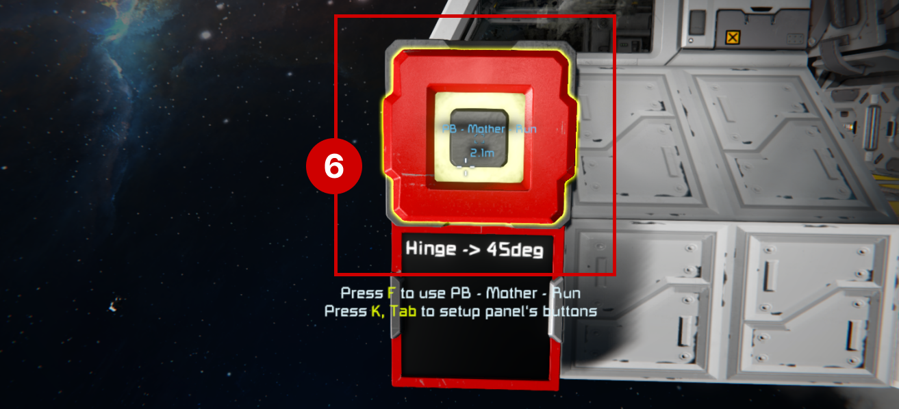

<!-- [Configuration >](Configuration.md) -->


