# Command Line Interface (CLI)

Mother's command line interface allows you to interact with your grid.  We can pass in *arguments* to the script to perform different actions.  The CLI is available in the programmable block terminal, and you can run it by hitting the `Run` button (or using the Run action) with an argument.

::: tip New in Version 1.1 - Automatic Command Sharing
You don't need to remember which script has which command. Mother Core automatically syncs commands between all Mother-powered scripts on your construct. Just run the command and it will be routed to the correct script.
:::

[[toc]]

::: tip
See the [Cheatsheet](../Cheatsheet.md) to get started!
:::

**Command Syntax**
```
<Command> <Argument,> [Option,]
```

Multple commands together form a *routine*:

```ms title="Terminal"
; commmand - set a light color
light/color LandingLight red; 

; routine - set a light color and make it blink
light/color LandingLight red; light/blink LandingLight fast;
```
<br>

<!-- [](https://www.youtube.com/watch?v=Ax5bhoeutcA) -->

<iframe width="100%" height="300" src="https://www.youtube.com/embed/Ax5bhoeutcA?si=B2aE2rusI70_tcJg" title="YouTube video player" frameborder="0" allow="accelerometer; autoplay; clipboard-write; encrypted-media; gyroscope; picture-in-picture; web-share" referrerpolicy="strict-origin-when-cross-origin" allowfullscreen></iframe>


## Anatomy of a Command
Commands are similar to a traditional command line interface, and consist of 3 *terms*:

| Term Type  | Example | Description |
| --------	|-| ------- |
| Command	| `hinge/rotate`<br>`light/color`<br>`help` | The command determines which action is performed by Mother.  See the [Command Cheetsheet](../Cheatsheet.md) for a complete list of commands, or run Mother with the `help` command.  |
| Argument	| `Hinge`<br>`45`<br>`"Rotor 1"`<br>`#main-airlock`| Arguments are expected by most commands and contain the details they require to operate.  This is usually values like angle, color or a GPS waypoint. Use double quotes when your arguments include spaces. In most cases, the first argument of command will target a **Block**, **Group**, or **Tag** by its name. |
| Option	| `--speed=2`<br>`--offset=0.1`<br>`--force` |Options can be used with commands to trigger specific modifications like rotational speed or blink offset. Sometimes they may be used without a set value.  |

## Running a Command

Let's start with an simple example, where a rotate a Hinge block:

```ms title="Terminal"
hinge/rotate Hinge 45;
```

We can see the [`hinge/rotate`](../IngameScript/Modules/Extension/HingeModule.md#rotate) command targets the block named `Hinge`, and rotates it to `45` degrees. If we wanted to rotate the hinge at 2 RPM, we can add the `speed` option:

```ms title="Terminal"
hinge/rotate Hinge 45 --speed=2;
```

::: important
 Running `help` in the Programmable Block terminal will show all available commands.  
:::

### Targeting Blocks

#### By Block Name
You can target blocks by their name, via a terminal group, or using a tag.  In our main airlock we have two lights. First we will target them specifically by name:

```ms title="Terminal"
light/color AirlockLightInner red;
light/color AirlockLightOuter red;
```

#### By Group Name
Using multiple block names is verbose, so let's create a group with these our blocks called `AirlockLights`. Now we can run the following command:

```ms title="Terminal"
light/color "Airlock Lights" red;
```

#### By Tag
As you add more connected ships to your grid, you will quickly notice that groups merge, and the terminal window becomes quite busy with block groups. Mother offers a 3rd way to select blocks using **tags**.

```ms title="Terminal"
light/color #airlock red;
```

You'll notice that we don't specify *lights* in the above command. This is because tags allow us to include multiple block types, and use the command to determine which block should be operated.  Similar to above, we can close both airlock doors if we also use the tag `#airlock`:

```ms title="Terminal"
door/close #airlock;
```

##### Defining a Tag
Tags are defined within a block's Custom Data:

```ms title="AirlockLightInner > Custom Data"
[general]
tags=airlock,airlock-light
```

### Variables

Players can use variables in their commands to store and reuse values and logic. They can be defined in the Custom Data in the `[variables]` section, or provided by players at the time of command execution.

#### Global Variables in Custom Data

Global variables are defined *once* in the `[variables]` section of Mother's Custom Data. We don't expect these to change and so consider them constant during Mother runtime.  They can be used across all commands and routines, and are a great way to store values that are used frequently across your commands.

```ms title="Mother > Custom Data"
; Define a variable for use in commands
[variables]
WARNING_COLOR=red
CLEAR_COLOR=green

; Use the variable in a command with the $ prefix
[commands]
Alert=light/color AirlockLightInner $WARNING_COLOR;
Clear=light/color AirlockLightInner $CLEAR_COLOR;
```

#### Runtime Variables in Commands

Runtime Variables provide players with the flexibility to define dynamic commands that can be reused with different values.  They are used at the time of command execution giving players the ability to customize their commands on the fly. We use double curly braces `{{ }}` to indicate a runtime variable in a command. A default value can also be provided.

```
CustomCommand=command {{name:default}};
```

Let's imagine we want a single command to open any door on our grid. We can define a command with a runtime variable like this:

```ms title="Mother > Custom Data"
[commands]
; Single command with a runtime variable for the door name
OpenDoor=door/open {{door}};

; Or with a default value
OpenDoor=door/open {{door:AirlockDoor}};

; Or using a global variable for the default value
OpenDoor=door/open {{door:$MAIN_DOOR}};

; Routine with a runtime variable for a group of landing gear blocks
ExtendLandingGear=
| piston/distance {{blockGroup}} 3;
| hinge/rotate {{blockGroup}} 70;
```

We can execute the command, and provide the `door` option where we specifically target the `AirlockDoor`. When using a routine, we can provide the `blockGroup` variable to target the entire `LandingGearAssembly` group and the command will determine which blocks in the groups should operate based on the group name.

```ms title="Terminal"
; Single command with runtime variable
OpenDoor --door=AirlockDoor;

; Or with default value
OpenDoor;

; Routine with runtime variable
ExtendLandingGear --blockGroup=LandingGearAssembly;
```

## Running a Routine

### Using the Terminal
Sometimes it is useful to group commands into a series of actions.  A `Routine` is simply a group of commands separated by a semi-colon `;` that execute in sequence.  The following example changes the color of our `LandingLight`, and also initates a blinking effect.

```ms title="Terminal"
light/color LandingLight red; light/blink LandingLight 0.5 --length=0.5;
```
The light will blink for 0.25s, every 0.5s (50% duty cycle).

### Custom Commands and Routines

The command syntax can get verbose in the terminal, so it is recommended that you define routines in the `commands` section of Mother's **Custom Data**. We can use a multi-line syntax to make it much more readable:

```ms title="Mother > Custom Data"
[Commands]
; Single line
ExtendArm=wait 2; piston/distance LandingArm 3;

; Multi-line
ActivateLandingLight=
| light/color LandingLight red;
| light/blink LandingLight 0.5 --length=0.5;
```

::: tip
The pipe character `|` is used to indicate a new line within Custom Data.  This is not required in the Programmable Block terminal. This only allows us to organize our commands and routines across multiple lines within Custom Data. See [MyIni](https://github.com/malware-dev/MDK-SE/wiki/VRage.Game.ModAPI.Ingame.Utilities.MyIni) for more information.
:::

Now we can run `ActivateLandingLight` in the terminal to execute the routine, or get clever and set it as an *Action* in an Event Controller, or a *hook* on a [Sensor](./Modules/Extension/SensorModule.md).

```ms title="Terminal"
ActivateLandingLight; ExtendArm;
```

## Running Commands in Parallel

As your library of commands and routines grows, you will quickly want to dispatch them in parallel, rather than having everything run sequentially.  By default, commands and routines run sequentially, meaning that the next command will not start until the previous one has finished.  To run commands in parallel, we simply wrap then in single curly braces `{ }`:

```ms title="Mother > Custom Data"
[commands]
; Sequential commands (run one after another).
SequentialRoutine=
| light/color Light1 red;
| light/color Light2 green;
| light/color Light3 blue;

; Parallel commands (run at the same time).
ParallelRoutine=
| { light/color Light1 red } 
| { light/color Light2 green }
| { light/color Light3 blue }

; Combo routine with both sequential and parallel commands.
; wait 5 seconds, then execute parallel commands
ComboRoutine=
| wait 5;
| { light/color Light2 green }
| { light/color Light3 blue }
```

::: note
Commands are not technically run in parallel, but this is imperceptible to the player as they usually execute within the same program cycle.
:::

## Important Commands

When running multiple Mother Core scripts on the same construct, you may want certain commands to always be handled by a specific script. Mark a command as "important" by prefixing it with `!` in your Custom Data:

```ms title="Main Ship Script > Custom Data"
[commands]
; This script will handle ALL 'Alert' commands on the construct
!Alert=light/color WarningLights red; sound/play AlarmSound;
```

Important commands take priority over local commands. When any script on the construct runs `Alert`, it will be delegated to the script that has `!Alert` defined.

### Overriding Important Commands

If you need to run a local command instead of the important version, prefix your command with `!!`:

```ms title="Terminal"
; Forces local execution, ignoring important commands on construct
!!Alert;
```

This is useful when you want to test a local command, or when a specific script needs its own behavior for a commonly-used command name.

## Delaying Command Execution
Mother comes with a `wait` command that allow you to delays a command for execution in seconds.

```ms title="Terminal"
door/open AirlockDoor;
wait 10;
door/close AirlockDoor;
```

This works remotely as well. Imagine we want to run the `Arm` command stored on the `StealthMissile` grid:

```ms title="Terminal"
@StealthMissile fcs/start; wait 10; _Arm;
```

## The Terminal Window

The terminal window act as the primary interface for Mother.  You can run commands directly in the terminal, and you will receive immediate feedback from the script. The window also shows several indicators as relevant:

|Indicator	| Description|
|-			|-|
|#			| A number showing how many grids Mother is currently storing in the Almanac. Mother stores the position and status of other grids automatically as long as they are running Mother locally as well. |
|M			| Shows a mechanical system is currently in motion and tracked by the Activity Monitor.  Blocks like rotors, hinges and pistons will be monitored, and locked when finished to protect Space Engineers from the Almighty Clang.|
|C			| Indicates a communication is current in progress.  Grids running Mother will frequently communicate to share information automatically. |
|A			| Indicates that autopilot is currently enabled. |
|W          | Indicates that a command is currently waiting to be exeucuted at a later time via the `wait` command. |

<!-- |Q			| Indicates that a command is queued for future execution at a waypoint. | -->


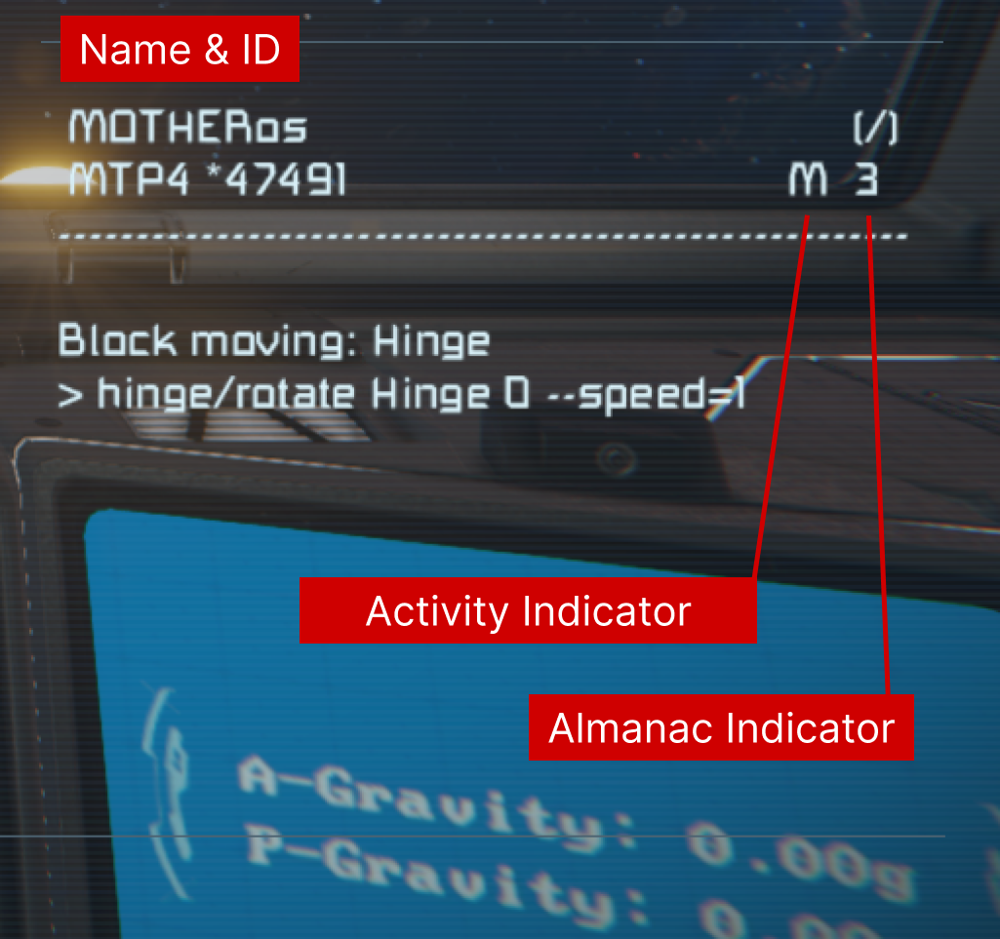


## Running Commands Automatically

You can run commands via several methods:

1. [Programmable Block terminal](#programmable-block-terminal-mother)
2. [Cockpit or Control Station toolbar action](#cockpitcontrol-station-toolbar)
3. [Button action](#button)
4. Event Controller action
5. Timer Block action

### Programmable Block Terminal (Mother OS)

From within your Programmable Block terminal, you can run commands directly.  This is the easiest way to interact with Mother and you will receive immediate feedback in the terminal window.

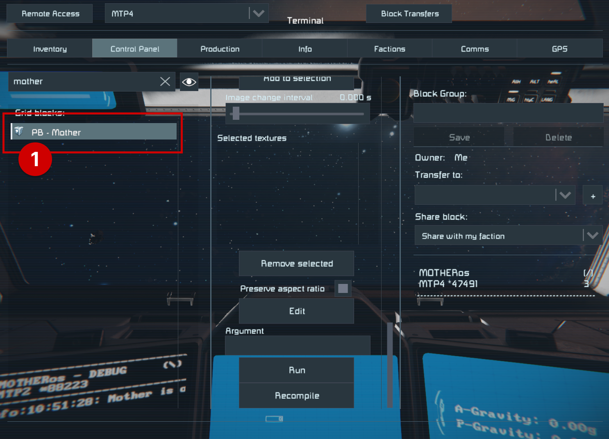

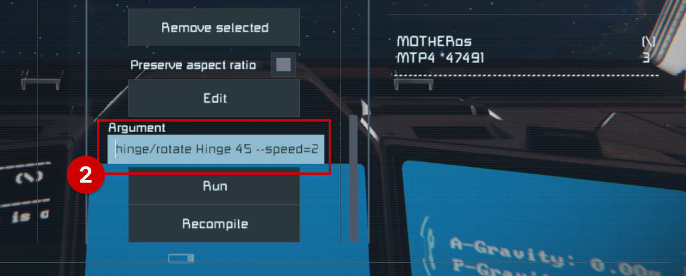

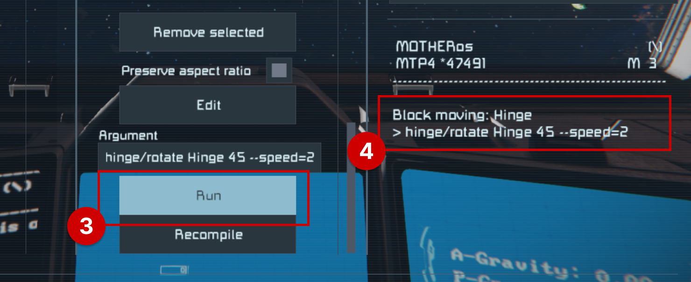


### Cockpit/Control Station Toolbar

When you're flying a ship or sitting at a control station, you can add a button to your toolbar that will run a command when pressed.  This is useful for quick actions like toggling lights or opening doors. To do this, assign the Programmable Block running Mother to the toolbar, and use the `Run` action.  A window will appear asking you for an argument - type your command here and click `Confirm`. You can also set a short label for the button to make it easier to identify.

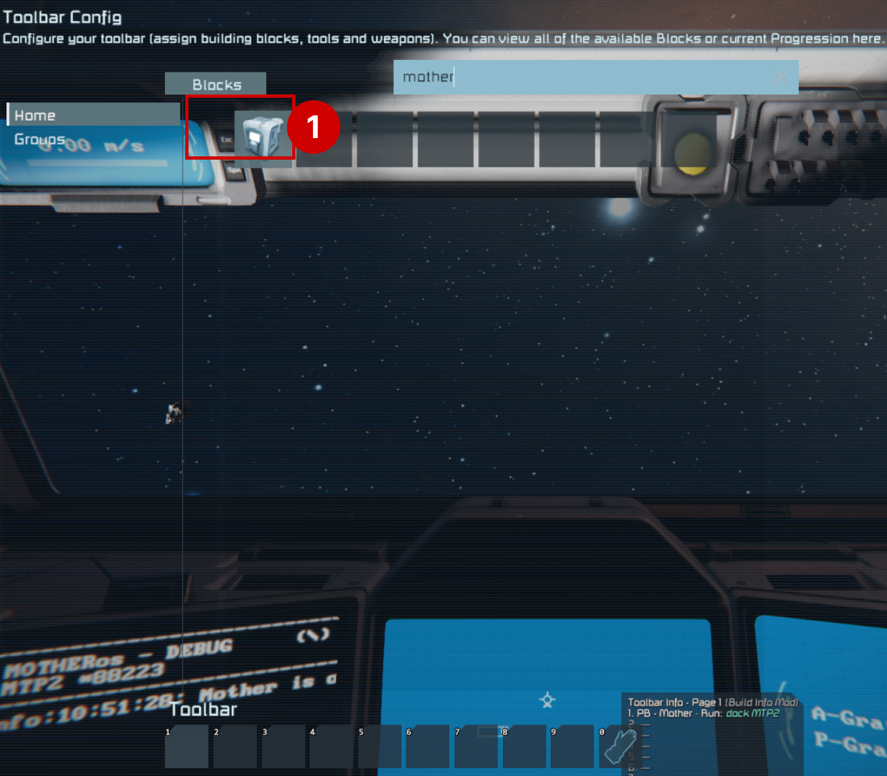

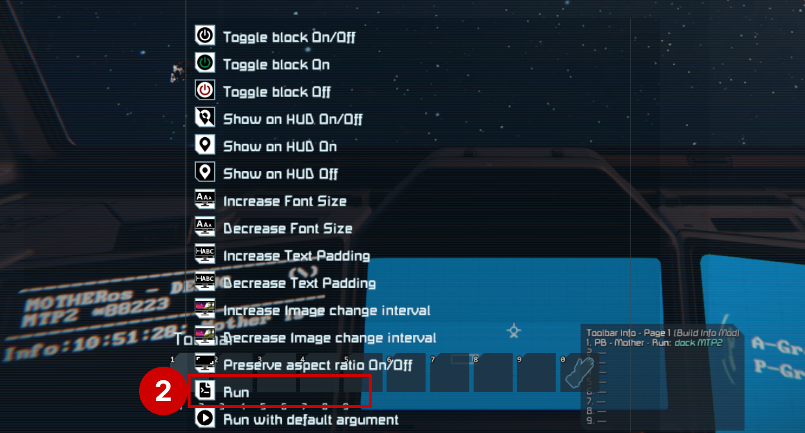

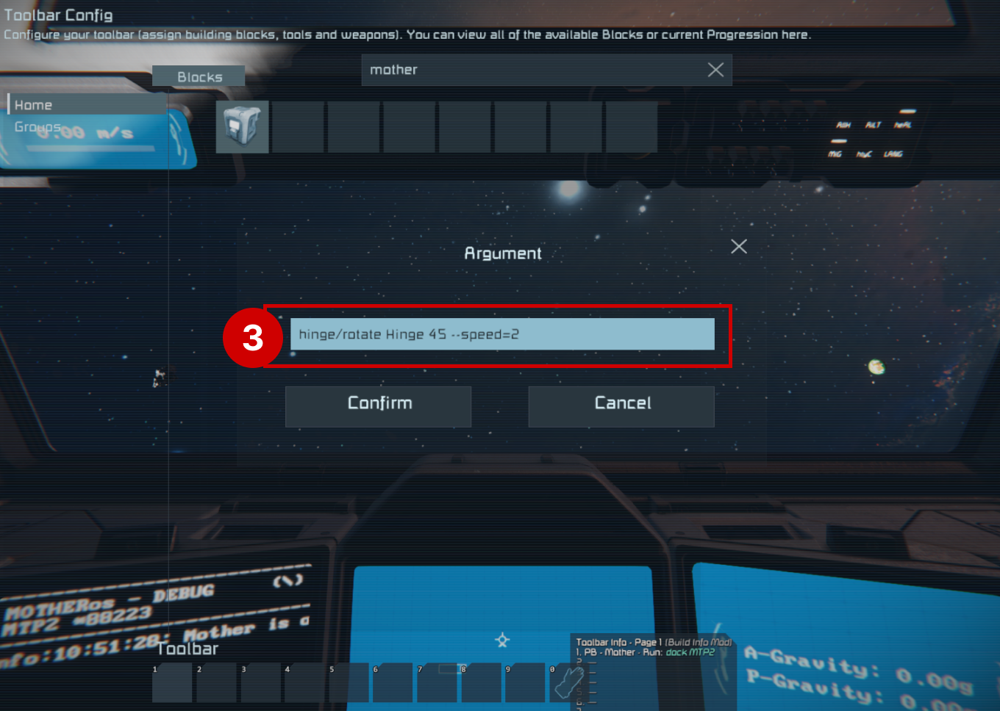

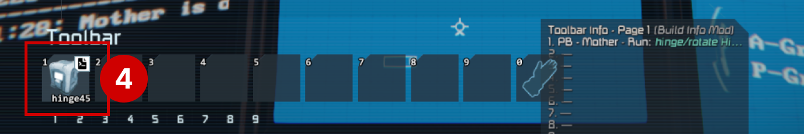

### Button

Like a toolbar, you can also assign a command to a button.  This is useful for quick actions like toggling lights, or initiating a return-to-base procedure for a wandering grid.  To do this, assign the Programmable Block running Mother to the button action, and use the `Run` action.  A window will appear asking you for an argument - type your command here and click `Confirm`. You can also set a short label for the button.

::: tip
Due to the way Space Engineers shows button actions to the player, we are unable to see which command the button runs.  It is recommended to make your button positions intuitive, or to label them with a sign.
:::

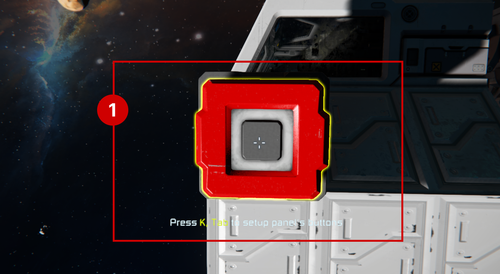

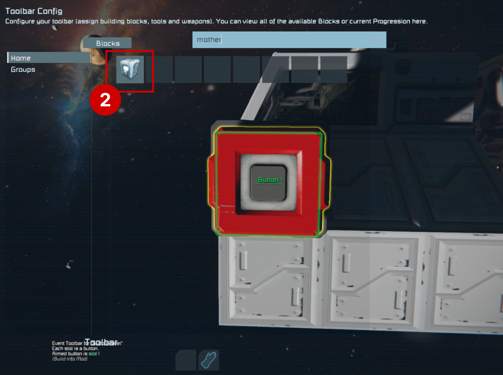

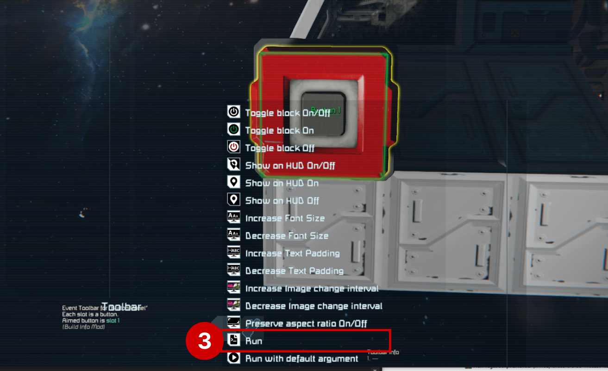

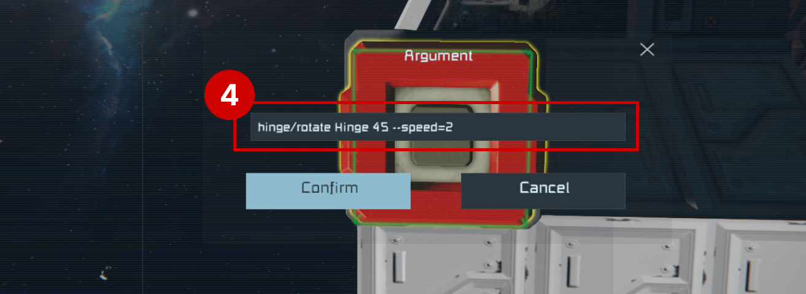

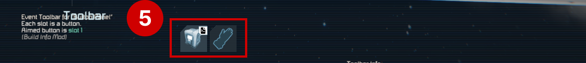

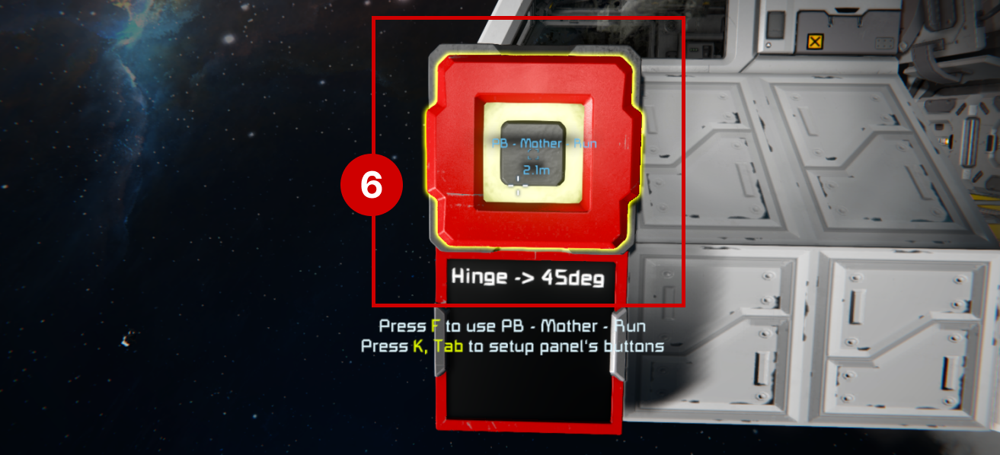

<!-- [Configuration >](Configuration.md) -->


