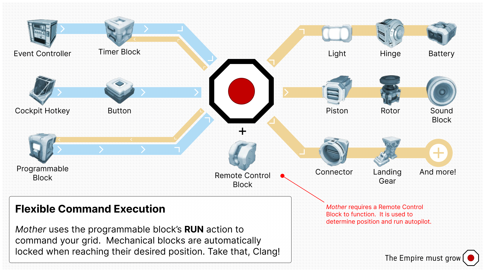

# Mother OS (Ingame Script)

<!-- [< Home](../README.md) -->
<Badge type="info" text="&nbsp;Beta&nbsp;" vertical="middle" />
<Badge type="warning" text="&nbsp;v0.2.7&nbsp;" vertical="middle" />

<!-- <CardGroup>
    <FeatureCard
        icon="" 
        title="Secure Communication" 
        description="Grids <a href='Modules/Core/Almanac.html'>share positions</a> and easy easily send commands remotely to each other."
    ></FeatureCard>
</CardGroup> -->
[[toc]]

::: tip
Using Mother OS does not require any programming/coding experience.
:::

::: warning
Mother is in beta development. I'm on a quest to reduce the character count, and increase the functionality. Please report any issues you encounter, and expect some of the commands and underlying framework to change.
:::

<!--  -->

Mother OS is available as an ingame script for Programmable Blocks in Space Engineers. It interoperates seamlessly with Timer Blocks and Event Controllers to augment existing automations.

<!-- [Install Mother OS](Installation.md) and take your automations to the next level! -->
<a class="route-link auto-link vp-hero-action-button primary" href="/IngameScript/Installation" aria-label="Mother OS" style="text-decoration: none">Install Mother OS</a>

## Features
 

- **Secure Intergrid Communication** - Grids [share positions](Modules/Core/Almanac.md) and easy easily send commands remotely to each other.
  
- **Expanded Automation** - Mother simplifies interacting with the mechanical systems on your grid, and monitors them for changes. See the [Command Cheatsheet](CommandCheatsheet.md).
  
- **Flight Planning and Visualization** - Leverage the existing GPS system and Remote Control block to program and [fly flight plans dynamically](Modules/Extension/NavigationModule.md#flight-planning).
  
- **Copy Automations with Ease** - Easily port your automations from one grid to another by copying `Custom Data` text.

 

**Tutorial Video:**

### Upcoming Features

#### Autodocking
<Badge type="warning" text="&nbsp;In deveopment&nbsp;" vertical="middle" />

Enable players to intitate and fly docking seqwuences automatically using intergrid communication and flight planning.

#### Master-Node Architecture
<Badge type="warning" text="&nbsp;In deveopment&nbsp;" vertical="middle" />

Allow multiple programmable blocks running Mother Core to cooperate on the same grid. This will enable more complex automations and distributed processing.
