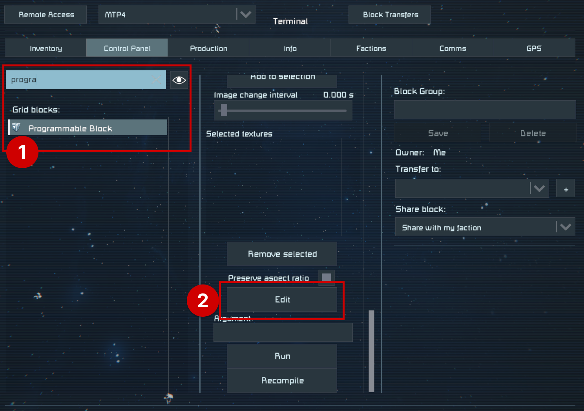
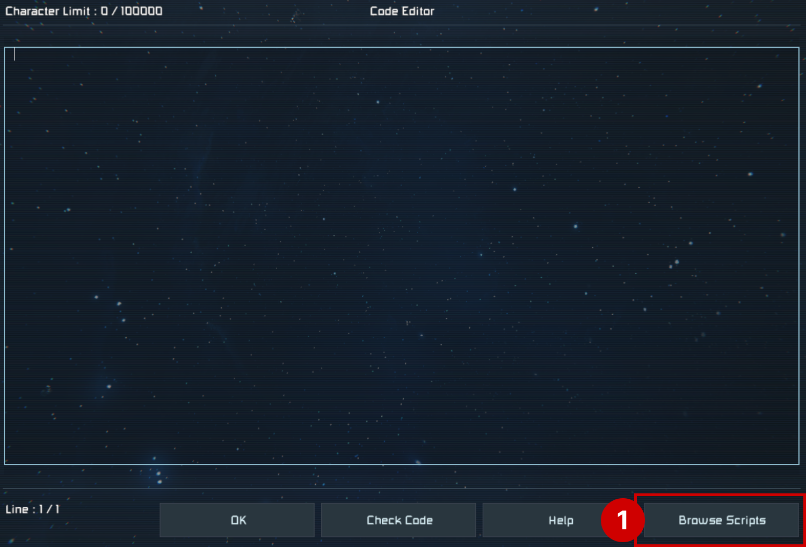
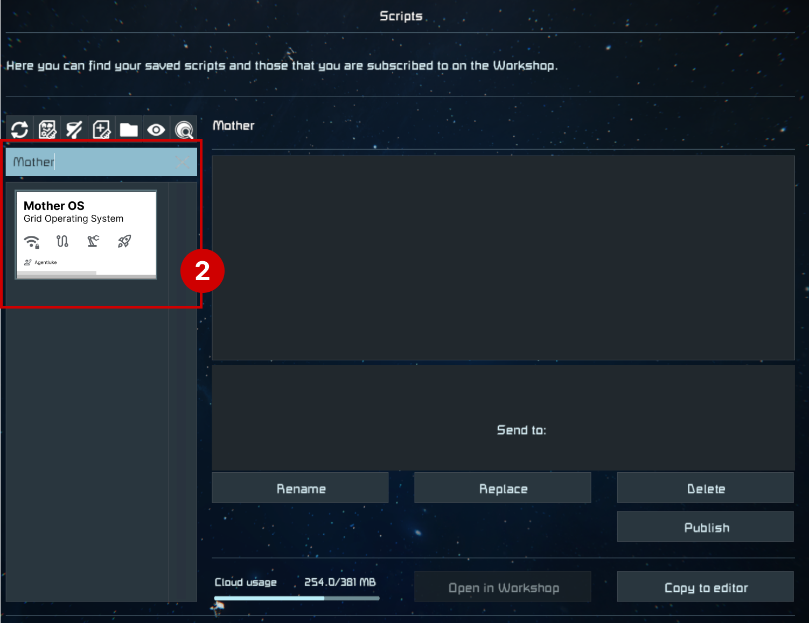
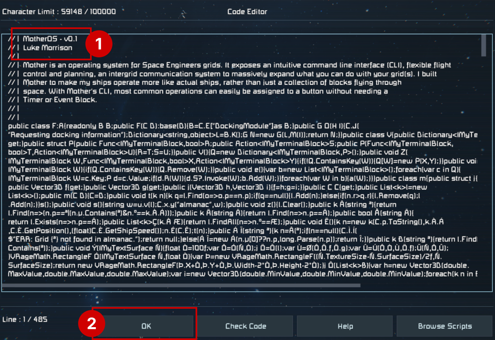
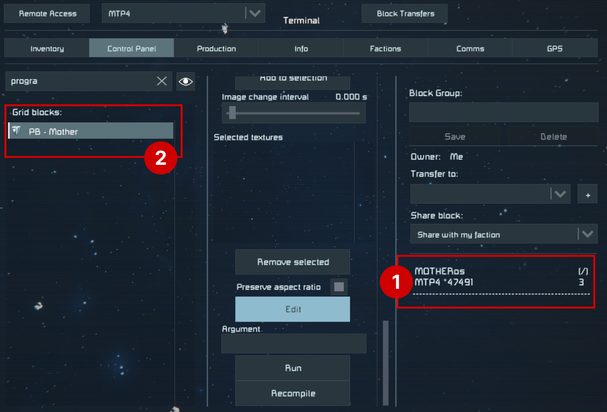

# Installation

[[toc]]

## Pre-Requisites
Mother is available as a script for Programmable Blocks in Space Engineers. Simply [subscribe in the Steam Workshop](https://steamcommunity.com/sharedfiles/filedetails/?id=3411507973) and it will be available to you in-game.

**To run Mother, your grid must have:**

1. A programmable block with the [Mother OS script](https://steamcommunity.com/workshop/filedetails/?id=3411507973) loaded; and
2. A Remote Control block.

If you're comfortable with adding scripts in Space Engineers, then you can jump ahead to the [Command Line Interface (CLI)](CommandLineInterface.md).

## Setup

### 1. Find and Edit the Programmable Block script
Mother is loaded into a Programmable Block by selecting the `Edit` button in the terminal.

### 2. Select Mother OS From Scripts
Mother will be available in the list of scripts to load if you have subscribed in the Steam Workshop. Select it and press `Ok`.

::: tip
Hit the 🔄 button above the search to refresh your list.
:::

### 3. Confirm Mother is Loaded
Mother should be loaded into the Programmable Block. You will know this if you see the description at the top of the Code Editor. Press `Ok` to save the changes.

### 4. Verify that Mother is Running
Mother should boot automatically when the script is loaded. Immediately, you will notice that Mother is now running. I recommend you rename your Programmable Block to make it easier to identify - this will help later.

::: important
Mother should boot automatically when the script is loaded, otherwise running the `boot` command, or pressing the `Recompile` button will ensure Mother completes the boot process. Running `help` in the Programmable Block terminal will show all available commands.  
:::

Congratulations! You have successfully installed Mother into your grid. Now let's look at how you can use it to automate your grids.

<!-- [Command Line Interface >](CommandLineInterface.md) -->