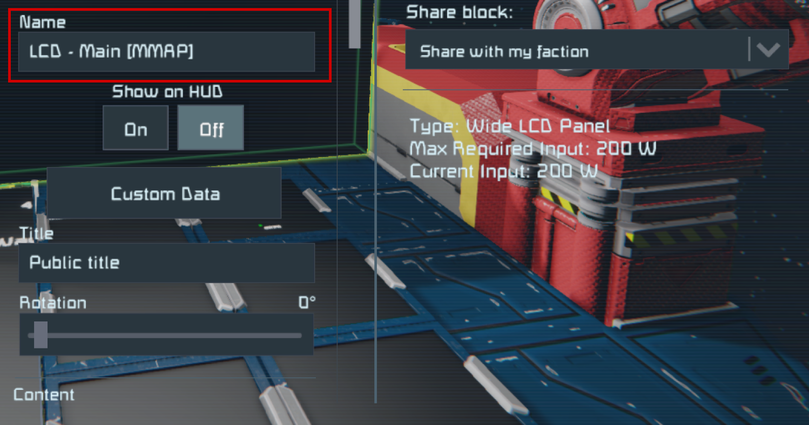

# Almanac
<!-- [< Modules](../Modules.md) -->

Mother maintains a list of all grids in the world running Mother that are connected via an antenna network. The Almanac is used to track grid locations, status, and other information. It is automatically generated during boot, and updates as a result of certain interactions with other grids. 

::: note
Grids running Mother will periodically communicate, at which time the Almanac is updated with details specific to each grid.
:::

To immediately refresh the Almanac, you can run the `ping` command.

<!--  -->


## Why Do We Have It?

In order for grids to interoperate seamlessly, it is important for them to store key information about each other.  This includes properties like their id, position and speed.  Other modules can make use of this for secure communication, and sending remote commands.

## Viewing the Map

Mother can render a map showing all grids and waypoints in the Almanac. Simply add `[MMAP]` to the end of your LCD name and `Recompile` Mother. The projection will automatically update.

You can target individual cockpit screens by targeting a screen index - `[MMAP:1]`.



## Configuration

|Key| Value| Description|
|-|-|-|
|`mapScale`| decimal| Set the map scale in meters. Defaults to 100m. |
|`center`| string | The point that the map should center on.  You can use the full GPS string, the X,Y,Z portions of a GPS string, or use the name of a grid/waypoint if present in the Almanac.|
| `mode` | `2D`, `3D`| Whether the map should render in 2D or 3D.<br><br>**NOTE**: 3D map rendering is experimental and will change in future updates. | 


### Example

<!-- **LCD Custom Data** -->
```ini title="LCD > Custom Data"
[general]
mapScale=150

; full GPS String or;
center=GPS:Mothership:227039.09:226939.44:227134.75:#FF75C9F1:
; partial GPS String or;
center=227039.09:226939.44:227134.75
; grid name
center=Mothership

; render mode
mode=2D
```


<!-- ## Friendly or Foe?

Mother can identify a grid as Friendly, Neutral, or Foe.  This setting is determined based upon how Mother communicates with the grid.  If your grid is using encrypted communication, then only grids with the same encryption key will be considered Friendly.  If your grid is using unencrypted communication, then all grids will be considered Neutral unless they belong to your faction. -->

## Storing Information

By default, the Almanac uses [LocalStorage](LocalStorage.md) to ensure the positions and information of grids and waypoints are not lost when Mother encounters an error, or the script is reloaded/recompiled.  This means that the Almanac is persistent across reboots of the Programmable Block, preventing the loss of important data over time.
