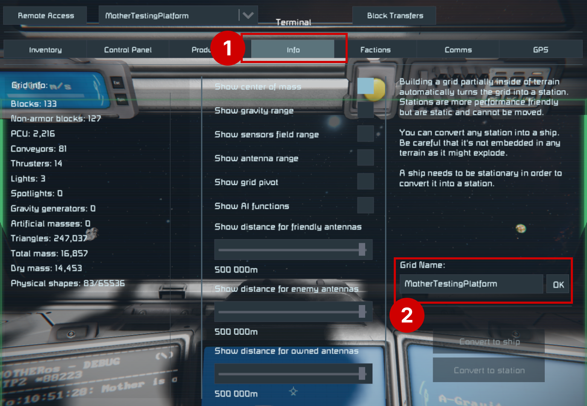

# Intergrid Message Service
<!-- [< Modules](../Modules.md) -->


Grids running Mother can communication by sending messages to each other.  This is useful for coordinating actions between multiple ships like docking, or sharing position data.

To send a command to another grid remotely, you must begin the command with the grid's `Name`, which is stored in the [Almanac](../Core/Almanac.md).  Your grid's name is found in the `Info` tab of the terminal screen. 

[[toc]]


::: caution
At this time, grid names should not contain spaces `" "`.
:::



## Sending a Remote Command

The simplest form of intergrid communication is to send a remote command. Mother may send a command to any other grid running Mother contained in the [Almanac](../Core/Almanac.md), and available on the antenna network. The receiving grid will execute the command as if it were entered in the local Programmable Block terminal. See the [Security](../Core/Security.md) for more information on protecting intergrid communication from unauthorized access.

**Example**

Imagine we have a drone and want it come directly to our position.  We could pilot it remotely, but this is time consuming.  Instead, we can send a command to the ship no matter where it is, and no matter where we are.

We can use the `nav/set-flight-plan` command to send a GPS waypoint to the ship so it knows where to go.

```bash title="Terminal"
# remotely set a flight plan on SurveyDrone grid
@SurveyDrone nav/set-flight-plan "GPS:CurrentPosition#1:211.78:-52.93:59.19:#FF75C9F1:"
```

Similiarily, if we couple the autopilot start command into a routine, then the SurveyDrone will start flying to the GPS waypoint as soon as it receives the command.:

```bash title="Terminal"
# remotely set a flight plan, and start autopilot on SurveyDrone grid
@SurveyDrone nav/set-flight-plan "GPS:CurrentPosition#1:211.78:-52.93:59.19:#FF75C9F1:"; fcs/start;
```
See the [Flight Planning Module](FlightPlanningModule.md) for more information on flight planning.


::: note
Mother will automatically reduce all remote commands to core commands listed in the [Command Cheatsheet](../../CommandCheatsheet.md). This means that all grids can run remote routines as long as they contain the same core command library. [Keep Mother OS up to date](https://steamcommunity.com/sharedfiles/filedetails/?id=3411507973) to ensure you have the most recent library of core commands across your grids.
:::

## Using Communication Channels

As you add more grids to your network, you will quickly look for ways to organize them.  Mother supports communication channels, which enables communication with multiple factions at once, or the isolation of grids localized to an outpost, station, or squadron.

Channels are defined in the `[channels]` section the Programmable Block's Custom Data.  The `*` channel is the default public channel.  You may leave a channel's `value` empty to indicate that the channel is unencrypted.  If a channel has a value, then it is encrypted using the provided passcode. 

```ini title="Mother > Custom Data"
[channels]
; Set public channel as available and unencrypted. 
*=

; The private channels are encrypted if a passcode is provided.
MyFaction=Sup3rSecr3tP@ssw0rd
OtherFaction=An0therP@ssw0rd
; No passcode means no encryption on this channel.
ThirdFaction=  
```

::: important
Communication channels are new in version **0.2.14**.  If you are using an older version of Mother, then you should update to the latest version.
:::

::: caution
By default, all grids in Space Engineers can access Intergrid Communication (IGC), so ensuring that your faction's passcode is secure is important.  If you are in a public server, this is the only way to ensure other factions cannot intercept messages and execute remote commands on your grid. 
:::

Should your grid receive a unencrypted message, or with an incorrect passcode, Mother will log the message, but will not respond.


## Running Commands Defined on a Remote Grid

In most cases, the commands you define will only be relevant to the current grid.  Custom commands defined in Custom Data are stored locally. When sending a command remotely, another grid will attempt to run it exactly as is. Let's take a look at the PowerOff command on our `SurveyDrone` grid.

```ini title="SurveyDrone > Custom Data"
[commands]
PowerOff=
| block/off Thrusters; 
| block/off Lights;
| block/off Antenna;
```

To run this, we can use the following with the `SurveyDrone`'s terminal:

```bash title="SurveyDrone > Terminal"    
PowerOff;
```

We may want to call this command remotely. However, the `Mothership` has no knowledge of this command. Mothership does not have a `PowerOff` command defined locally so we expect an error.

We can prefix the remote command with an underscore `_` to indicate that the command is defined locally on the remote grid. This allows Mothership to call commands defined locally on the `SurveyDrone` grid.

```bash title="Mothership > Terminal"
@SurveyDrone _PowerOff
```

This command will call the `PowerOff` command stored in the SurveyDrone's **Custom Data**. 

::: warning
Failing to include an underscore `_` when running a remotely defined command could result in your local grid taking action. This could be dangerous if the command is not intended for your local grid but it has a command with the same name defined.
:::


**Video - Sending a Remote Command Video**
[](https://www.youtube.com/watch?v=ubFKpvxrtz0)
