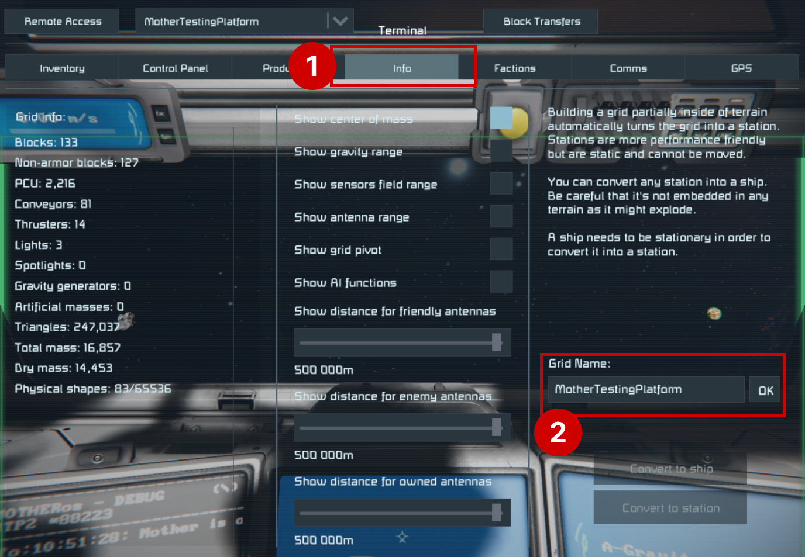

# Communication Module
<!-- [< Modules](../Modules.md) -->

## Intergrid Communication

Grids running Mother can communication by sending messages and querying each other.  This is useful for coordinating actions between multiple ships like docking, or formation flight but allows remote command execution.

To send a command to another grid remotely, you must begin the command with the grid's `Name`, which is stored in the [Almanac](../Core/Almanac.md).  Your grid's name is found in the `Info` tab of the terminal screen. 

::: caution
At this time, grid names cannot contain spaces " ".
:::



### Sending a Remote Command/Routine

The simplest form of intergrid communication is to send a remote command. Mother may send a command to any other grid running Mother contained in the [Almanac](../Core/Almanac.md), and available on the antenna network. The receiving grid will execute the command as if it were entered in the local Programmable Block terminal. See the [Security](../Core/Security.md) for more information on protecting intergrid communication from unauthorized access.

**Example**

Imagine we have a drone and want it come directly to our position.  We could pilot it remotely, but this is time consuming.  Instead, we can send a command to the ship no matter where it is, and no matter where we are.

We can use the `nav/set-flight-plan` command to send a GPS waypoint to the ship so it knows where to go.

```bash title="Terminal"
# remotely set a flight plan on SurveyDrone grid
@SurveyDrone nav/set-flight-plan "GPS:CurrentPosition#1:211.78:-52.93:59.19:#FF75C9F1:"
```

Similiarily, if we couple the autopilot start command into a routine, then the SurveyDrone will start flying to the GPS waypoint as soon as it receives the command.:

```bash title="Terminal"
# remotely set a flight plan, and start autopilot on SurveyDrone grid
@SurveyDrone nav/set-flight-plan "GPS:CurrentPosition#1:211.78:-52.93:59.19:#FF75C9F1:"; fcs/start;
```
<br>

::: note
Mother will automatically reduce all remote commands to core commands listed in the [Command Cheatsheet](../../CommandCheatsheet.md). This means that all grids can run remote routines as long as they contain the same core command library. [Keep Mother up to date](https://steamcommunity.com/sharedfiles/filedetails/?id=3411507973) to ensure you have the most recent library of core commands across your grids.
:::

### Leveraging Local Commands
It is best to store important commands locally on a grid.  Nonetheless, there will be time when you want to target a local command remotely.  To do this, simply prefix the command with an underscore `_`.

```bash title="Terminal"
# remotely trigger a local command on SurveyDrone grid
@SurveyDrone _PowerOff
```

This command will call the `PowerOff` command stored in the SurveyDrone's **CustomData**.


See the [Navigation Module](NavigationModule.md) for more information on flight planning.


### Sending a Remote Command Video
[](https://www.youtube.com/watch?v=ubFKpvxrtz0)
