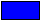

# Light Module
<!-- [< Modules](../Modules.md) -->

The light module allows the user to control lights and searchlights on the grid.  Players can now dynamically control light color and blinking. Use this to take your landing pads and warning lights to the next level.

[[toc]]

## Commands

### light/color

Set the color of a light or group of lights. The color of the light is RGB ie. `255,255,255`.

```
light/color <Light|Group> <color>
```

You have access to the following colors which may be used in place of their RGB values:

|Name                                                   | RGB         | Hexidecimal   |
|---                                                    |---          | ---           |
|        |255,0,0      | FF0000        |
|    |0,255,0      | 00FF00        |
|      |0,0,255      | 0000FF        |
|  |255,255,0    | FFFF00        |
|  |255,165,0    | FFA500        |
|      |0,255,255    | 00FFFF        |
||255,0,255    | FF00FF        |
|    |255,255,255  | FFFFFF        |
|    |0,0,0        | 000000        |

**Example**

```bash title="Terminal"
# by name
light/color LandingLight red;
# by RGB
light/color LandingLight 255,0,0;
```

### light/blink
Make a light blink at an interval in seconds.

```
light/blink <Light|Group> <interval> [--options]
```

You have access to several blinks which may be used instead of the value in seconds:

| Name         | Blink Interval (s)  | Blink Length (%)    | Blink Offset (%)  | Example                                                                 |
|--------------|:---------------:|:---------------:|:--------------------:|------------------------------------------------------------------------|
| `off `        | 0             | 0            | 0                 |    |
| `slow `        | 3             | 30            | 0                 |    |
| `med`          | 1             | 50            | 0                 |        |
| `fast`         | 0.25          | 50            | 0                 |    |

#### Options

| Option  | Values     | Unit | Description                                                         |
| ------- | :----------: | ---- | ------------------------------------------------------------------- |
| `length` | 0 - 1 | int  | Set the blink length of the light. Default is 0.5 (50%). |
| `offset` | 0 - 1 | int  | Set the blink offset of the light. Default is 0 (0%). |

**Example**

```bash title="Terminal"
# using preset
light/blink SignalLight slow;

# using values and options
light/blink SignalLight 3 --length=0.3 --offset=0;
```

### light/intensity

Set the intensiity of a light or group of lights. The intensity is a value between 0 and 1, where 0 is off and 1 is full brightness.

```
light/intensity <Light|Group> <Intensity> [--options]
```

Options
| Option  | Values     | Unit | Description                                                         |
| ------- | ---------- | ---- | ------------------------------------------------------------------- |
| `add` | `true`, `false` | `bool`  | Indicates that the intensity should be *added* to the current intensity. Allows incremental changes to intensity. |
| `sub` | `true`, `false` | `bool`  | Indicates that the intensity should be *subtracted* from the current intensity. Allows decremental changes to intensity. |

**Example**

Set the intensity of the signal light to 0.5 (50% brightness):
```bash title="Terminal"
light/intensity SignalLight 0.5;
```

Reduce the intensity of the signal light by 0.2 (20%):
```bash title="Terminal"
light/intensity SignalLight 0.2 --sub;
```

### light/reset

Reset a light or group of lights to white and cease any blinking.

```
light/reset <Light|Group>
```

**Example**

```bash title="Terminal"
light/reset SignalLight;
```
