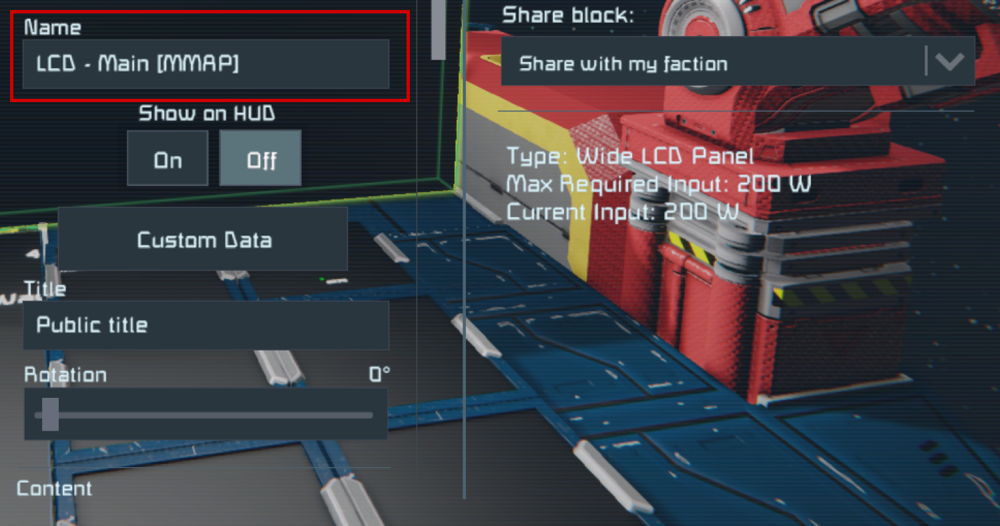
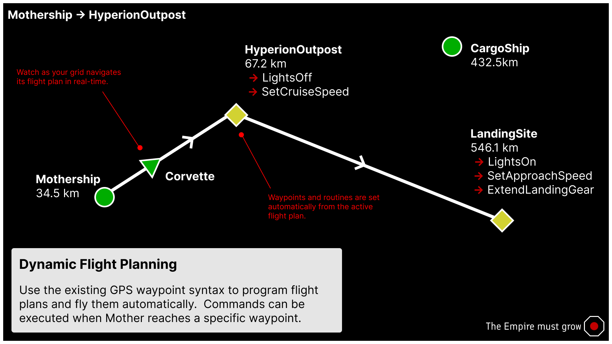

# Map Module

The map module allows Mother to visualize the positions of all grids and waypoints in the [Almanac](../Core/Almanac.md). This provides players with a spacial representation of all grids running Mother Core, and communicating via the antenna network.

[[toc]]

## Viewing the Map

Mother can render a map showing all grids and waypoints in the Almanac. Simply add `[MMAP]` to the end of your LCD name and reboot Mother using the `boot` command. The projection will automatically update.

You can target individual cockpit screens by targeting a screen index - `[MMAP:1]`.





## Filtering the Map

Players can filter which grids are shown on the map by using the `filter` configration. This setting uses a whitelist/blacklist and supports both grid names, as well as communication channels.

Let's imagine our grid is currently communicating on the following channels, with the following grids:
- `*` - Public Channel
  - `SurveyDrone`
  - `DrillShip1`
  
- `MyFaction` - Private Channel
  - `Mothership`
  - `Corvette`

### Whitelisting

If we want to only include specific grids, or channels, we can use a `+` symbol:

```ini title="LCD > Custom Data"
[general]
; show only the Survey Drone grid, or
filter=+SurveyDrone
; show only MyFaction channel, or
filter=+MyFaction
; show only the Survey Drone grid, and MyFaction channel
filter=+SurveyDrone +MyFaction
```

### Blacklisting

If we want to exclude specific grids, or channels, we can use a `-` symbol. All other grids will be shown.

```ini title="LCD > Custom Data"    
[general]
; exclude the Survey Drone grid, or
filter=-SurveyDrone
; exclude MyFaction channel, or
filter=-MyFaction
; exclude the Survey Drone grid, and MyFaction channel
filter=-SurveyDrone -MyFaction
```

## Configuration

|Key| Value| Description|
|-|-|-|
|`filter`| string | A space separated list of grids and channels to include or exclude from the map. Use `+` to include, and `-` to exclude. Defaults to all grids and channels. |
|`mapScale`| decimal| Set the map scale in meters. Defaults to 100m. |
|`center`| string | The point that the map should center on.  You can use the full GPS string, the X,Y,Z portions of a GPS string, or use the name of a grid/waypoint if present in the Almanac.|
| `mode` | `2D`, `3D`| Whether the map should render in 2D or 3D.<br><br>**NOTE**: 3D map rendering is experimental and will change in future updates. In most cases is will not be reliable for navigation. | 


**Example**

<!-- **LCD Custom Data** -->
```ini title="LCD > Custom Data"
[general]
;filter grids
filter=+MyFaction +SurveyDrone

;the scale of the rendered map in meters
mapScale=150

; full GPS String or;
center=GPS:Mothership:227039.09:226939.44:227134.75:#FF75C9F1:
; partial GPS String or;
center=227039.09:226939.44:227134.75
; grid name
center=Mothership

; render mode
mode=2D


```