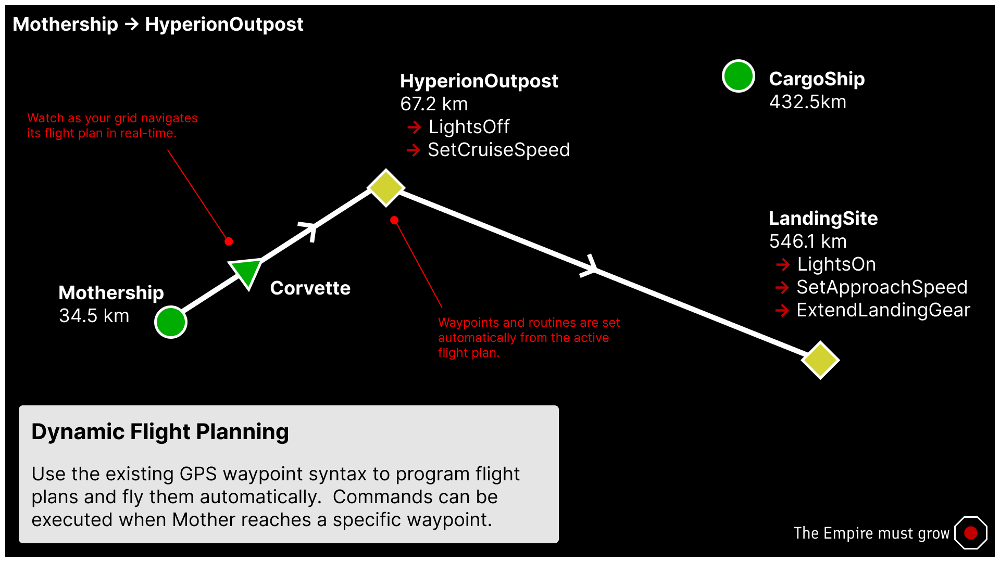

# Navigation Module
<!-- [< Modules](../Modules.md) -->

[[toc]]
## Flight Planning

Mother has a built-in flight planning system that allows you to dynamical assign flight plans to your grid. You may fly to GPS Waypoints, and grids in the Almanac via a simple interface. In cooperation with the [Flight Control Module](FlightControlModule.md), we are leveraging the Remote Control block for waypoint management and autopilot.

<!--  -->

Let's start with reviewing the GPS Waypoint system. A **GPS Waypoint** has 6 parts, which are separated by colons `:`

```bash
<Identifier>:<Name>:<X>:<Y>:<Z>:<Color>:
```

|Name|Format |Description|
|-|-|-|
|`Identifier`| string = **GPS**| The identifier showing that this is a GPS waypoint. |
|`Name`| string | The name of the waypoint. |
|`X`| float | The X coordinate of the waypoint. |
|`Y`| float | The Y coordinate of the waypoint. |
|`Z`| float | The Z coordinate of the waypoint. |
|`Color`| string | The color of the waypoint in hexidecimal format, with transparency [Learn more](https://www.quackit.com/css/color/values/css_hex_color_notation_8_digits.cfm#:~:text=Syntax,alpha%20chanel%20of%20the%20color.). |


We use this format since at any time, a player may copy a GPS waypoint to their clipboard via the GPS Panel in the terminal. This simplifies the process of setting a flight plan considerably - copy, paste, fly.

## The Flight Plan

A flight plan is broken into terms, separated by a space ` `. Each term is a **GPS waypoint**, a **routine**, or a **modifier**.  The flight plan can be passed as a single string to the [`nav/set-flight-plan`](#set-flight-plan) command.

```bash title="Terminal"
nav/set-flight-plan "GPS:TopSecretBase:211.78:-52.93:59.19:#FF75C9F1: { DoSomethingSecret; light/blink SignalLights med; }";
```

Every waypoint may be followed by a routine, which will run when that waypoint is reached. You may also start the flight plan with a routine which will run immediately. Perfect for pre-flight.

```bash title="Terminal"
nav/set-flight-plan "{ RetractLandingGear } GPS:TopSecretBase:211.78:-52.93:59.19:#FF75C9F1: { DoSomethingSecret; light/blink SignalLights med; }";
```

This looks best as a custom command in **Custom Data**:

```ini title="Mother > Custom Data"
[Commands]

FlyToTopSecretBase=
| nav/set-flight-plan 
| "
|     { RetractLandingGear } 
| 
|     GPS:TopSecretBase:211.78:-52.93:59.19:#FF75C9F1:
|     { DoSomethingSecret; light/blink SignalLights med; }
| ";
```

::: important
Take note of the double quotes `"`. These must enclose the entire flight plan string to be interpretted correctly. Flight plan terms must be separeted by a space ` `. You can use additional spaces to indent the flight plan for readability without issue.
:::

### Setting a GPS Waypoint
You can copy any GPS waypoint you have created to your clipboad by selecting it in the GPS panel and clicking the `Copy to clipboard` button. This makes GPS waypoints easy to transfer into flight plans.


### Setting a Flight Plan

Here is an example GPS waypoint, `TopSecretBase`:

```
GPS:TopSecretBase:211.78:-52.93:59.19:#FF75C9F1:
```

To chart a course to this waypoint, we can set it as Mother's current flight plan:

```bash title="Terminal"
nav/set-flight-plan "GPS:TopSecretBase:211.78:-52.93:59.19:#FF75C9F1:";
```

If we wanted to fly to a `Midpoint`, before proceeding to the `TopSecretBase`, we can simply add the term to our flight plan, separated by a space:

```bash title="Terminal"
nav/set-flight-plan "GPS:Midpoint:190.12:-54.45:45.89:#FF75C9F1: GPS:TopSecretBase:211.78:-52.93:59.19:#FF75C9F1:";
```

If this is a long flight plan, it is most intuitive to store the command in the Programmable Block's **Custom Data**:

```ini title="Mother > Custom Data"
[Commands]

set-route-1=
| nav/set-flight-plan 
| "
|     GPS:Midpoint:190.12:-54.45:45.89:#FF75C9F1: 
|     GPS:TopSecretBase:211.78:-52.93:59.19:#FF75C9F1:
| ";
```

Under the hood, Mother will monitoring and update progress towards each waypoint, interfacing with the grid's Remote Control block. When a flight plan is created, GPS waypoints will be added automatically to the [Almanac](../Core/Almanac.md), and you may use them by name in subsequent flight planning.

Next time we want to run the flight plan we can shorten it:

```bash title="Terminal"
nav/set-flight-plan "Midpoint TopSecretBase";
```
::: tip
Use the `nav/set-flight-plan` and `fcs/start` commands together to set the flight plan and begin autopilot immediately.
:::

---

<!-- ### Preflight -->

### Running Routines at a Waypoint

Mother supports running routines when your grid reaches a specific waypoint.  This is done by adding a routine to the flight plan string.

```bash title="Terminal"
nav/set-flight-plan "GPS:Midpoint:190.12:-54.45:45.89:#FF75C9F1: { ExtendWings; light/blink SignalLights off; block/off BoosterThrusters; }"; 
```

### Modifiers

A flight plan may be modified with the following options, as the last term in the flight plan string:

<!-- table -->
| Option | Name | Description |
|:---:| --- | --- |
| `R` | Roundtrip | The grid will fly the flight plan in reverse after reaching the last waypoint. |
| `C` | Continuous | The grid will fly the flight plan in a continuous loop, back and forth, without stopping. |

An example of a roundtrip flight plan:

```bash title="Terminal"
# Fly to Midpoint, then TopSecretBase, then return to Midpoint
nav/set-flight-plan "GPS:Midpoint:190.12:-54.45:45.89:#FF75C9F1: GPS:TopSecretBase:211.78:-52.93:59.19:#FF75C9F1: R";
```

### Loading a Flight Plan
[](https://www.youtube.com/watch?v=jFMLTiwC3Sg)

## Commands

### set-flight-plan
Set the active flight plan in the navigation system. Combine with [`fcs/start`](#flight-control-system) to initiate autopilot.

```
nav/set-flight-plan <FlightPlanString> [--options]
```

**Example:**

```bash title="Terminal"
nav/set-flight-plan "GPS:Midpoint:190.12:-54.45:45.89:#FF75C9F1: GPS:TopSecretBase:211.78:-52.93:59.19:#FF75C9F1:";
```

<!-- ## Actions

Let's go further. Flying a route isn't always enough. Sometimes we need to perform actions at each waypoint.  This is where Actions come in.  We can instruct a grid to perform an action at each waypoint, such as running a command.

```bash
# Fly to TargetPosition and deploy solar panels
nav/set-flight-plan "GPS:TargetPosition:190.12:-54.45:45.89:#FF75C9F1:?command=DeploySolarPanels";
```

Where the `DeploySolarPanels` command is a custom routine that actuates rotors and hinges.

```bash
# DeploySolarPanels
hinge/rotate SolarPanelArrayHinges 0; rotor/rotate SolarPanelArrayRotors 135;
``` -->
