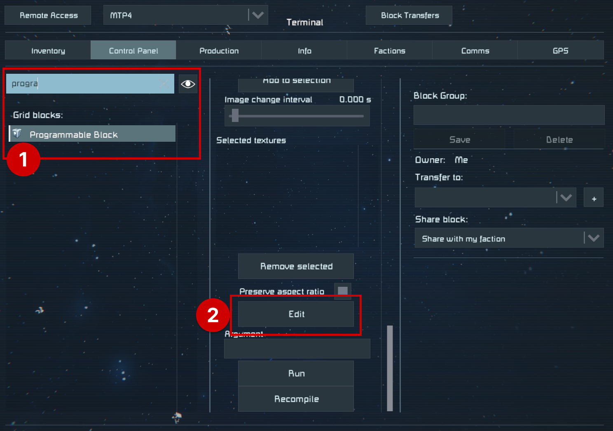
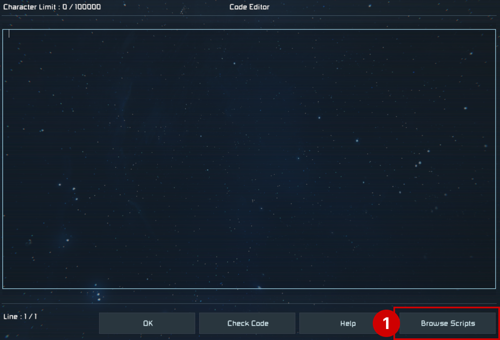
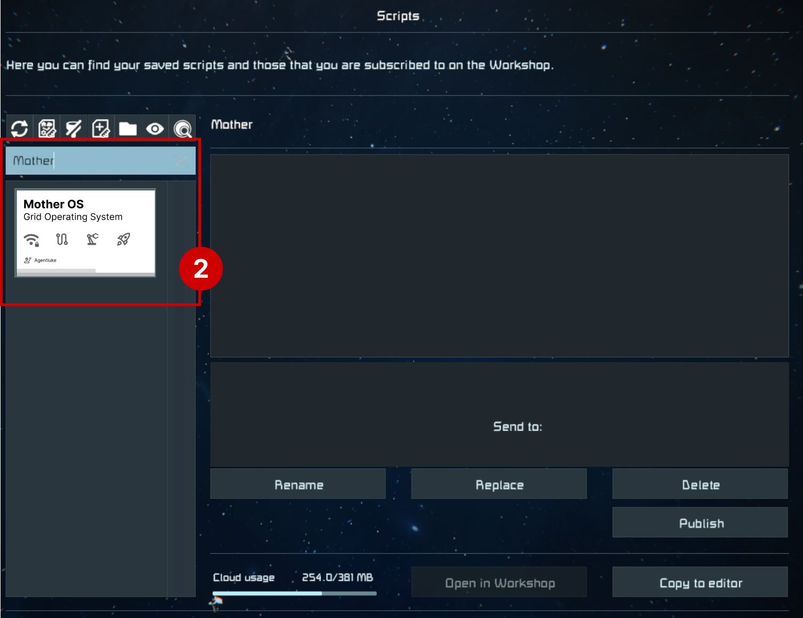
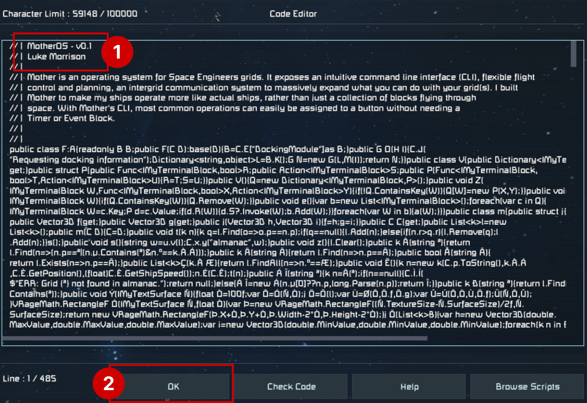
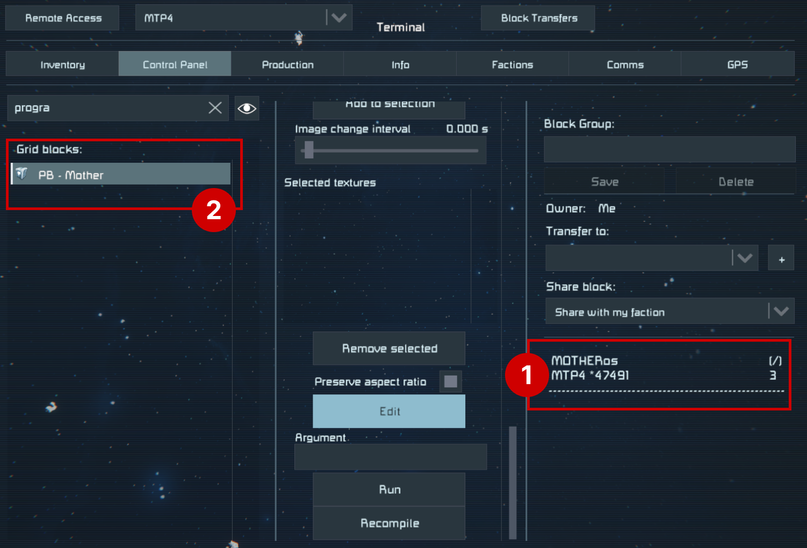

# Installation

[[toc]]

## Prerequisites
Mother Autopilot System is available as a script for Programmable Blocks in Space Engineers. Simply [subscribe in the Steam Workshop](https://steamcommunity.com/sharedfiles/filedetails/?id=3411507973) and it will be available to you in-game.

**To run MAPS, your grid must have:**

1. A programmable block with the [Mother Autopilot System script](https://steamcommunity.com/workshop/filedetails/?id=3411507973) loaded; and
2. A Remote Control block.

If you're comfortable with adding scripts in Space Engineers, then you can check out to the [Command Line Interface (CLI)](../IngameScript/CommandLineInterface.md).

## Setup

### 1. Find and Edit the Programmable Block script
Mother Autopilot System is loaded into a Programmable Block by selecting the `Edit` button in the terminal.

### 2. Select Mother Autopilot System From Scripts
Mother Autopilot System will be available in the list of scripts to load if you have subscribed in the Steam Workshop. Select it and press `Ok`.

::: tip
Hit the 🔄 button above the search to refresh your list.
:::

### 3. Confirm Mother Autopilot System is Loaded
Mother Autopilot System should be loaded into the Programmable Block. You will know this if you see the description at the top of the Code Editor. Press `Ok` to save the changes.

### 4. Verify that Mother Autopilot System is Running
Mother Autopilot System should boot automatically when the script is loaded, otherwise running the `boot` command, or pressing the `Recompile` button will ensure Mother completes the boot process.I recommend you rename your Programmable Block to make it easier to identify - this will help later.

Congratulations! You have successfully installed Mother Autopilot System into your grid. Now let's look at how you can use it to automate your grids.

<!-- [Command Line Interface >](CommandLineInterface.md) -->