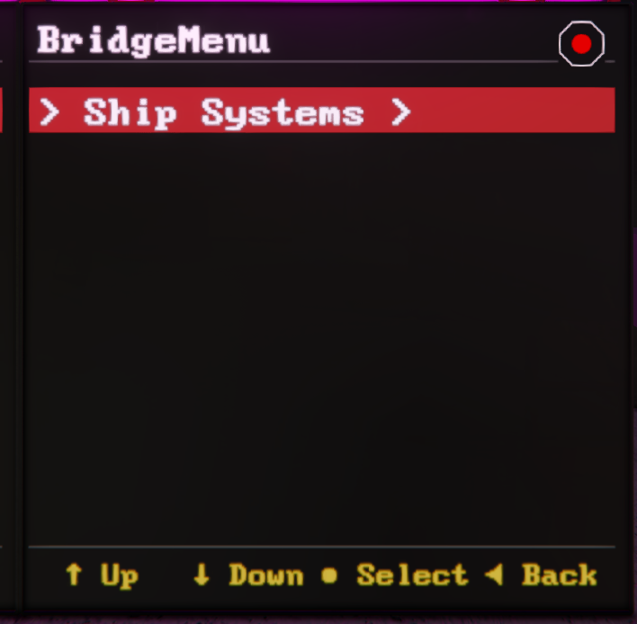
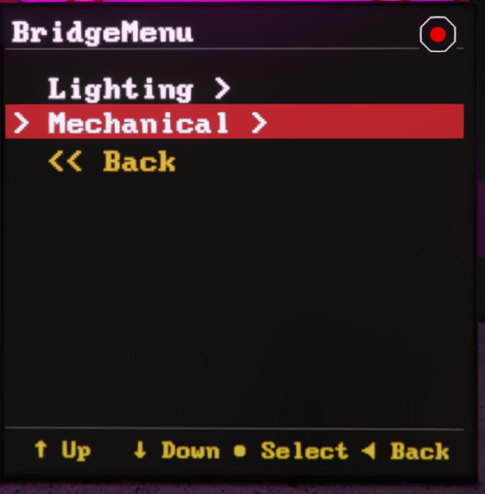
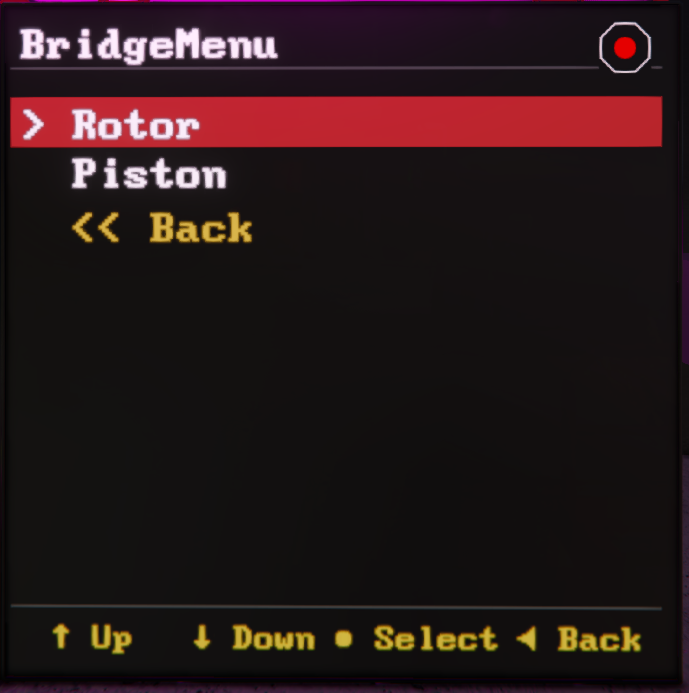
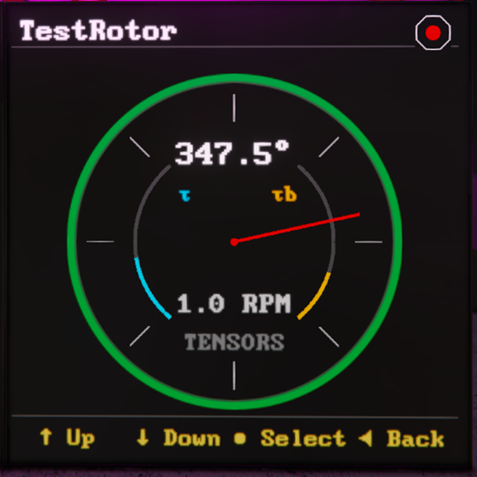
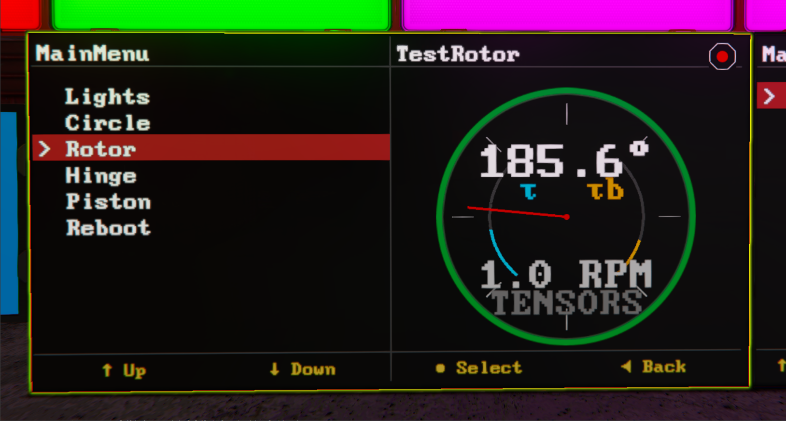

# Configuration

Mother GUI is configured entirely through `Custom Data`. In practice, you will work in two places:

- The Mother GUI programmable block for named menus and the default menu
- Each display block for surface assignments and optional inline menus

[[toc]]

## Surface Assignments

Mother GUI scans the `[surfaces]` section on each supported display block. Each entry uses this format:

```ms title="Surface Entry Format"
[surfaces]
<surfaceIndex>=<ViewName> [parameter]
```

Examples:

```ms title="Bridge LCD > Custom Data"
[general]
scale=1.15

[surfaces]
0=MainMenu
```

<br>

```ms title="Cockpit > Custom Data"
[general]
scale=1.05

[surfaces]
0=MainMenu
1=RotorView "Port Rotor"
```

<!-- <br>

```ms title="Engineering Console > Custom Data"
[surfaces]
0=RotorGridView "2x2:Port Rotor,Starboard Rotor,Top Rotor,Bottom Rotor"
``` -->

Rules worth knowing:

- Surface indices are zero-based. `[0...1...2...3]`
- Parameters are optional.
- Block names with spaces should be wrapped in `""` double quotes.
<!-- - Trailing semicolons are ignored in surface entries. -->

## General Display Settings

Mother GUI currently reads two optional display-level settings from `[general]`:

```ms title="Display Settings"
[general]
scale=1.15
size=0
```

- `scale` adjusts the render scale for the display.
- `size` can be used when you need to override the default text size behavior on a screen.

In most cases, `scale` is the setting you will use first.

## Named Menus

Named menus live on the Mother GUI programmable block. We can pass the default view for a surfaces in the `[surfaces]` sections of the custom data.

For a full walkthrough of menu structure, navigation behavior, and practical patterns, see [MenuView](./MenuView.md).

```ms title="Mother GUI > Custom Data"
[surfaces]
0=MainMenu

[menu:MainMenu]
Mechanical=
.Rotor=view/go self "RotorView" "Port Rotor"
.Piston=view/go self "PistonView" "Lift Piston"

Power=
.Reactors=block/on Main Reactors
.Batteries=battery/auto Main Batteries
```

Mother GUI resolves menus in this order:

1. A display-specific named menu (ie. `RotorView`)
2. An player defined menu`[menu:]`

## Inline Menus

If a display needs a one-off menu, define it directly on the block with the `[menu]` section in the custom data.

```ms title="Airlock LCD > Custom Data"
[surfaces]
0=MenuView

[menu]
Airlock=
.Open Outer Door=door/open "Outer Door"
.Close Outer Door=door/close "Outer Door"
.Depressurize=vent/depressurize Airlock Vent
```

Inline menus are useful for local control panels that should not reuse the global menu tree.

## Nested Menu Syntax

Menus use dot prefixes to define depth. Every line still needs an `=` so the INI parser keeps the entry.

```ms title="Nested Menu Example"
[menu:BridgeMenu]
; top level
Ship Systems=
; first level
.Lighting=
; second level
..Red Alert=light/color Warning Lights red
..Clear Alert=light/color Warning Lights whiteS
.Mechanical=
..Rotor=view/go self "RotorView" "Port Rotor"
..Piston=view/go self "PistonView" "Lift Piston"
```

This creates the following menu structure:
```plaintext title="Menu Outline"
Ship Systems /
    |-- Lighting /
        | -- Red Alert
        | -- Clear Alert
    |-- Mechanical /
        | -- Rotor
        | -- Piston
``` 


|||
|--|--|
|||
|||


If you need duplicate labels under the same section, prefix the key with an internal id and a colon. The id is hidden when rendered.

```ms title="Duplicate Labels"
[menu]
Light 1=
.1:Red=light/color MenuLight1 red
.2:Green=light/color MenuLight1 green

Light 2=
.3:Red=light/color MenuLight2 red
.4:Green=light/color MenuLight2 green
```

## Widescreen Behavior

On widescreen displays, `view/go` opens a live view in a side panel while the current menu stays visible. On smaller screens, the selected view replaces the menu until you use `view/back`.

That makes widescreen LCDs a good fit for bridge consoles, while cockpit screens work well as compact detail displays.

