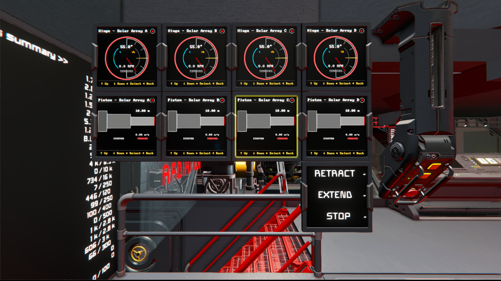

<script setup>
  import MotherGUIAnimation from '../../../components/MotherGUI/MotherGUIAnimation.vue';
</script>

# Mother GUI

 [](https://steamcommunity.com/sharedfiles/filedetails/?id=3724497528)

Mother GUI is an ingame script for Space Engineers players that turns text surfaces into interactive ship displays. Use it to build navigable menus and render live mechanical block views.

::: warning Alpha Development
Mother GUI is currently in Alpha and is subject to change at any time. I will try my best to make graceful changes to navigation to ease ongoing use.
:::

<!-- <MotherGUIAnimation /> -->




Mother GUI is designed to feel at home beside other scripts Powered by Mother like [Mother OS](../IngameScript/IngameScript.md). Control it with toolbar actions, buttons, timers, event controllers, or other Mother-powered scripts that can issue terminal commands.

[[toc]]

## Features

- **Interactive menus** - Build hierarchical menus in Custom Data and navigate them on any supported display surface.
- **Live mechanical views** - Render rotors, hinges, pistons, and doors as live diagnostic widgets.
- **Multi-surface support** - Target LCD panels directly or configure cockpit, programmable block, and sound block surfaces with `Block Name:SurfaceIndex`.
- **Screen automation** - Jump to views, switch menus, and change surface content types with terminal commands.

## Quick Example

```ms title="Cockpit > Custom Data"
[general]
scale=1.15

[surfaces]
0=MainMenu
1=DoorView "Outer Airlock Door"
```
<br>

```ms title="Mother GUI > Custom Data"
[general]
defaultMenu=MainMenu

[menu:MainMenu]
Mechanical=
.Ramp=view/go self "RotorView" "Ramp Rotor"
.Lift=view/go self "PistonView" "Lift Piston"
.Hangar Door=view/go self "DoorView" "Hangar Door"
```

::: tip
On a widescreen surface, Mother GUI keeps the menu on the left and renders the selected live view on the right. On smaller screens, the selected view takes over the display until you go back.
:::

## Views

Mother GUI current supports the following views:

- `MenuView` - Hierarchical menu navigation and display control. See [MenuView](./MenuView.md).
- `RotorView` - Single rotor dial
- `HingeView` - Single hinge dial
- `PistonView` - Single piston indicator
- `DoorView` Sliding door indicator
<!-- - `RotorGridView` for multiple rotors on one display -->
<!-- - `CircleView` as a simple example view -->

Continue with the [installation guide](./Installation.md) to load the script and configure your first display.