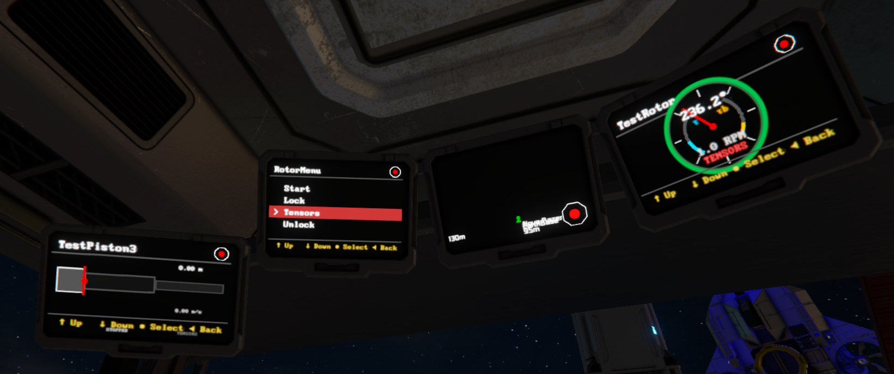
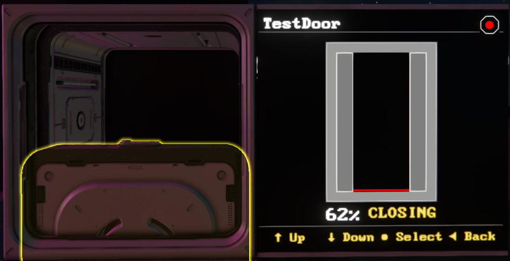

# Views

Mother GUI currently ships with a focused set of views aimed at mechanical diagnostics and menu-driven ship control.

For the full menu system documentation, see [MenuView](./MenuView.md).

[[toc]]

<!-- ## MenuView

`MenuView` is the default interactive menu renderer. Most displays will start here unless a surface is configured to open a different view directly.

The dedicated [MenuView](./MenuView.md) page covers:

- named menus and inline menus
- nested menu syntax
- `view/go self` and cross-menu navigation
- widescreen split-view behavior

```ms title="Mother GUI > Custom Data"
[surfaces]
0=MainMenu
``` -->

## RotorView

Shows a single rotor with a live dial, current angle, RPM, torque, braking torque, and lock-state ring.

```ms title="Mother GUI > Custom Data"
view/go "Bridge LCD" "RotorView" "Port Rotor";
```

If no rotor name is provided, Mother GUI uses the first rotor it can resolve.



<!-- ## RotorGridView

Shows multiple rotors in a grid on one surface. The optional parameter can define layout and rotor order.

```ms
view/go "Engineering LCD" "RotorGridView" "2x2:Port Rotor,Starboard Rotor,Top Rotor,Bottom Rotor";
```

Valid parameter patterns include:

- `2x2:Name1,Name2,Name3,Name4`
- `2:Name1,Name2,Name3,Name4`
- `Name1,Name2,Name3,Name4`
- `2x2` -->

## HingeView

Shows a single hinge with a live semi-circular angle dial and lock-state status.

```ms title="Mother GUI > Custom Data"
view/go "Bridge LCD" "HingeView" "Main Hinge";
```

## PistonView

Shows a piston with current extension, limits, velocity, and a live extension bar.

```ms title="Mother GUI > Custom Data"
view/go "Bridge LCD" "PistonView" "Lift Piston";
```

## DoorView

Shows a door with live open percentage and current state such as `OPEN`, `OPENING`, `CLOSING`, or `CLOSED`.

```ms title="Mother GUI > Custom Data"
view/go "Bridge LCD" "DoorView" "Hangar Door";
```



<!-- ## CircleView

`CircleView` is a simple example view that renders concentric circles. It is useful as a test target while you are verifying that a display is configured correctly.

```ms
view/go "Bridge LCD" "CircleView";
``` -->

## View Parameters

Most block-specific views accept an optional block name parameter. If the name contains spaces, wrap it in quotes.

```ms title="Mother GUI > Custom Data"
view/go "Bridge LCD" "RotorView" "Port Rotor";
view/go "Bridge LCD" "DoorView" "Main Hangar Door";
```

When no parameter is supplied, Mother GUI falls back to the first matching block of that type on the construct.