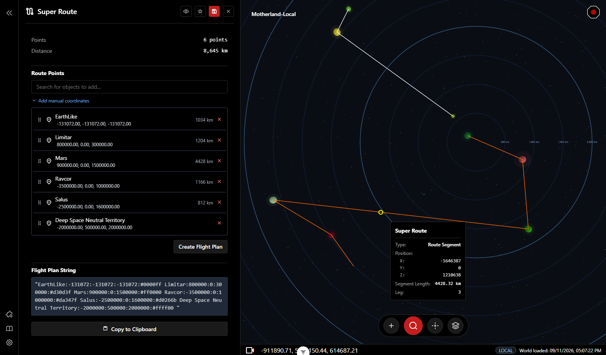

# Mother Studio

Mother Studio is a tool for viewing and editing game worlds in Space Engineers. It allows players to chart their star systems, view detailed planet and grid information, and manage mod configurations with plugins. Players can also create routes flyable with [Mother Autopilot System (MAPS)](../MotherAutopilotSystem/README.md) and can expect many more exciting features coming soon to support automation with Mother. 

### Loading a World

- load grids
- load skybox

#### Loading Grids

- note on performance hit (and loading time) when loading grids into world

## World Objects

- Planets
  - view a planet
- Waypoints
  - view a waypoint
- Grids
  - view a grid
  - note: grid support is extremely limited and should not be used for anything other than tinkering
  
- search for an object
- note world objects can be extended via plugins.

## Plugins

- mods can be supported using plugins
- included plugins:
  - MES
  - ConfigurableParameters
  - ConfigurableOres
- loading plugins
  - plugin file selection and defaults
- Developing a plugin:
  - Route to dedicated pages for developing a plugin (future)

## Contributing