# Mother Studio

[[toc]]


Mother Studio is a tool for viewing and editing game worlds in Space Engineers. It allows players to chart their star systems, view detailed planet and grid information, and manage mod configurations with plugins. Players can also create routes flyable with [Mother Autopilot System (MAPS)](../MotherAutopilotSystem/README.md) and can expect many more exciting features coming soon to support automation with Mother. 


## Getting Started

### Installation

Mother Studio is built with Electron and can be downloaded for the most common systems.

- Windows
- Linux
- MacOS

### Loading a World

When Mother Studio boots, you will be asked to select a game folder.  Mother Studio will remember previous worlds so you should only need to locate these once.

:::tip
Local saves are typically in the following location on Windows: 

`%appdata%\SpaceEngineers\Saves\76561197977942683\`
:::

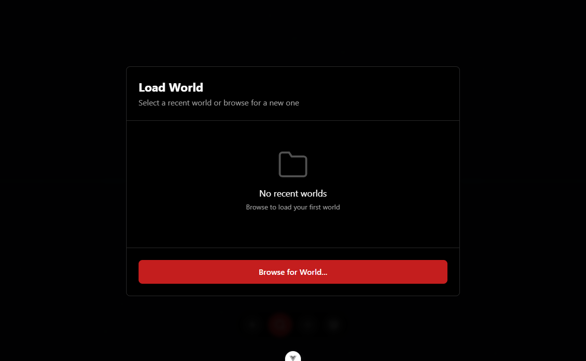

Mother Studio will detect configurations for several popular mods and ask if you want to enable their respective plugins. Please request new plugin support via the Discord channel. I intend to extend the plugin system to support community contributions in the future.

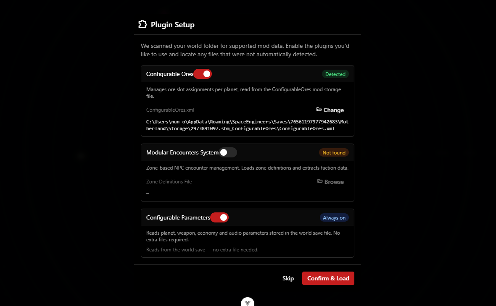

For more information on supported plugins, see [Plugins](#plugins) below.

### World Settings

User have access to several world settings to enrich the Mother Studio experience. These are subject to change and will likely be expanded significantly in future versions.
|Setting| Description|
|--             |--|
|Load Grids     | When selected, grids within the world file will also be loaded. This is important when you wish to modify Motherscript configurations within grids. Note that this impacts world load time for larger world files.|
|Show Skybox    | When selected, stellar fields are projected into a skybox to improve immersion. |

## World Objects

Grids, Planets and Waypoints are considered world objects. Users will have quick access the data like their position, and can seamlessly construct [routes](#routes-and-flight-plans) between them.

:::danger Modifying World Files
Mother Studio allows you to edit entities within your world file. For changes to occur, the game world cannot currently be loaded. This means that real-time updates are not possible and this tools should be used as an offline maintenance utility.
:::

### Searching for Objects

Mother Studio allows you to quickly search for any object within the game world. Players can click the Search button in the hotbar, or use the `Win+K`/`Cmd+K` keyboard shortcut. By selecting an object in the search list, the map will automatically take you to it, and open the object details drawer.  Each supported object type is described in more detail below.

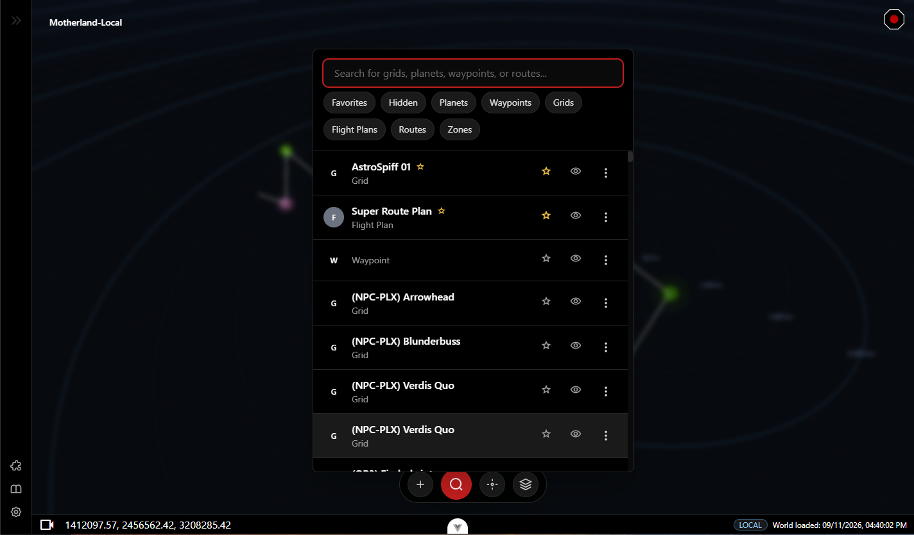


### Planets

You can view the common properties of planets within current game world. If you are using the [Configurable Ores](https://steamcommunity.com/sharedfiles/filedetails/?id=2973891097) mod then you will also have access to charts describing ore distribution.

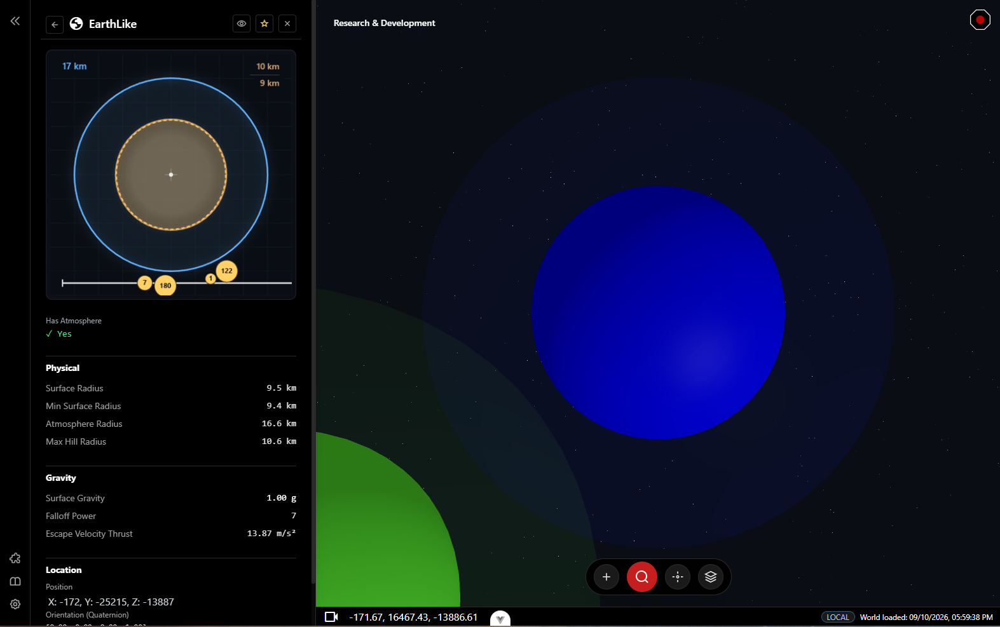

You can view nearby grids by hovering and selecting them from clusters present in the planet map within the planet menu.

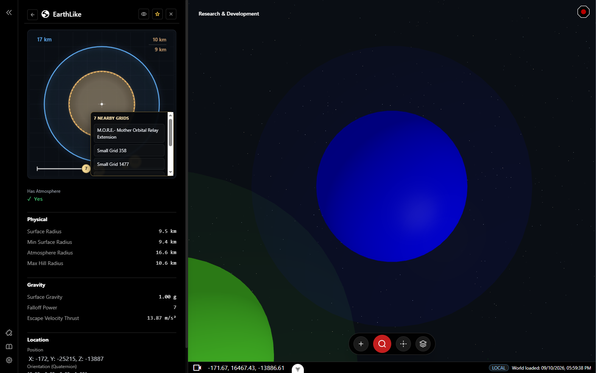


<!-- - Waypoints
  - view a waypoint -->

### Grids

You can access and modify many details about a grid using Mother Studio. 

:::info
Modifying grid data is limited at this time. Mother Studio remains focused on scripting and dimensions to support automation. The best way to update every block property is still *in-game*.
:::

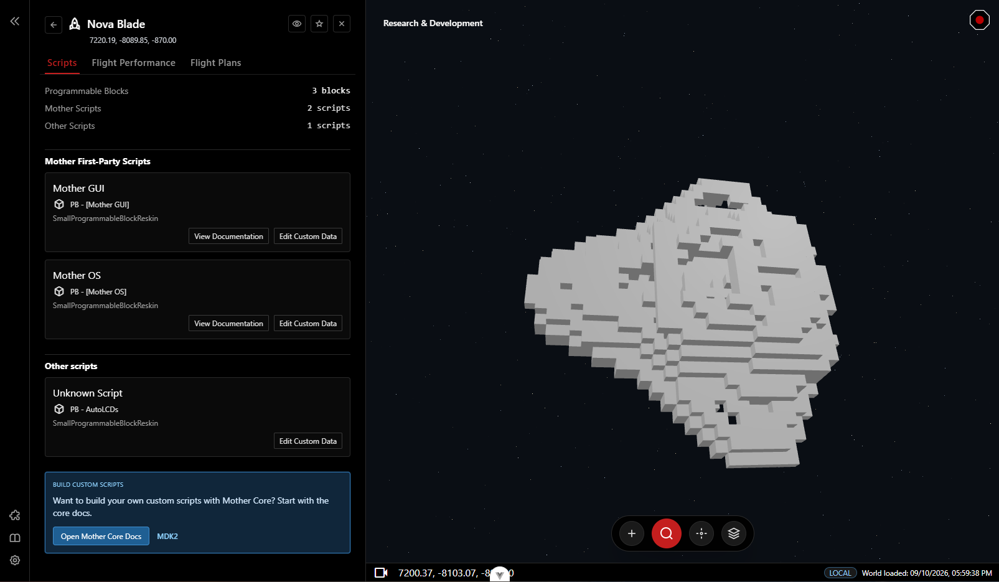

#### Scripts

Mother Studio was born to enrich grid automation and orchestration across an entire world.  Scripts built using [Mother Core](../Framework/README.md) will automatically come with language support for writing *motherscript* within the Programmable Block's Custom Data property. This tool uses knowledge of existing scripts, and the blocks on your grid to significantly reduce the time it takes to write automations.

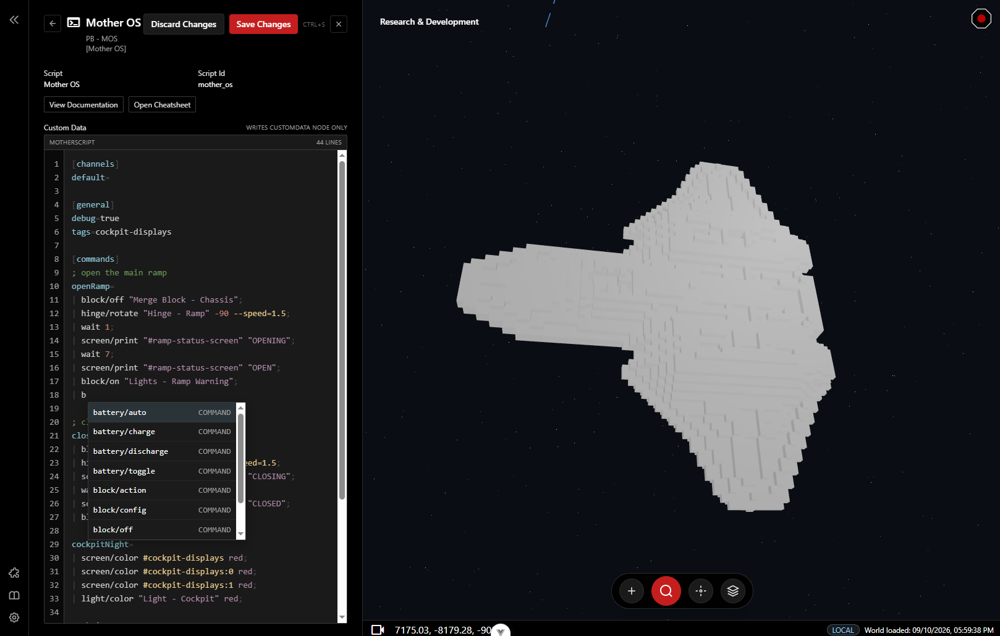

To make things even easier, Mother Docs has been integrated and first party scripts like [Mother OS](../IngameScript/IngameScript.md) will automatically link to the relevant documentation.

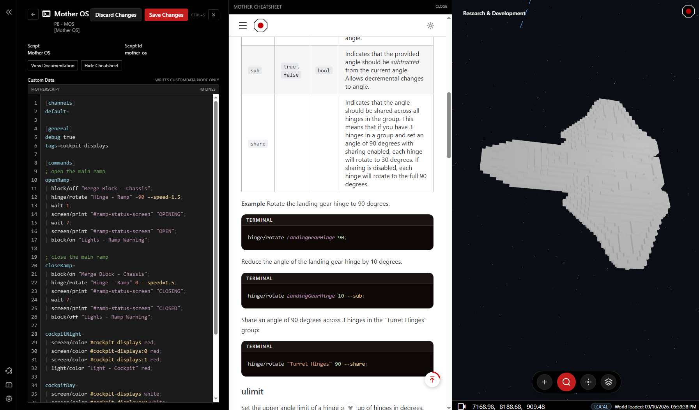


#### Flight Performance

Mother Studio allows you review a grid's flight performance against the various atmospheres and gravity fields of planets in the game world. As a starting point, you may adjust the altitude to calculate at (relevant to the planet's surface), and the angle of attack of your grid. Mother Studio assumes the standard forward + up convention of ideal motion.

:::tip
Angle of Attack (AoA) is the angle measured between the horizon, and the direction of motion of your grid. A aircraft taking off will have a positive AoA.
:::


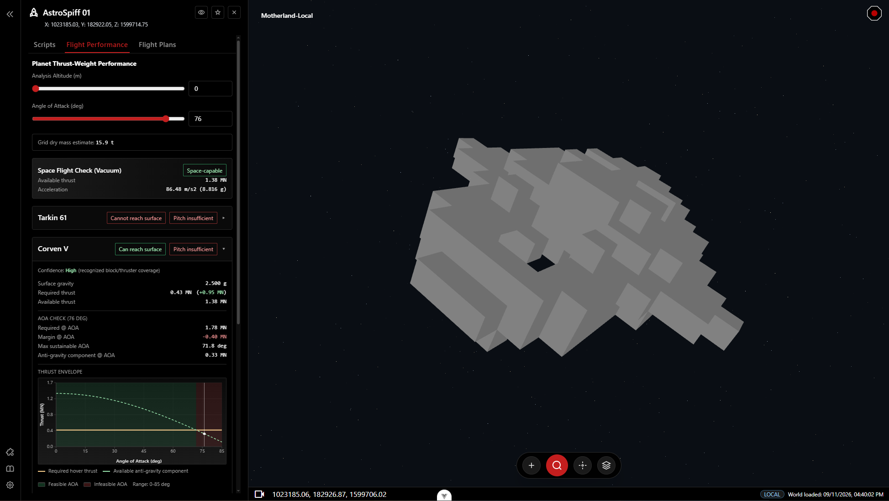

Fight performance will be expanded on over time and work will continue in parallel with the development of the [Mother Autopilot System](../MotherAutopilotSystem/README.md) script.

#### Flight Plans

A grid can hae flight plans, which are typically generated from [Routes](#routes-and-flight-plans). When creating a Flight Plan for a grid, you will 

  
## Routes and Flight Plans

Mother Studio offers a rich starting point for flight planning to support ingame travel. [Mother Autopilot System](../MotherAutopilotSystem/README.md) was created to make automated flight more straightforward and Mother Studio takes this to the next level by giving players the ability to rapidly define Routes and fly them as Flight Plans.

### Routes

Routes can be created using the *New Object Menu*. Routes start empty and can be filled with any objects in the game world (ie. grids, planets, waypoints), or with a manual point.


You may easily drag and drop points to re-order the points in the route. You may also add objects from the canvas to the route using the right-click menu.

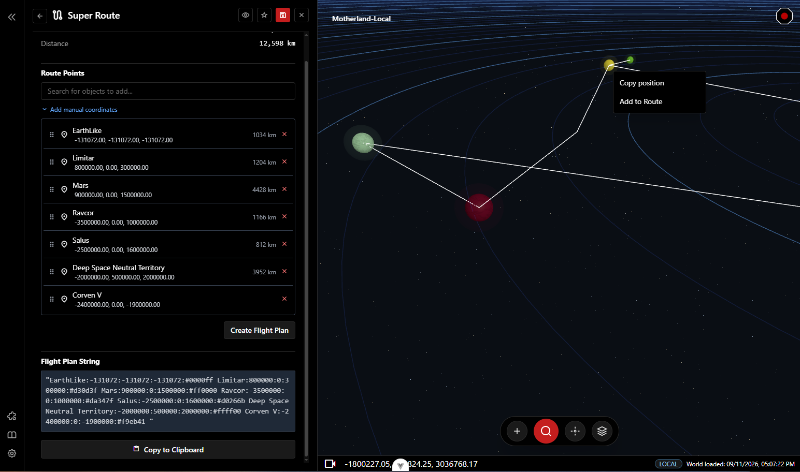

Routes should be reusable pathways you expect players or grids to travel along. When you are ready to make a grid fly a route, you may copy the flight plan string, or create a [Flight Plan](#flight-plans-1).

```plaintext title="Flight Plan String"
"EarthLike:-131072:-131072:-131072:#0000ff Limitar:800000:0:300000:#d30d3f Mars:900000:0:1500000:#ff0000 Ravcor:-3500000:0:1000000:#da347f Salus:-2500000:0:1600000:#d0266b Deep Space Neutral Territory:-2000000:500000:2000000:#ffff00 Corven V:-2400000:0:-1900000:#f9eb41 "
```

### Flight Plans

Flight plans are designed as a grid-specific route to travel. Flight plans provide detailed grid performance along the [Route](#routes), and will be used as the main instruction set for future versions of [Mother Autopilot System](../MotherAutopilotSystem/README.md). A flight plan cannot be created without an associated grid - otherwise it would just be another Route!

Flight plans are created from routes:

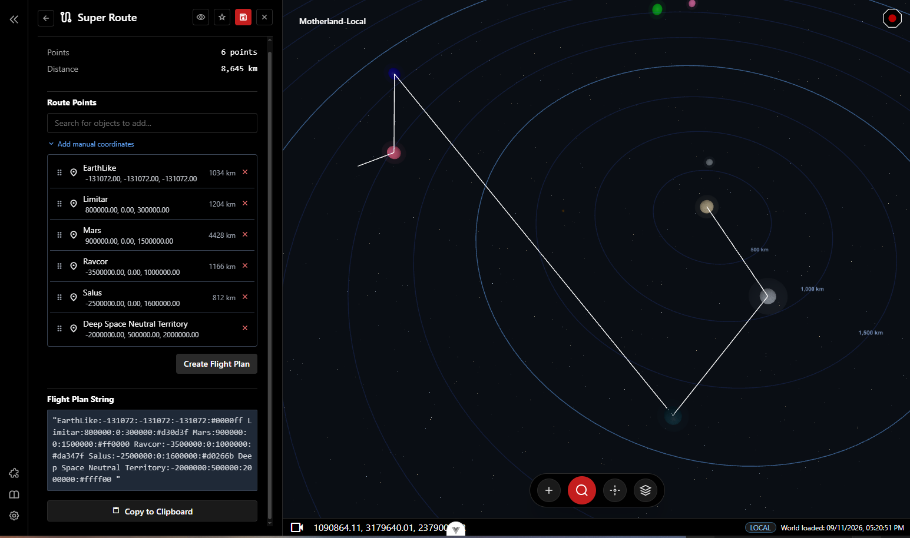

Like a route, flight plans can be flown between any object defined in the game world. Between two points, a cruise leg is automatically created, and acceleration and decelleration flight phases are automatically calculated. You may update the speed during the cruise and which thruster types to use. Performance is automatically updated with each change.

:::warning A Note on Reliability
Flight plan and grid performance are still in alpha and should be verified for the time being - baby steps!
:::

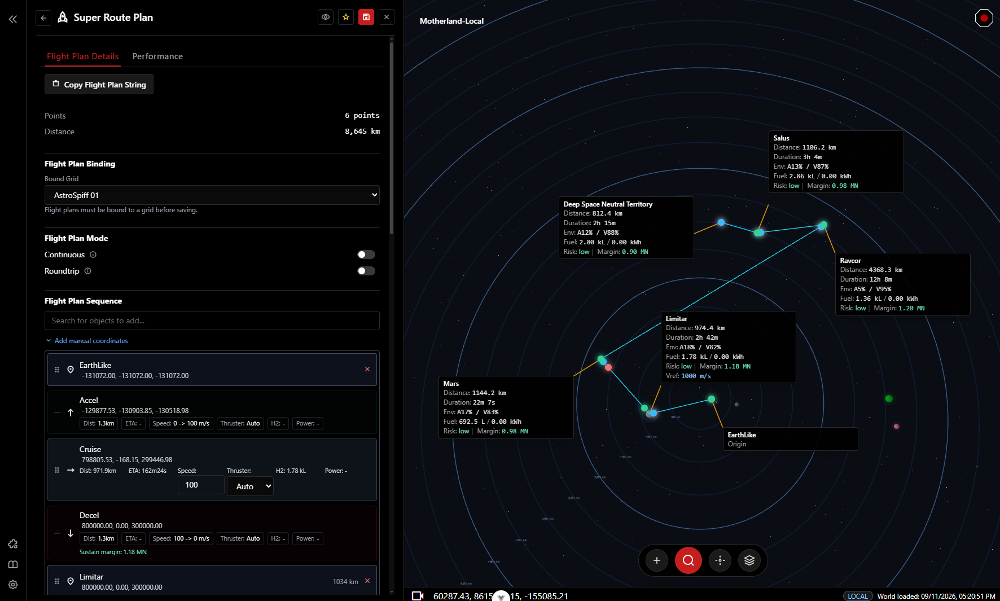

Like routes, the flight plan string can be copied and pasted into a [Mother Autopilot System](../MotherAutopilotSystem/Modules/FlightPlanningModule.md) instance. Over time, this flight plan string will have new parameters to manage speed, and other automations via [waypoint routines](../MotherAutopilotSystem/Modules/FlightPlanningModule.md#running-routines-at-a-waypoint).

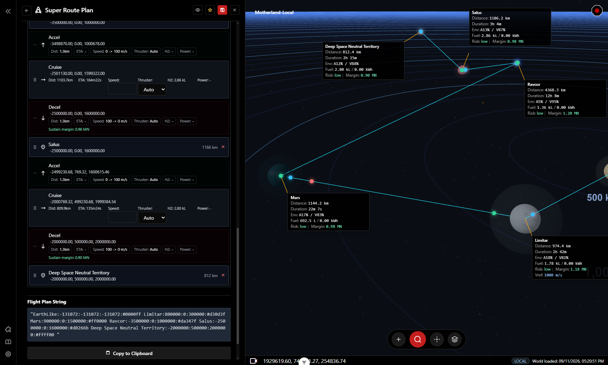

## Plugins

Space Engineers would not be the same without some irreplaceable mods that extend the gameplay experience. Mother Studio comes with a plugin system to add support for specific mods, outside of the standard objects and actions supported by the application.

### Available Plugins
The following mods are currently supported with plugins:

|Mod| Coverage|
|-|-|
|[Modular Encounters Systems](#modular-encounters-systems)| Modify combined zone definitions to: <br><br>- modify Zones <br> - modify Spawn Groups <br> - modify Spawn Conditions |
|Configurable Parameters| View and modify all parameters available to players in-game|
|Configurable Ores| View ore allocations for each planet, and distribution of ores across planets.|

### Loading Plugins

When the world loads for the first time, you are prompted to enable or disable plugins. If configuration files are found for the supported mods, it will be noted. You can disable plugins at any time via the Plugin menu:

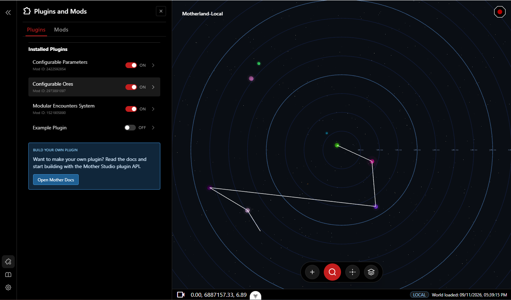

### Creating Custom Plugins (Coming Soon)

Users will eventually be able to create their own plugins using a built-in toolset current in development. This will enable new developers to add support for common mods not yet included. In the mean time, please request popular mod support via the [Discord channel](https://discord.gg/PrrmBujmXQ).


### Supported Mods

#### Modular Encounters Systems
[Steam Workshop](https://steamcommunity.com/workshop/filedetails/?id=1521905890)

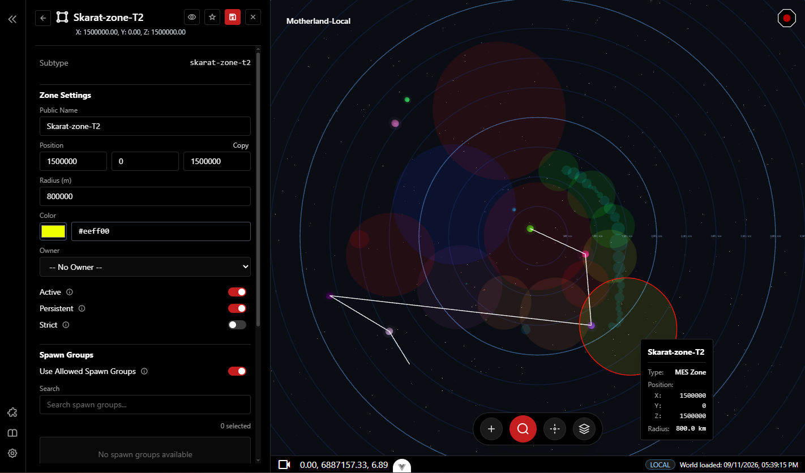
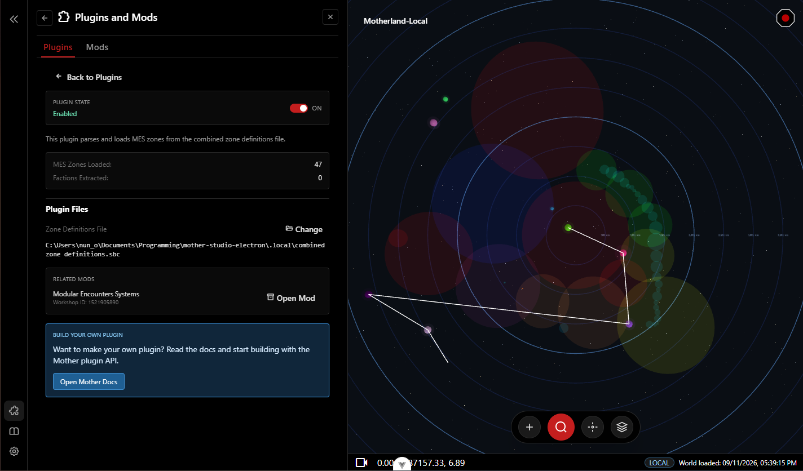

#### Configurable Parameters

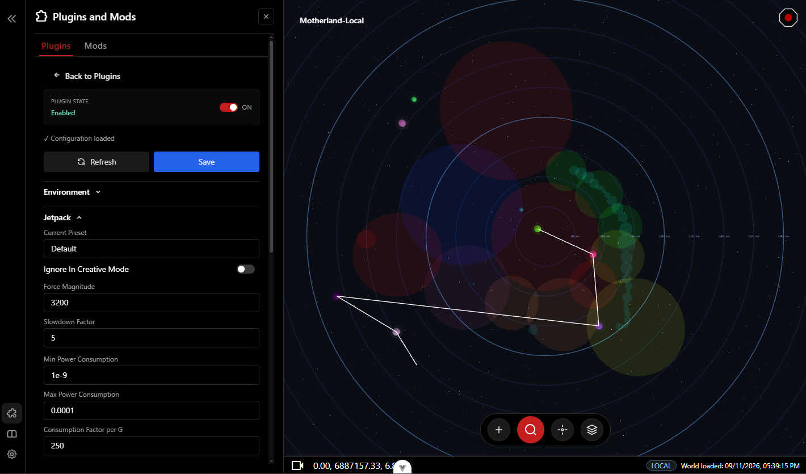

#### Configurable Ores

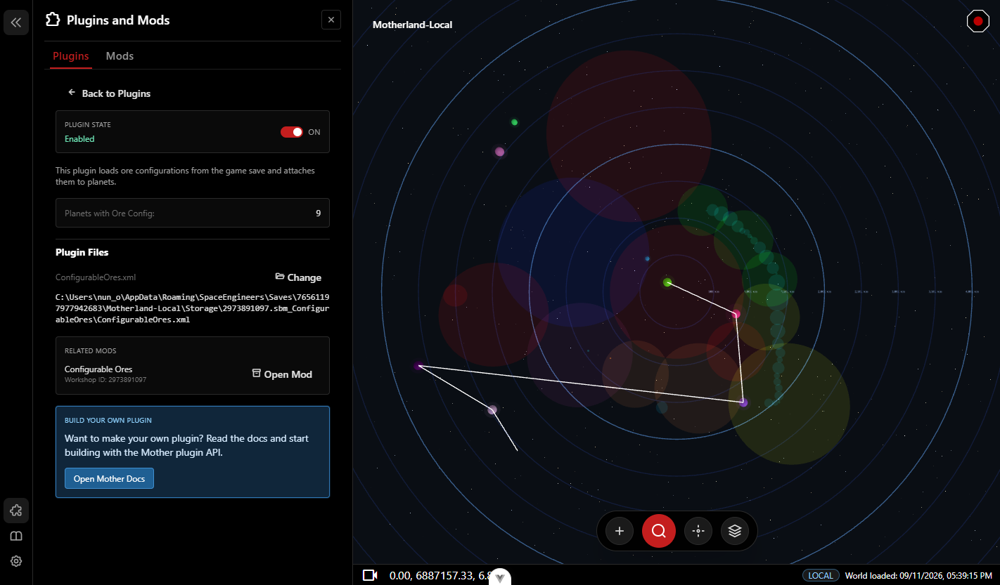

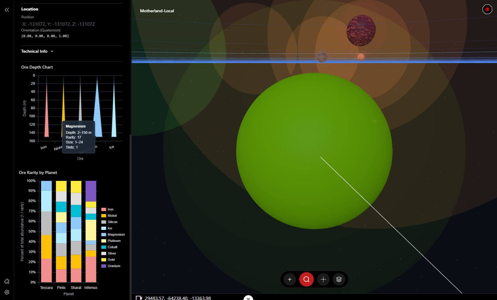


## Contributing

At this time Mother Studio is closed source, but over time will open to the public in a similar fashion as [Mother Core](../Framework/README.md) to enable players to build their own tools to enrich their gameplay experiences. For now, please submit feature requests and bug reports via the [Discord channel](https://discord.gg/PrrmBujmXQ).