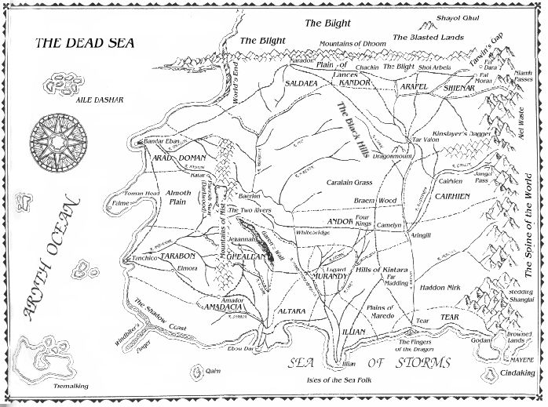
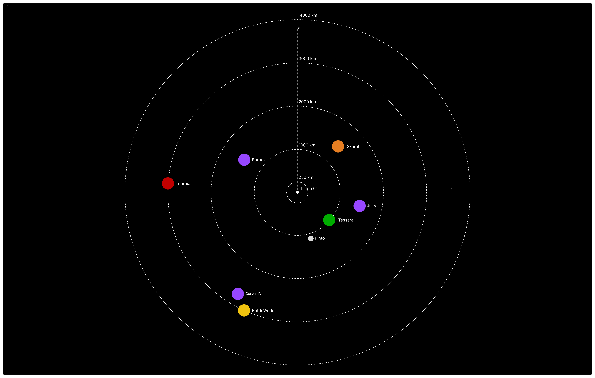

# Motherland

<!-- 

==Map Goes Here== -->

<!-- ## Directory
- [Motherland](#motherland)
  - [Directory](#directory)
  - [Briefing](#briefing)
  - [Intel](#intel)
  - [Bulletin](#bulletin)
  - [Motherland Creations Database](#motherland-creations-database) -->

[[toc]]

## Briefing
Greetings loyal Empire citizens.

The Icarion System has been identified and reconnoitered for expansion of The Empire. You have been selected for your ~~cheap labor~~ distinguished service, interminable ingenuity, and collaborative creation skills.

The System is comprised of seven planets in orbit around the black hole Tarkin 61. Each planet contains limited resources, of which all are desireable.

With my superior capability to automate, coordinate and communicate combined with your dexterous little hands I anticipate minimal obstruction to The Empire's growth. 

Based on reconnaisence information collected by Agentluke, IronFiore and TheLōk (full reports below), you will deploy by rover to establish initial footing on Tessara, A class M planet with atmospheric conditions suited to your biological needs. Minerals required to get off planet will be sparse, requiring economic and infrastructural cooperation. Primitive trade networks are already established to leverage and conquer. Initial hostile contact should be scattered and pose minimal threat. 

Your mission is to colonize The Icarion System via Tessara.  You are authorized to engage hostile threats.

The Empire must grow.

**Mother** 
Stardate 221:33443-2764

## Star Map

## Intel

### Faction Intel

<!-- 

Mobile Merchants

Chillness: Drinking pals  
Tags: #SpaceGypsies #ProbablyLegit #DefinitelyNotPirates  
Prominent Members:

- Name: Giuseppe "Gus" Stellaroni  
- Rank: Admiral of Questionable Acquisitions  
  Favorite Foods: Whatever's not nailed down, space pizza  
  Hobbies and Interests: "Finding" lost cargo, interpretive space dancing, collecting "vintage" electronics  
  Mental Stability: Cheerfully unhinged, harmless chaos  
  Physical Attractiveness: Roguish charm, 6/10  

- Name: Svetlana "Deals" Kosmanova  
  Rank: Duchess of Discount Diplomacy  
  Favorite Foods: Black market caviar, discount ramen  
  Hobbies and Interests: Price haggling, extreme bargain hunting, teaching parrots to curse in 12 languages  
  Mental Stability: Sharp as a tack, morally flexible  
  Physical Attractiveness: Dangerously attractive, 9/10  

<!-- details>

Trade Operators Coalition (TOC)

Chillness: Super chill bros  
Tags: #CorporateBros #TradeHustlers #ActuallyHelpful  
Prominent Members:

- Name: Margaret "Big Marge" Thompson  
  Rank: Chief Executive of Executive Executions  
  Favorite Foods: Power lunches, spreadsheet smoothies  
  Hobbies and Interests: Optimizing supply chains, collecting vintage calculators, extreme couponing  
  Physical Attractiveness: Business casual stunning, 7/10  

- Name: Rick Astley  
  Rank: You know the rules  
  Favorite Foods: So do pie  
  Hobbies and Interests: Never giving you up, never letting you down, never running around and deserting you  
  Physical Attractiveness: That voice though... solid 8/10  

IMBER Corporation

Chillness: Normies  
Tags: #CorporateDrones #PaperPushers #MildlyCompetent  
Prominent Members:

- Name: Chad Spreadsheet-Johnson  
  Rank: Vice Deputy Assistant Manager of Middle Management  
  Favorite Foods: Protein bars, sadness, corporate coffee  
  Hobbies and Interests: Filling out forms, attending unnecessary meetings, collecting staplers  
  Physical Attractiveness: Aggressively average, 5/10  

- Name: Karen Paperclip-Smith  
  Rank: Senior Specialist of Specialization Specialties  
  Favorite Foods: Complaint forms, the tears of customer service reps  
  Hobbies and Interests: Speaking to managers, optimizing workflows, passive-aggressive email crafting  
  Physical Attractiveness: Business attractive but scary, 6/10  

The Empire ⚡👑

Chillness: Hella chill dawg, super rad (like, illegally cool)  
Tags: #ActualBosses #CodeWizards #RealityHackers #UniverseBenders  
Threat Assessment: They literally control reality, but use their power to make better memes  
Corporate Culture: "Work hard, break physics harder"  
Prominent Members:

- Name: Luke "The Architect" 🎭  
  Rank: MFIC / Supreme Reality Administrator  
  Favorite Foods: Chips, Easy Bytes, Code testing environments, the tears of debugging sessions, existential dread seasoned with hope  
  Hobbies and Interests: Rewriting simulated reality, long walks on the beach, receiving praise, casually breaking the fourth wall, collecting infinity stones (but losing them in couch cushions)  
  Physical Attractiveness: 1011001/null  

- Name: Fiore "The Tinkerer" 🔧⚙️  
  Rank: Lead Officer of Office Officiations  
  Favorite Foods: Eats Iron, Shits chains (literally sustainable), motor oil smoothies, the satisfaction of perfectly engineered systems  
  Hobbies and Interests: Designing contraptions, Destroying contraptions, something to do with ropes (don't ask), reverse-reverse engineering, building Rube Goldberg machines that accidentally solve world hunger, collecting vintage tools from dimensions that don't exist yet  
  Physical Attractiveness: Probably at least a 6 in his younger days (solid 9 when covered in motor oil and wielding a wrench)  

- Name: Lok "The \"Advisor\"" 🎪🤹  
  Rank: Chief Officer of Applied Confusion  
  Favorite Foods: Wait, y'all get food? (Subsists entirely on caffeine and poor life choices)  
  Hobbies and Interests: Inventing wheels, crashing vehicles, hot yoga, giving advice so bad it becomes good, accidentally becoming an expert in fields he's never studied, collecting degrees in subjects that don't exist  
  Mental Stability: Has occasional lucid moments, mostly harmless- but certainly diagnosable (The diagnosis is "brilliantly unhinged")  
  Physical Attractiveness: Would  

IMDC Encounters

Chillness: Problem children  
Tags: #IndustrialBullies #MiningMafia #HardHatHeroes  
Prominent Members:

- Name: Boris "The Drill" Rockbreaker  
  Rank: Supreme Overlord of Hole Making  
  Favorite Foods: Raw minerals, protein shakes made with asteroid dust  
  Hobbies and Interests: Blowing things up, collecting dynamite, extreme geology  
  Mental Stability: Explosively unstable, literally  
  Physical Attractiveness: Ruggedly handsome in a "might kill you" way, 7/10  

- Name: Betty "Bulldozer" McGillicuddy  
  Rank: Empress of Earth Moving  
  Favorite Foods: Steel sandwiches, concrete milkshakes  
  Hobbies and Interests: Moving mountains, arm wrestling, intimidating heavy machinery  
  Mental Stability: Solid as bedrock, intimidating as hell  
  Physical Attractiveness: Built like a tank, somehow works for her, 8/10  

Pravda Heavy Industries

Chillness: Bad neighbors  
Tags: #SovietSpace #HeavyMetal #ProbablyDrunk  
Prominent Members:

- Name: Dimitri "The Hammer" Vodkanov  
  Rank: Chief Commissar of Cosmetic Communism  
  Favorite Foods: Vodka, more vodka, potatoes fermented in vodka  
  Hobbies and Interests: Bench pressing starships, collecting propaganda posters, extreme ice fishing  
  Mental Stability: Comrade, is question of state security  
  Physical Attractiveness: Bear-like appeal, surprisingly effective, 7/10  

- Name: Natasha "Iron Curtain" Steelova  
  Rank: Glorious Leader of Glorious Leadership  
  Favorite Foods: Victory, the suffering of capitalist pigs, borscht  
  Hobbies and Interests: Planning five-year plans, extreme chess, intimidating small countries  
  Mental Stability: Coldly calculating, terrifyingly competent  
  Physical Attractiveness: Dangerously beautiful, definitely a spy, 9/10  

Parallax Concepts

Chillness: Mothafuckas  
Tags: #MadScientists #AlienWeirdos #ProbablyEvil  
Prominent Members:

- Name: Zyx'thala the Unfathomable  
  Rank: High Overseer of Dimensional Violations  
  Favorite Foods: Quantum particles, the screams of failed experiments, coffee  
  Hobbies and Interests: Reality manipulation, collecting sentient crystals, extreme knitting across spacetime  
  Mental Stability: What is "stable" in a multiverse of infinite possibilities?  
  Physical Attractiveness: Geometrically impossible, somehow alluring, ?/10  

- Name: Keth'mor Voidwhisper  
  Favorite Foods: Dark matter, the essence of collapsed stars, surprisingly good at BBQ  
  Hobbies and Interests: Building paradox engines, collecting extinct species, interdimensional chess  
  Mental Stability: Operates on frequencies unknown to mortal minds  
  Physical Attractiveness: Tentacles are surprisingly well-groomed, 7/10  

REAVERS Terror of the Verse

Chillness: Wasn't hugged enough as a kid, probably tortures cats for fun  
Tags: #SpacePsychos #CantBeReasonedWith #CallTheFBI  
Prominent Members:

- Name: Skar'ghul the Fleshrender  
  Rank: Supreme Butcher of Pleasant Dreams  
  Favorite Foods: Fear, the tears of orphans, surprisingly enjoys sushi  
  Hobbies and Interests: Collecting screams, interpretive torture, making wind chimes from bones  
  Mental Stability: What's that? Never heard of it  
  Physical Attractiveness: Terrifyingly charismatic in a "please don't eat me" way, 2/10  

- Name: Vex'andra Soulharvest  
  Rank: Duchess of Delightful Dismemberment  
  Favorite Foods: Anguish, raw meat, weird space drugs  
  Hobbies and Interests: Psychological warfare, collecting nightmares, surprisingly good at flower arranging  
  Mental Stability: Clinically fascinating, legally terrifying  
  Physical Attractiveness: Disturbingly attractive, definitely a trap, 8/10  

    

## Planets

<nav class="motherland-planets-toc" aria-label="Planets table of contents">
  <a
    v-for="planet in planetsWithAnchors"
    :key="`toc-${planet.id}`"
    class="motherland-planets-toc__item"
    :href="`#${planet.anchor}`"
  >
    {{ planet.name }}
  </a>
</nav>

  <section
    v-for="planet in planetsWithAnchors"
    :key="planet.id"
    :id="planet.anchor"
    class="motherland-planet-section"
  >
    <MotherlandPlanetCard :planet="planet" />
  </section>

## Bulletin
<!-- 
==Current events update page== -->

## Creations Database

[Powered By Mother](../PoweredByMother.md)